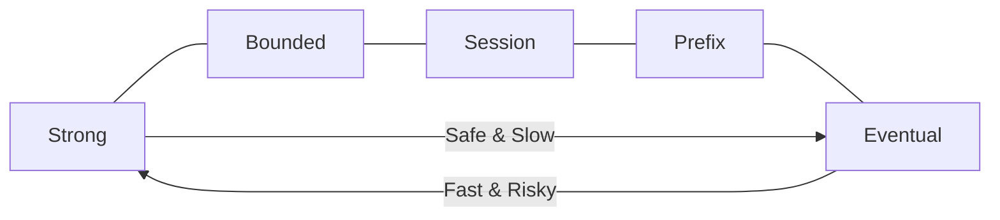

# 🌌 Azure CosmosDB: The Multi-Model Marvel
> **Objective:** Master Azure's globally distributed, multi-model database service that offers guaranteed low latency and tunable consistency | **Language:** Hinglish | **Standard:** 2026 Expert Framework

---

## 🧭 1. Beginner-Friendly Hinglish Explanation
Azure CosmosDB ka matlab hai "Microsoft ka super-flexible global database".

- **The Idea:** Ye ek aisa database hai jo sab kuch kar sakta hai.
  - Aap ise **Document DB** ki tarah use karein (MongoDB API).
  - Aap ise **Graph DB** ki tarah use karein (Gremlin API).
  - Aap ise **Key-Value** ya **SQL** ki tarah use karein.
- **The Best Part:** Microsoft guarantee deta hai ki $99.999\%$ time ye fast rahega (SLA). Aap duniya ke kisi bhi kone mein data copy kar sakte hain sirf ek click se.
- **Intuition:** Ye ek "All-in-one" remote control jaisa hai. Aap chahe TV chalao (NoSQL) ya AC (SQL), ye sab handle kar lega.

---

## 🧠 2. Deep Technical Explanation
### 1. The Multi-Model Engine:
CosmosDB stores data internally as an **Atom-Record-Sequence (ARS)**. All APIs (SQL, MongoDB, Cassandra, Gremlin) are just "Wrappers" on top of this core storage.

### 2. Tunable Consistency (The 5 Levels):
Unlike CAP Theorem's binary choice (C or A), CosmosDB gives you 5 levels:
1. **Strong:** Guaranteed fresh data (Slowest).
2. **Bounded Staleness:** Data is behind by at most $X$ minutes or $Y$ versions.
3. **Session:** Guaranteed fresh data for the *same* user (Most popular).
4. **Consistent Prefix:** Data is never out of order.
5. **Eventual:** Fastest but data might be old.

### 3. Request Units (RU):
You don't pay for CPU/RAM. You pay for "RUs" (Request Units). 1 RU is the cost of reading a 1KB document.

---

## 🏗️ 3. Database Diagrams (The 5 Levels of Consistency)


---

## 💻 4. Query Execution Examples (SQL API)
```sql
-- 1. Standard SQL Query (Document Store)
SELECT * FROM c WHERE c.userId = "sameer"

-- 2. Querying Nested Arrays
SELECT VALUE t FROM c IN c.tags WHERE t = "coding"

-- 3. Stored Procedures (JavaScript based!)
-- CosmosDB allows writing stored procs in JS that run inside the DB engine.
```

---

## 🌍 5. Real-World Production Examples
- **ASOS:** Uses CosmosDB to handle millions of fashion shoppers globally with low latency.
- **Xbox:** Uses it to store player profiles and game state across the globe.
- **Coca-Cola:** Uses it for global supply chain visibility.

---

## ❌ 6. Failure Cases
- **Partition Key Choice:** If you choose a bad partition key, your "Request Units" (RUs) will be wasted on only one partition (**Hot Partition**), and your bill will skyrocket.
- **Cost Complexity:** Calculating how many RUs you need is very difficult. It's easy to overspend.
- **Query Cross-Partition:** If a query needs to check all partitions, it costs much more RU.

---

## 🛠️ 7. Debugging Guide
| Problem | Reason | Solution |
| :--- | :--- | :--- |
| **Request Rate Too Large (429 Error)** | RU Limit Hit | Increase your RUs or optimize your queries to use less data. |
| **High Latency** | Cross-region read | Ensure your application is connecting to the nearest Azure region's CosmosDB endpoint. |

---

## ⚖️ 8. Tradeoffs
- **Guaranteed Performance (High SLA)** vs **Cost (High and complex).**

---

## 🛡️ 9. Security Concerns
- **IP Firewall:** CosmosDB should always be restricted to specific IP ranges or a Virtual Network (VNet).
- **Master Key vs Resource Tokens:** Use "Resource Tokens" for client apps so they don't have the "Master Key" to your whole DB.

---

## 📈 10. Scaling Challenges
- **Infinite Storage:** CosmosDB automatically splits partitions when they hit 50GB. You don't have to manage it, but you have to monitor the RU costs of those splits.

---

## ✅ 11. Best Practices
- **Choose the Partition Key carefully** (it's the most important step!).
- **Use 'Session' consistency** for most web apps.
- **Monitor the 'Provisioned Throughput'** and use 'Autoscale' if your traffic is unpredictable.
- **Keep documents small.**

---

## ⚠️ 13. Common Mistakes
- **Using the 'Master Key' in your frontend code.**
- **Not defining any indexing policy** (CosmosDB indexes everything by default, which can be expensive).

---

## 📝 14. Interview Questions
1. "What are the 5 consistency levels in CosmosDB?"
2. "What is a Request Unit (RU)?"
3. "How does the Multi-model architecture work?"

---

## 🚀 15. Latest 2026 Production Database Patterns
- **Serverless CosmosDB:** No more provisioned RUs; you only pay per request. Great for small apps or testing.
- **Analytical Store (Synapse Link):** Automatically syncing your NoSQL data to an Analytics engine without affecting the production DB performance.
漫
