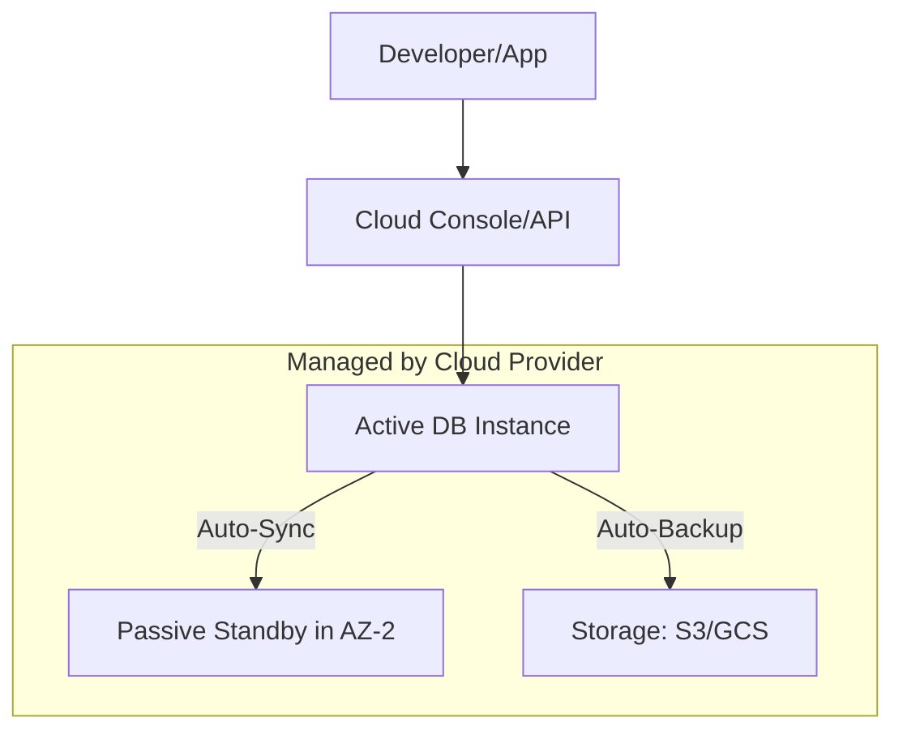

# ☁️ Cloud Database Fundamentals: Managed Mastery
> **Objective:** Master the core concepts of cloud-hosted databases, shared responsibility models, and why most modern apps choose managed services | **Language:** Hinglish | **Standard:** 2026 Expert Framework

---

## 🧭 1. Beginner-Friendly Hinglish Explanation
Cloud Database Fundamentals ka matlab hai "Database ko cloud par chalana aur managed services ke fayde samajhna".

- **The Old Way (Self-Hosted):** Aap khud server khareedte ho, OS install karte ho, DB setup karte ho, backup ki script likhte ho, aur har raat darte ho ki kahin server crash na ho jaye.
- **The New Way (Managed Services):** AWS, Google, ya Azure aapke liye sab karte hain.
  - **Provisioning:** Ek click mein database ready.
  - **Automated Backups:** Daily backup bina kisi extra mehnat ke.
  - **Scaling:** Button dabao aur RAM/CPU badhao.
  - **Security:** OS level ke patches cloud provider lagata hai.
- **Intuition:** Self-hosting ek "Ghar par sabzi ugane" jaisa hai. Cloud database "Zomato se khana mangane" jaisa hai—fast, reliable, aur aapko sirf "Khane" (Data) se matlab hai, "Ugane" se nahi.

---

## 🧠 2. Deep Technical Explanation
### 1. Shared Responsibility Model:
- **Cloud Provider (AWS/GCP):** Takes care of physical hardware, networking, cooling, and OS patching.
- **You (The Developer):** Take care of Schema design, Query optimization, User permissions, and Encryption settings inside the DB.

### 2. DBaaS (Database as a Service):
A model where the provider manages everything including the database engine itself. (e.g., AWS RDS, MongoDB Atlas).

### 3. Key Concepts:
- **High Availability (Multi-AZ):** Running a standby copy of your DB in another building (Availability Zone). If one building catches fire, the DB automatically switches to the other one.
- **Elasticity:** Growing or shrinking the database size based on traffic spikes.

---

## 🏗️ 3. Database Diagrams (Managed Architecture)


---

## 💻 4. Query Execution Examples (AWS CLI)
```bash
# 1. Create a managed Postgres instance with one command
aws rds create-db-instance \
    --db-instance-identifier my-db \
    --db-instance-class db.t3.micro \
    --engine postgres \
    --allocated-storage 20

# 2. Modify instance size (Vertical Scaling)
aws rds modify-db-instance \
    --db-instance-identifier my-db \
    --db-instance-class db.m5.large \
    --apply-immediately
```

---

## 🌍 5. Real-World Production Examples
- **Startups:** Using **Supabase** or **PlanetScale** to get a production-ready DB in 30 seconds.
- **Enterprises:** Moving their old Oracle databases to **AWS Aurora** to save millions in licensing costs.
- **Global Apps:** Using **Google Spanner** to keep data consistent across 5 continents simultaneously.

---

## ❌ 6. Failure Cases
- **Vendor Lock-in:** Using a database that *only* works on one cloud (e.g., DynamoDB). If you want to move to another cloud, you have to rewrite your whole app.
- **Cost Explosion:** Cloud databases are expensive. If you have a bad query that scans 1TB of data, you might get a $1,000 bill in one day.
- **Connection Storms:** Managed DBs often have limits on the number of simultaneous connections. **Fix: Use a 'Connection Pooler'.**

---

## 🛠️ 7. Debugging Guide
| Problem | Reason | Solution |
| :--- | :--- | :--- |
| **Can't connect to DB** | Security Group / Firewall | Check if your IP is whitelisted in the Cloud Console. |
| **DB is slow suddenly** | Burst Credits exhausted | You were using a "Cheap" instance and ran out of performance credits. Upgrade to a "Provisioned" instance. |

---

## ⚖️ 8. Tradeoffs
- **Managed (Low Maintenance / High Reliability / High Cost)** vs **Self-Hosted (Low Cost / Full Control / High Maintenance).**

---

## 🛡️ 9. Security Concerns
- **Identity & Access Management (IAM):** Using cloud roles instead of passwords to connect to the DB.
- **VPC Isolation:** Ensuring the database is NOT on the public internet, only accessible by your backend servers.

---

## 📈 10. Scaling Challenges
- **Storage Auto-Scaling:** Ensuring the disk grows automatically before it hits 100%, otherwise, the database will stop accepting writes and crash.

---

## ✅ 11. Best Practices
- **Enable Multi-AZ for production.**
- **Use "Reserved Instances"** to save 30-50% on costs if you know you'll use the DB for a year.
- **Monitor CloudWatch / Stackdriver metrics daily.**
- **Enforce encryption at rest.**

---

## ⚠️ 13. Common Mistakes
- **Leaving the DB publicly accessible.**
- **Not setting up billing alerts.**
- **Ignoring the instance "Performance Limits"** (IOPS/Throughput).

---

## 📝 14. Interview Questions
1. "What is the Shared Responsibility Model?"
2. "Why is Multi-AZ important for high availability?"
3. "What is 'Serverless Database' and how is it different from a standard managed DB?"

---

## 🚀 15. Latest 2026 Production Database Patterns
- **Database Branching:** (Neon / PlanetScale) Creating a copy of your whole database in 1 second to test a new feature, just like a Git branch.
- **Zero-ETL:** Modern cloud DBs (like Aurora) that can send data to an Analytics engine (like Redshift) instantly without you writing any Python code.
漫
