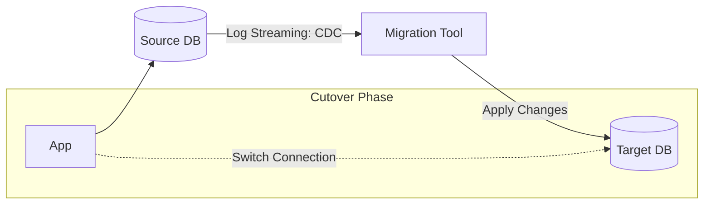

# 🚚 Database Migration Strategies: Zero Downtime
> **Objective:** Master the techniques of moving data between databases (Migration) and changing schema (Schema Migration) without stopping the application | **Language:** Hinglish | **Standard:** 2026 Expert Framework

---

## 🧭 1. Beginner-Friendly Hinglish Explanation
Database Migration ka matlab hai "Data ko ek jagah se dusri jagah le jana ya structure badalna".

- **The Problem:** Aapke paas 100GB data hai. Aapko server badalna hai (e.g., On-premise to Cloud). Par aap site ko 10 ghante ke liye band nahi kar sakte.
- **The Solution:** 
  1. **Online Migration:** Database chalta rahega aur piche se data copy hota rahega.
  2. **Schema Migration:** Bina site crash kiye naye columns add karna.
- **The Process:** 
  - Pehle pura data copy karo.
  - Phir "Change Data Capture" (CDC) use karke live changes ko sync karo.
  - Jab dono DBs barabar ho jayein, toh app ka connection naye DB par "Switch" kar do.
- **Intuition:** Ye "Ek chalti hui train ke dibbe badalne" jaisa hai. Train rukni nahi chahiye, par dibba (Database) naya hona chahiye.

---

## 🧠 2. Deep Technical Explanation
### 1. The Migration Workflow (Online):
1. **Initial Load:** Copying the current snapshot of data.
2. **CDC (Change Data Capture):** Reading the Transaction Logs (WAL/Binlog) to stream every new `INSERT/UPDATE` to the target DB.
3. **Verification:** Checking if counts and checksums match.
4. **Cutover:** Updating the application config to point to the new DB.

### 2. Schema Migration Strategies (Blue-Green):
- **Expand and Contract:**
  1. **Expand:** Add a new column (DB now has old and new).
  2. **Migrate:** Copy data from old column to new.
  3. **Switch:** Update app to read from the new column.
  4. **Contract:** Delete the old column.

### 3. Tooling:
- **AWS DMS (Database Migration Service):** Automates the process.
- **Liquibase / Flyway:** For tracking and versioning schema changes.

---

## 🏗️ 3. Database Diagrams (The Online Migration)


---

## 💻 4. Query Execution Examples (Schema Migration)
```sql
-- ❌ Dangerous: Locks the whole table during migration
ALTER TABLE orders ADD COLUMN status_v2 TEXT;

-- ✅ Safe (Expand and Contract pattern)
-- Step 1: Add nullable column
ALTER TABLE orders ADD COLUMN IF NOT EXISTS status_v2 TEXT;

-- Step 2: Use a background script to copy data in batches
-- UPDATE orders SET status_v2 = status WHERE id BETWEEN 1 AND 1000;

-- Step 3: Switch app logic to use status_v2
```

---

## 🌍 5. Real-World Production Examples
- **Airbnb:** Successfully migrated from a single massive database to hundreds of small services without a single second of site downtime.
- **Financial Migration:** Moving a core banking DB from Oracle to AWS Aurora. They ran both DBs in parallel for 3 months to be $100\%$ sure before switching.

---

## ❌ 6. Failure Cases
- **Missing CDC Events:** The migration tool misses 100 orders during the sync. Now your balances are wrong. **Fix: Use "Checksum" tools after migration.**
- **Schema Incompatibility:** Target DB doesn't support a specific data type from the source (e.g., Postgres `JSONB` to MySQL `JSON`).
- **Network Latency:** The "Sync" can't keep up with the "Writes", and the migration lag keeps increasing forever.

---

## 🛠️ 7. Debugging Guide
| Problem | Reason | Solution |
| :--- | :--- | :--- |
| **Migration is stuck** | Large LOB/Blobs | Exclude images/blobs from the migration; move them to S3 separately. |
| **Data Mismatch** | Triggers/Stored Procs | Ensure that triggers on the source are not causing "Double Writes" on the target. |

---

## ⚖️ 8. Tradeoffs
- **Offline Migration (Safe / Simple / High Downtime)** vs **Online Migration (Complex / Expensive / Zero Downtime).**

---

## 🛡️ 9. Security Concerns
- **Encryption during Move:** Data must be encrypted while traveling between the source and target servers.
- **Sensitive Data in Logs:** Migration logs might contain plain-text data. Protect the log files.

---

## 📈 10. Scaling Challenges
- **Large Table Lock:** Some migrations require a `SELECT *` which can lock the table and crash the production app. **Fix: Use 'Read Replicas' for the initial load.**

---

## ✅ 11. Best Practices
- **Always take a backup before starting.**
- **Test the migration in a "Staging" environment first.**
- **Migrate in small batches.**
- **Have a "Rollback Plan"** (If the new DB fails, how do you go back to the old one in 1 minute?).

---

## ⚠️ 13. Common Mistakes
- **Forgetting to migrate "Users and Permissions".**
- **Not checking the "Index Performance" on the new DB.** (Queries might be slow after migration).

---

## 📝 14. Interview Questions
1. "Explain the 'Expand and Contract' pattern for schema migrations."
2. "What is CDC (Change Data Capture)?"
3. "How would you migrate a 1TB database with zero downtime?"

---

## 🚀 15. Latest 2026 Production Database Patterns
- **Ghost Migrations:** Using tools like **gh-ost** or **pt-online-schema-change** that create a "Ghost Table" in the background and swap it at the last millisecond to avoid table locks.
- **Multi-Cloud Disaster Recovery:** Automatically migrating data between AWS and Azure in real-time so the app can survive if an entire cloud provider goes down.
漫
