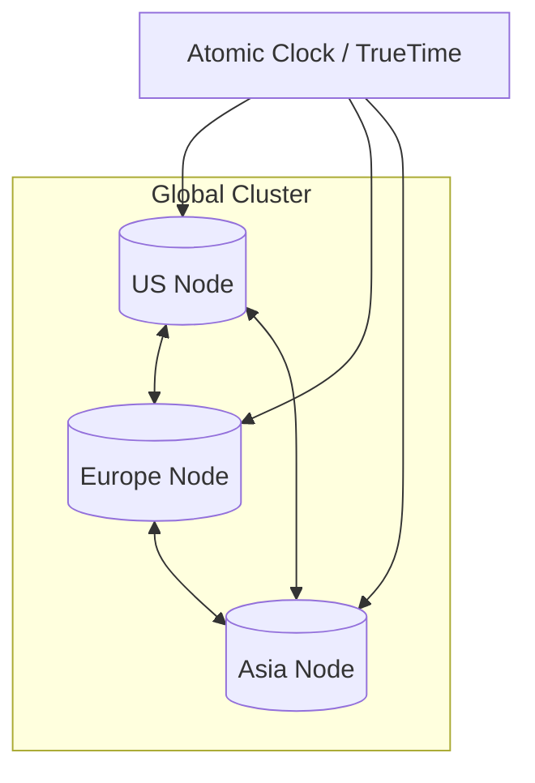

# 🌍 Google Cloud Spanner: The Global Giant
> **Objective:** Master the architecture of Google Spanner—the world's first relational database that provides global scale with strong consistency | **Language:** Hinglish | **Standard:** 2026 Expert Framework

---

## 🧭 1. Beginner-Friendly Hinglish Explanation
Google Cloud Spanner ka matlab hai "Duniya ka sabse powerful Global Database".

- **The Problem:** Agar aapko ek aisa database chahiye jo New York, Mumbai aur Tokyo mein ek saath chale, toh aapke paas do options the:
  1. **Consistent (SQL):** Par ye slow hota hai global scale par (CAP Theorem says NO).
  2. **Available (NoSQL):** Par isme data mismatch ho sakta hai (Eventual Consistency).
- **The Solution:** Google Spanner. Ye SQL ki **Consistency** aur NoSQL ki **Scalability** ko jod deta hai.
- **The Magic:** Ye Atomic Clocks aur GPS use karta hai (TrueTime) taaki saare servers ka time perfectly sync ho.
- **Intuition:** Ye ek "Super-Computer Database" jaisa hai. Aap pura table globally shard kar sakte hain aur Google automatically manage karega ki data hamesha sahi (Consistent) rahe.

---

## 🧠 2. Deep Technical Explanation
### 1. TrueTime API:
The heart of Spanner. Every Google data center has an Atomic Clock and a GPS receiver.
- It provides a time range $[earliest, latest]$. Spanner waits for the "uncertainty" to pass before committing a transaction, ensuring a global order of events.

### 2. External Consistency:
Spanner provides "Serializability" at global scale. If Transaction A happens before Transaction B in the real world, Spanner guarantees the DB will reflect that.

### 3. Split-based Sharding:
Spanner automatically splits your data into "Splits" (Shards) based on traffic. If one part of the table is busy, it moves to a more powerful server automatically.

---

## 🏗️ 3. Database Diagrams (Global Architecture)


---

## 💻 4. Query Execution Examples (Spanner SQL)
```sql
-- 1. DDL (Defining a table with Interleaving)
-- Interleaving stores 'child' data physically close to 'parent' data for speed.
CREATE TABLE Users (
  UserId INT64 NOT NULL,
  Name STRING(MAX),
) PRIMARY KEY (UserId);

CREATE TABLE Orders (
  UserId INT64 NOT NULL,
  OrderId INT64 NOT NULL,
  Amount FLOAT64,
) PRIMARY KEY (UserId, OrderId),
  INTERLEAVE IN PARENT Users ON DELETE CASCADE;

-- 2. Querying (Standard SQL)
SELECT u.Name, o.Amount 
FROM Users u JOIN Orders o ON u.UserId = o.UserId
WHERE u.UserId = 123;
```

---

## 🌍 5. Real-World Production Examples
- **Google Play Store:** Handles billions of transactions and app downloads globally with 100% consistency.
- **AdWords:** Spanner was originally built to replace Google's massive MySQL clusters for its ads business.
- **Pokemon GO:** Used Spanner to handle the sudden burst of millions of concurrent users globally during its launch.

---

## ❌ 6. Failure Cases
- **The "Cost" Barrier:** Spanner is expensive. It's built for "Google-scale" problems. For a small local app, it's total overkill.
- **Secondary Index Latency:** If you have a global database, searching for an email that isn't the primary key can involve a "Global Scan" across continents, which is slow.
- **Cold Starts:** Provisioning a new Spanner instance takes several minutes.

---

## 🛠️ 7. Debugging Guide
| Problem | Reason | Solution |
| :--- | :--- | :--- |
| **High Latency** | Inter-regional traffic | Use "Read-Only Replicas" in the local region to speed up reads. |
| **Schema Update Slow** | Massive Table | Spanner schema changes are online but can take time for huge tables. Plan ahead. |

---

## ⚖️ 8. Tradeoffs
- **Scale & Consistency (Unbeatable)** vs **Cost & Complexity (High).**

---

## 🛡️ 9. Security Concerns
- **Regional Isolation:** Ensuring that sensitive data (like European user info) stays only on Spanner nodes located in Europe (Data Sovereignty).

---

## 📈 10. Scaling Challenges
- **The "Hot Tablet" Problem:** If all users with IDs starting with 'A' are very active, the node holding that 'Split' will be overloaded. **Fix: Use UUIDs or Hash the Primary Key.**

---

## ✅ 11. Best Practices
- **Use Interleaving** for parent-child relationships to avoid cross-node joins.
- **Avoid monotonically increasing keys** (like Timestamps) as the primary key.
- **Use 'Read-only transactions'** for $90\%$ of your read traffic to save costs and improve speed.

---

## ⚠️ 13. Common Mistakes
- **Using Spanner for a single-region app.** (Just use Cloud SQL/RDS, it's cheaper).
- **Not using Query Parameters** (SQL Injection risk).

---

## 📝 14. Interview Questions
1. "How does Spanner overcome the CAP Theorem?" (It doesn't technically, but TrueTime makes it act like it does).
2. "What is 'Interleaving' in Spanner?"
3. "Explain the importance of Atomic Clocks for Google Spanner."

---

## 🚀 15. Latest 2026 Production Database Patterns
- **PostgreSQL Interface:** Spanner now supports a "Postgres Dialect", allowing you to use your standard Postgres tools and drivers with Spanner's global backend.
- **Free Trial Instances:** Google now offers tiny, free Spanner instances for learning and small production pilots.
漫
