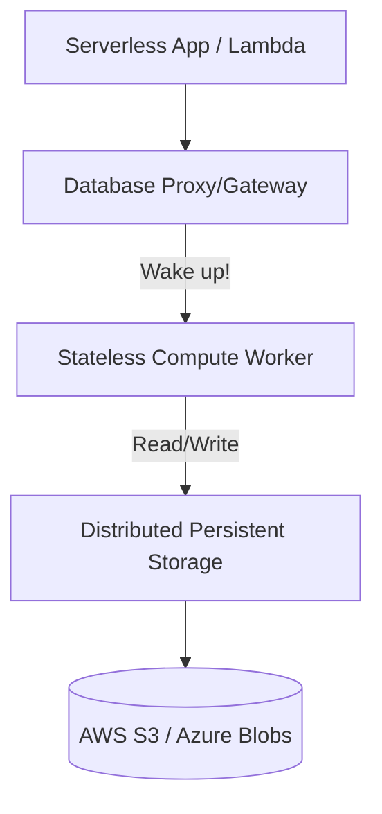

# ⚡ Serverless Databases: Pay-Per-Query
> **Objective:** Master the concept of "Serverless" databases (like Neon, PlanetScale, Upstash) where you don't manage instances, only your data | **Language:** Hinglish | **Standard:** 2026 Expert Framework

---

## 🧭 1. Beginner-Friendly Hinglish Explanation
Serverless Databases ka matlab hai "Aisa database jahan aapko 'Server' ka naam-o-nishan nahi dikhega".

- **The Problem:** Normal managed databases (like RDS) mein aapko choose karna padta hai: "Humein 4GB RAM chahiye". Agar traffic kam hai, toh aap faltu paise de rahe hain. Agar traffic jyada hai, toh database slow ho jayega.
- **The Solution:** Serverless DB. 
  - **No Provisioning:** Aap ye nahi batate ki kitna RAM chahiye.
  - **Auto-Scaling:** Traffic aayega toh database apne aap bada ho jayega. Traffic zero hoga toh database "So" (Sleep) jayega aur bill zero ho jayega.
  - **Pay-per-use:** Aap sirf un queries ke paise dete hain jo aapne chali hain.
- **Intuition:** Ye "Uber" jaisa hai. Aap gaadi (Server) nahi khareedte, aap sirf "Ride" (Query) ke paise dete hain.

---

## 🧠 2. Deep Technical Explanation
### 1. Separation of Storage and Compute:
This is the core architecture of serverless DBs.
- **Storage:** Persistently stored on a distributed layer (like S3 or specialized clusters).
- **Compute:** Tiny "Workers" (Lambdas/Containers) that spin up in milliseconds to execute your query and then shut down.

### 2. Cold Starts:
If no one has used the DB for a while, the first query might take 1-2 seconds because the "Compute" has to wake up. Modern providers (like Neon) have reduced this to < 500ms.

### 3. Connection Management:
Serverless apps (like AWS Lambda) create many short-lived connections. Serverless DBs usually provide a **WebSocket** or **HTTP** interface to handle this efficiently.

---

## 🏗️ 3. Database Diagrams (The Serverless Stack)


---

## 💻 4. Query Execution Examples (Neon / PlanetScale)
```javascript
// 1. Connecting via HTTP (No persistent connection needed)
import { neon } from '@neondatabase/serverless';

const sql = neon(process.env.DATABASE_URL);
const users = await sql`SELECT * FROM users WHERE active = true`;

// 2. Branching (PlanetScale/Neon feature)
// You can create a branch of your DB like a Git branch
// 'pscale branch create my-feature-branch'
```

---

## 🌍 5. Real-World Production Examples
- **Vercel / Netlify Apps:** Most modern web developers use **PlanetScale** (MySQL) or **Neon** (Postgres) because they scale perfectly with the frontend.
- **IoT Events:** Using **Upstash Redis** to capture sensor data where traffic is very "Spiky".
- **Dynamic Blogs:** A blog that gets 1000 hits in 1 hour and 0 hits for the rest of the day.

---

## ❌ 6. Failure Cases
- **The "Heavy Query" Bill:** Since you pay per query/data scanned, one bad `SELECT *` on a massive table can cost you more than a whole month of a standard server.
- **VPC Latency:** Connecting from a serverless function (Lambda) to a serverless DB inside a private VPC can add 100ms of "Cold Start" lag.
- **Limited Control:** You can't change low-level OS or DB configurations (like `shared_buffers`).

---

## 🛠️ 7. Debugging Guide
| Problem | Reason | Solution |
| :--- | :--- | :--- |
| **First query is slow** | Cold Start | Use "Warm-up" requests or keep the compute active with a cron job. |
| **High Bill** | Unoptimized Queries | Check which queries are scanning the most data. Add indexes! |

---

## ⚖️ 8. Tradeoffs
- **Convenience (Zero Maintenance / Instant Scaling)** vs **Performance Predictability (Variable Latency / Higher cost for high steady traffic).**

---

## 🛡️ 9. Security Concerns
- **Token Security:** Serverless DBs use long-lived tokens. If a token is leaked, an attacker can access the DB from anywhere. **Fix: Use 'IP Whitelisting' and rotate tokens.**

---

## 📈 10. Scaling Challenges
- **Transaction Limits:** Some serverless DBs have limits on how long a transaction can last (e.g., max 30 seconds).

---

## ✅ 11. Best Practices
- **Use Serverless DBs for new startups and "Spiky" workloads.**
- **Optimize queries to scan minimum data** to keep costs low.
- **Use HTTP/WebSocket clients** if your environment is serverless (Edge functions).
- **Leverage 'Branching'** for your CI/CD pipeline.

---

## ⚠️ 13. Common Mistakes
- **Using a Serverless DB for a "Heavy Write" 24/7 workload.** (A standard RDS will be 5x cheaper).
- **Forgetting to set a 'Spend Limit'.**

---

## 📝 14. Interview Questions
1. "How does a Serverless Database handle 'Scale to Zero'?"
2. "What is the difference between Storage and Compute in a serverless DB?"
3. "Explain the 'Cold Start' problem."

---

## 🚀 15. Latest 2026 Production Database Patterns
- **Database Snapshots as Code:** Using **Drizzle** or **Prisma** with serverless DBs to automatically create temporary databases for every Pull Request.
- **Global Edge Databases:** (Cloudflare D1 / Turso) Replicating small SQLite databases to every edge location in the world for $0ms$ latency reads.
漫
