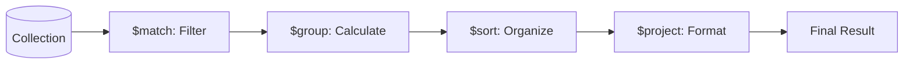

# 📊 Aggregation Framework Mastery: SQL Power in MongoDB
> **Objective:** Master the MongoDB Aggregation Pipeline to perform complex data analysis, joins, and transformations directly in the database | **Language:** Hinglish | **Standard:** 2026 Expert Framework

---

## 🧭 1. Beginner-Friendly Hinglish Explanation
Aggregation Framework ka matlab hai "MongoDB ka advanced calculation engine".

- **The Problem:** Simple `find()` se aap data filter kar sakte hain, par agar aapko "Total Sales per Month" chahiye ya "Joins" karne hain, toh `find()` kaafi nahi hai.
- **The Solution:** Aggregation Pipeline.
  - Ye ek "Assembly Line" jaisa hai. 
  - Pehle data ko filter karo (`$match`).
  - Phir use group karo (`$group`).
  - Phir sort karo (`$sort`).
  - Aur end mein final result nikaalo.
- **Intuition:** Ye "Juice Maker" jaisa hai. Aapne phal dale (Data), unhe chheela (Match), unhe peesa (Group), aur glass mein nikaal liya (Project).

---

## 🧠 2. Deep Technical Explanation

### 1. The Pipeline Concept:
Each stage in the pipeline takes the output of the previous stage as its input.
- **$match:** Filters documents (like WHERE).
- **$group:** Groups documents by a key and performs calculations (SUM, AVG).
- **$project:** Reshapes the document (Rename or Hide fields).
- **$lookup:** Performs a left outer join to another collection.

### 2. Performance:
Aggregations run on the server side. They are much faster than fetching all data to your Node.js/Python app and calculating there.

---

## 🏗️ 3. Database Diagrams (The Pipeline Flow)


---

## 💻 4. Query Execution Examples (Aggregation Power)
```javascript
// 1. Calculate Total Revenue per Category
db.orders.aggregate([
    { $match: { status: "completed" } },
    { $group: { 
        _id: "$category", 
        totalRevenue: { $sum: "$amount" },
        count: { $sum: 1 }
    } },
    { $sort: { totalRevenue: -1 } }
]);

// 2. Joining Collections ($lookup)
db.orders.aggregate([
    { $lookup: {
        from: "products",
        localField: "product_id",
        foreignField: "_id",
        as: "productDetails"
    } },
    { $unwind: "$productDetails" } // Flatten the array
]);

// 3. Faceted Search (Filters + Categories in one query)
db.products.aggregate([
    { $facet: {
        "priceRanges": [ { $bucket: { groupBy: "$price", boundaries: [0, 100, 500, 1000] } } ],
        "topBrands": [ { $group: { _id: "$brand", count: { $sum: 1 } } }, { $limit: 5 } ]
    } }
]);
```

---

## 🌍 5. Real-World Production Examples
- **Dashboards:** Calculating real-time analytics like "Active users in the last 10 minutes".
- **E-commerce:** Building the sidebar filters (Brand, Price, Rating) using `$facet`.
- **Reporting:** Generating monthly tax reports by joining user data with transactions.

---

## ❌ 6. Failure Cases
- **Memory Limit:** A single aggregation stage can only use **100MB** of RAM. If your group is too big, it will crash. **Fix: Use `{ allowDiskUse: true }`.**
- **Unwinding Large Arrays:** Using `$unwind` on an array with 10,000 items will create 10,000 copies of the document, killing performance.

---

## 🛠️ 7. Debugging Guide
| Problem | Reason | Solution |
| :--- | :--- | :--- |
| **Stage 1 is slow** | No index on $match | Ensure the first `$match` stage uses an index. |
| **Result is empty** | Logic error in $match | Test stages one by one. |

---

## ⚖️ 8. Tradeoffs
- **In-DB Aggregation (Fast / Saves Network)** vs **External BI Tools (Tableau/Metabase) (Easier for non-coders / Better for massive historical data).**

---

## ✅ 11. Best Practices
- **Filter early!** Put `$match` at the very beginning of the pipeline.
- **Project only needed fields** to save memory.
- **Use `$limit`** as soon as possible.
- **Index the fields** used in the first `$match`.

漫
---

## 📝 14. Interview Questions
1. "How does the Aggregation Pipeline differ from a normal `find()` query?"
2. "What is the purpose of the `$unwind` stage?"
3. "How do you handle the 100MB RAM limit in aggregations?"

---

## 🚀 15. Latest 2026 Production Database Patterns
- **Aggregation as a Service:** Using MongoDB Atlas "Data API" to run complex aggregations via HTTP from edge workers.
- **Window Functions in Mongo:** MongoDB 5.0+ now supports `$setWindowFields`, allowing SQL-like ranking and moving averages.
漫
