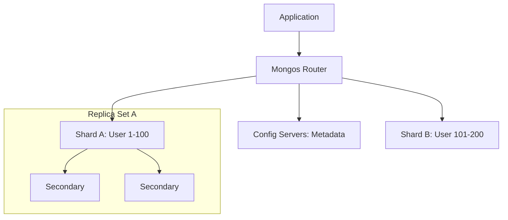

# 🌐 Replication and Sharding in MongoDB: Global Scale
> **Objective:** Master the mechanisms of high availability (Replication) and horizontal scaling (Sharding) to build MongoDB clusters that handle petabytes of data and millions of users | **Language:** Hinglish | **Standard:** 2026 Expert Framework

---

## 🧭 1. Beginner-Friendly Hinglish Explanation
Replication aur Sharding ka matlab hai "Database ko bada aur majboot banana".

- **The Problem:** 
  1. Agar ek server down ho jaye, toh app band ho jayegi.
  2. Agar itna data aa jaye jo ek server par na sama paaye, toh database crash ho jayega.
- **The Solution:** 
  - **Replication:** Data ki dher saari "Copies" banana (Safety ke liye).
  - **Sharding:** Data ko "Tukdon" mein baantna aur alag-alag servers par rakhna (Size ke liye).
- **Intuition:** 
  - **Replication** ek "Backup Singer" jaisa hai jo tab gaata hai jab main singer bimar ho. 
  - **Sharding** ek "Pizza" jaisa hai jise aap slices mein kaat dete hain takki dher saare log ek saath kha sakein.

---

## 🧠 2. Deep Technical Explanation

### 1. Replica Sets (High Availability):
- **Primary:** Handles all writes.
- **Secondaries:** Copy data from Primary. If Primary dies, Secondaries hold an "Election" to pick a new Primary.
- **Oplog:** A circular collection that stores all changes. Secondaries read this to stay in sync.

### 2. Sharding (Horizontal Scaling):
- **Mongos:** The router. Your app talks to this.
- **Config Servers:** Store the metadata (Who has which data?).
- **Shards:** The actual data nodes.
- **Shard Key:** The field used to decide where a document goes. **This is the most critical decision in MongoDB.**

---

## 🏗️ 3. Database Diagrams (Sharded Cluster)


---

## 💻 4. Query Execution Examples (Managing the Cluster)
```javascript
// 1. Checking Replication Status
rs.status();

// 2. Setting Write Concern (Wait for majority before success)
db.orders.insertOne(
    { item: "Laptop", qty: 1 },
    { writeConcern: { w: "majority", j: true } }
);

// 3. Enabling Sharding
sh.enableSharding("myApp");
sh.shardCollection("myApp.users", { "user_id": 1 });
```

---

## 🌍 5. Real-World Production Examples
- **Amazon/E-commerce:** Using Sharding to store billions of product reviews across 50 servers.
- **Fintech:** Using Replication with `w: "majority"` to ensure a transaction is saved on at least 2 servers before telling the user "Success".

---

## ❌ 6. Failure Cases
- **Replication Lag:** If the network is slow, Secondaries might be 5 seconds behind. If you read from them, you see "Old" data. **Fix: Use 'Causal Consistency' or read from Primary.**
- **The Hot Shard:** You chose a Shard Key (like `status`) that isn't diverse. All data goes to one shard while others are empty. **Fix: Use a 'Hashed Shard Key' or a unique `user_id`.**

---

## 🛠️ 7. Debugging Guide
| Problem | Reason | Solution |
| :--- | :--- | :--- |
| **No Primary elected** | Network Partition / Not enough nodes | Ensure you have an odd number of nodes (Minimum 3). |
| **Uneven data distribution** | Poor Shard Key | Change the Shard Key (Hard! Requires re-sharding). |

---

## ⚖️ 8. Tradeoffs
- **Sharding (Unlimited Scale)** vs **Complexity (HARD to manage / Expensive configuration).**

---

## ✅ 11. Best Practices
- **Always have an odd number of nodes** in a Replica Set.
- **Choose a high-cardinality Shard Key.**
- **Use 'Majority' Read/Write concerns** for critical data.
- **Monitor the Oplog size.**

漫
---

## 📝 14. Interview Questions
1. "What is an election in a MongoDB Replica Set?"
2. "Why is the Shard Key so important and what makes a good one?"
3. "Difference between Replication and Sharding?"

---

## 🚀 15. Latest 2026 Production Database Patterns
- **Global Clusters:** Sharding data by "Region" (e.g., India data in Mumbai, USA data in Virginia) for GDPR compliance and low latency.
- **Auto-sharding:** Cloud providers (Atlas) now automatically balance shards so you don't have to manually tune them.
漫
