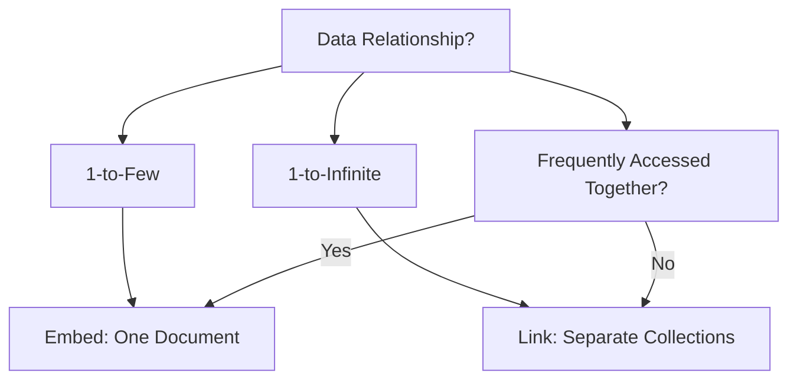

# 📐 Schema Design Patterns: Embedding vs Linking
> **Objective:** Master the art of MongoDB schema design, choosing between Denormalization (Embedding) and Normalization (Linking) to optimize for read/write performance | **Language:** Hinglish | **Standard:** 2026 Expert Framework

---

## 🧭 1. Beginner-Friendly Hinglish Explanation
Schema Design Patterns ka matlab hai "MongoDB mein data kaise store karein takki app fast chale".

- **The Big Question:** Kya main sara data ek hi document mein daal doon (**Embedding**) ya phir alag-alag collections banau (**Linking**)?
- **Embedding:** Ek "User" document ke andar hi uske "Addresses" daal dena. (Fast Reads, but document can grow too big).
- **Linking:** "User" document mein sirf address ka "ID" dena. (SQL style, slow reads because of multiple queries).
- **Intuition:** 
  - **Embedding** ek "Ready-to-eat Meal" jaisa hai. Sab kuch ek hi plate mein hai.
  - **Linking** ek "Kitchen" jaisa hai jahan aapko sabzi, roti aur daal alag-alag bartan se nikaalni padti hai.

---

## 🧠 2. Deep Technical Explanation

### 1. Rule of Thumb:
- **Embed** if the relationship is **1-to-few** or **1-to-many** (where the "many" is small and won't grow infinitely).
- **Link** if the relationship is **1-to-thousands** or if data is shared across many documents.

### 2. Common Patterns:
- **The Extended Reference:** Embed only the fields you need for the "Main" view (e.g., store `product_name` in the `orders` collection but keep full details in `products`).
- **The Subset Pattern:** Embed only the "Recent" data (e.g., store the last 5 reviews in the `product` document and put the rest in a `reviews` collection).

---

## 🏗️ 3. Database Diagrams (Decision Matrix)


---

## 💻 4. Query Execution Examples (Implementation)

### Pattern 1: Embedding (The FAST way)
```javascript
db.users.insertOne({
    name: "Sameer",
    addresses: [
        { city: "Delhi", type: "Home" },
        { city: "Mumbai", type: "Office" }
    ]
});
// One query gets everything!
```

### Pattern 2: Linking (The FLEXIBLE way)
```javascript
// User Document
{ _id: "u1", name: "Sameer" }
// Order Document
{ _id: "o1", user_id: "u1", amount: 500 }
// Requires $lookup or 2 queries
```

---

## 🌍 5. Real-World Production Examples
- **Blog Platform:** Embed the "Tags" in the Post document. Link the "Comments" if you expect thousands of comments.
- **E-commerce:** Embed the "Customer Name" in the Order document (Extended Reference) so the order history page loads instantly without joining the user table.

---

## ❌ 6. Failure Cases
- **The Unbounded Array:** Storing every single "Like" on a viral post inside the post document. The document will hit the **16MB limit** and crash your database. **Fix: Use Linking or the 'Outlier Pattern'.**
- **Data Inconsistency:** You embedded the `user_name` in the `order` table. The user changed their name. Now you have to update 1 million orders. **Fix: Only embed data that RARELY changes.**

---

## 🛠️ 7. Debugging Guide
| Problem | Reason | Solution |
| :--- | :--- | :--- |
| **Document too big** | Unbounded embedding | Move the array to a separate collection and use Linking. |
| **App is slow due to Joins** | Too much linking | Identify "Hot Data" and Embed it (Extended Reference). |

---

## ⚖️ 8. Tradeoffs
- **Embedding (Performance / Atomicity)** vs **Linking (Flexibility / Normalization).**

---

## ✅ 11. Best Practices
- **Favor Embedding** unless there is a strong reason not to.
- **Avoid deep nesting** (it makes indexing harder).
- **Store the "Read" format** in the database.
- **Watch out for the 16MB document limit.**

漫
---

## 📝 14. Interview Questions
1. "When would you choose Linking over Embedding in MongoDB?"
2. "What is the 'Extended Reference' pattern?"
3. "How do you handle many-to-many relationships in NoSQL?"

---

## 🚀 15. Latest 2026 Production Database Patterns
- **Computed Schema:** Using AI to analyze query patterns and automatically suggest which fields should be "Embedded" for maximum performance.
- **Schema Versioning:** Adding a `schema_version` field to every document so your application code knows how to parse old vs new data structures.
漫
