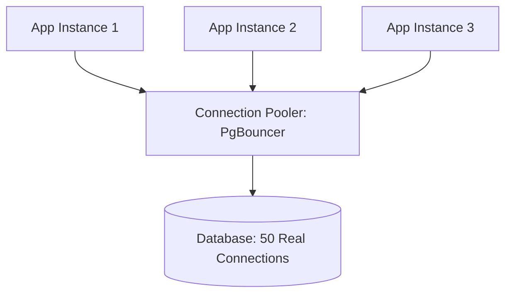

# 🔌 Connection Pooling: Managing the Traffic
> **Objective:** Master how to efficiently manage database connections to prevent "Connection Exhaustion" and minimize the overhead of opening/closing sessions | **Language:** Hinglish | **Standard:** 2026 Expert Framework

---

## 🧭 1. Beginner-Friendly Hinglish Explanation
Connection Pooling ka matlab hai "Database connections ko reuse karna".

- **The Problem:** Database connection kholna "Mehnga" (Expensive) hota hai. Isme CPU aur Memory kharch hoti hai. Agar aapka app har ek request ke liye naya connection khole aur band kare, toh database jaldi hi thak jayega (**Connection Storm**).
- **The Solution:** Connection Pool. 
- **How it works:** App shuru hote hi 10-20 connections pehle se khol kar rakh leta hai. Jab koi request aati hai, wo ek khali connection "Borrow" karta hai, kaam karta hai, aur use "Wapas" (Return) kar deta hai.
- **Intuition:** Ye ek "Library" jaisa hai. Aap har baar nayi book nahi khareedte. Aap library se book lete hain, padhte hain, aur wapas kar dete hain takki koi aur use kar sake.

---

## 🧠 2. Deep Technical Explanation
### 1. Why is a connection expensive?
- **Handshake:** TCP handshake + SSL/TLS setup.
- **Authentication:** Checking username/password and permissions.
- **Memory:** Every connection in Postgres/MySQL consumes ~10MB to 20MB of RAM for its own local buffers.

### 2. Client-Side vs Server-Side Pooling:
- **Client-Side (App Level):** Libraries like `HikariCP` (Java), `node-postgres` (Node), or `SQLAlchemy` (Python) manage a pool inside the app code.
- **Server-Side (Proxy Level):** Tools like **PgBouncer** (Postgres) or **ProxySQL** (MySQL) sit between the App and the DB. This is essential for serverless apps (Lambda).

### 3. Transaction vs Session Pooling:
- **Session Pooling:** A connection is tied to one user until they logout.
- **Transaction Pooling (Best):** A connection is released as soon as the SQL transaction finishes. This allows 100 actual DB connections to handle 10,000 active users.

---

## 🏗️ 3. Database Diagrams (The Proxy Pattern)


---

## 💻 4. Query Execution Examples (Node.js Pooling)
```javascript
// Using 'pg' library in Node.js
const { Pool } = require('pg');

const pool = new Pool({
  user: 'dbuser',
  host: 'database.server.com',
  database: 'mydb',
  password: 'password',
  port: 5432,
  max: 20, // Max connections in the pool
  idleTimeoutMillis: 30000,
});

// Using the pool
const res = await pool.query('SELECT NOW()'); 
// The library handles acquiring and releasing automatically.
```

---

## 🌍 5. Real-World Production Examples
- **Serverless (AWS Lambda):** Lambdas die after 1 minute. Without a proxy like **RDS Proxy**, they will create thousands of "Zombie" connections and crash the DB.
- **High-traffic APIs:** A Python app using `SQLAlchemy` with a pool size of 10 can easily handle 500 requests per second.

---

## ❌ 6. Failure Cases
- **Connection Leak:** You forgot to "Return" the connection to the pool (e.g., missed `client.release()`). Eventually, all connections are "Busy", and the app hangs. **Fix: Use `try-finally` blocks or ORMs that handle this automatically.**
- **Too Many Connections:** Setting the pool size to 500 when the DB only has 8GB RAM. The DB will crash due to "OOM" (Out of Memory).
- **Idle Timeout:** The DB closes an idle connection, but the pool still thinks it's alive. The next query fails with "Connection Closed". **Fix: Use 'Heartbeat' or 'Test on Borrow'.**

---

## 🛠️ 7. Debugging Guide
| Problem | Reason | Solution |
| :--- | :--- | :--- |
| **"Too many connections" error** | Pool size > DB Limit | Check `max_connections` in DB and reduce app pool size. |
| **App is slow waiting for connection** | Pool is too small | Increase the pool size or use **PgBouncer** for better efficiency. |

---

## ⚖️ 8. Tradeoffs
- **Persistent Connections (Fast queries / High memory)** vs **Short-lived Connections (Slow queries / Saves memory).**

---

## 🛡️ 9. Security Concerns
- **Connection Hijacking:** If the pooler is not secure, an attacker might be able to intercept a connection from the pool. **Fix: Use SSL between App, Pooler, and DB.**

---

## 📈 10. Scaling Challenges
- **Microservices:** If you have 50 microservices, each with a pool of 10, that's 500 connections. You need a **Centralized Pooler** (like PgBouncer) to protect the DB.

---

## ✅ 11. Best Practices
- **Never open/close a connection for every query.**
- **Use a server-side pooler (PgBouncer/RDS Proxy) for serverless apps.**
- **Keep the pool size small** (Usually $10-20$ per app instance is enough).
- **Set a timeout** so stuck connections are automatically killed.

---

## ⚠️ 13. Common Mistakes
- **Assuming "More connections = More speed".** (Actually, too many connections cause CPU context-switching and slow down the DB).
- **Not using a pooler in a containerized (K8s) environment.**

---

## 📝 14. Interview Questions
1. "Why is opening a database connection expensive?"
2. "Difference between Session and Transaction pooling?"
3. "What happens if you have a 'Connection Leak' in your code?"

---

## 🚀 15. Latest 2026 Production Database Patterns
- **Built-in Pooling:** Modern databases like **Supabase** or **PlanetScale** have connection pooling built-in at the infrastructure level, so you never have to worry about "Too many connections" again.
- **HTTP-based DB Access:** Using a "Data API" over HTTPS (like AWS Aurora Data API) instead of a raw persistent connection to eliminate pooling entirely.
漫
