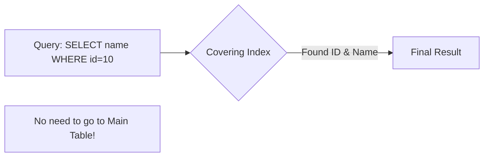

# 🚀 Index Optimization: Advanced Strategies
> **Objective:** Master advanced indexing techniques like Covering Indexes, Partial Indexes, and Multi-column Indexes to achieve sub-millisecond query performance | **Language:** Hinglish | **Standard:** 2026 Expert Framework

---

## 🧭 1. Beginner-Friendly Hinglish Explanation
Index Optimization (Advanced) ka matlab hai "Standard index se aage badhkar 'Special' shortcuts banana".

- **The Problem:** Normal index ek column par hota hai. Par aapki queries complex hain (Multiple filters, sorting, specifically needed columns). Ek normal index vahan fail ho sakta hai.
- **The Advanced Solutions:** 
  1. **Composite Index:** Do ya teen columns ka ek hi index. (e.g., Search by `First Name` AND `Last Name`).
  2. **Covering Index:** Index mein data bhi chhupa do takki database ko main table ko touch hi na karna pade (**Index Only Scan**).
  3. **Partial Index:** Sirf un rows ka index banao jo important hain (e.g., `WHERE status = 'active'`). Isse index ka size chota rehta hai.
- **Intuition:** Normal index "Phone Book" jaisa hai. Advanced index ek "VIP List" jaisa hai jo na sirf naam batata hai, balki unka "Phone Number" aur "Table Number" bhi batata hai takki aapko kahin aur na dekhna pade.

---

## 🧠 2. Deep Technical Explanation
### 1. Composite Indexes (Multi-Column):
The order of columns matters! `(last_name, first_name)` is great for searching by `last_name` OR `both`. But it's useless for searching by `first_name` alone (**Left-to-Right Rule**).

### 2. Covering Indexes (The `INCLUDE` clause):
By adding extra columns to an index (not for searching, but for data retrieval), you can eliminate the "Heap Fetch" step.
- `CREATE INDEX idx_user_email ON users(email) INCLUDE (name);`
- When you `SELECT name WHERE email = '...'`, the DB gets everything from the index.

### 3. Partial Indexes (Space Saving):
If $90\%$ of your data is "Processed" and you only query "Pending" data, why index the $90\%$?
- `CREATE INDEX idx_pending_orders ON orders(id) WHERE status = 'pending';`

---

## 🏗️ 3. Database Diagrams (Covering Index Path)


---

## 💻 4. Query Execution Examples (Postgres)
```sql
-- 1. Composite Index (Left-Prefix rule)
CREATE INDEX idx_orders_user_date ON orders(user_id, order_date);
-- Good for: user_id only, OR (user_id + order_date)
-- Bad for: order_date only.

-- 2. Covering Index
CREATE INDEX idx_products_price ON products(price) INCLUDE (title, stock);
-- SELECT title, stock FROM products WHERE price < 100; --> Index Only Scan!

-- 3. Partial Index
CREATE INDEX idx_active_users_email ON users(email) WHERE is_active = true;
-- Index size is much smaller, making it faster to load in RAM.
```

---

## 🌍 5. Real-World Production Examples
- **Reporting Dashboard:** Using Covering Indexes to show "Total Sales per Month" without scanning the heavy `Orders` table.
- **Maintenance Jobs:** Using Partial Indexes on a `last_processed_at` column to find data that needs cleanup.
- **UUID Search:** Using an index with `INCLUDE` to fetch a user's `ID` when searching by a 36-character UUID string.

---

## ❌ 6. Failure Cases
- **Over-Indexing:** Adding 20 indexes to a table. Now every `INSERT` takes 1 second because the DB has to update 20 trees. **Fix: Audit and remove unused indexes.**
- **Index Intersection:** Having 2 separate indexes on `name` and `age`. The DB might try to "Combine" them at runtime, which is slower than one **Composite Index** on `(name, age)`.
- **Low Cardinality:** Indexing a column like `Gender` or `Boolean`. The DB will likely ignore it and do a Full Scan because the index doesn't filter enough rows.

---

## 🛠️ 7. Debugging Guide
| Tool | Action | Goal |
| :--- | :--- | :--- |
| **`pg_stat_user_indexes`** | Check `idx_scan` | Find indexes that have `0` scans (Delete them!). |
| **`EXPLAIN`** | Check `Index Only Scan` | Confirm if your Covering Index is working as expected. |

---

## ⚖️ 8. Tradeoffs
- **Covering Index (Super Fast Reads / Larger Disk Space / Slower Writes).**

---

## 🛡️ 9. Security Concerns
- **Index Data Exposure:** Even if a user doesn't have `SELECT` permission on a table, if they have access to an index, they might be able to infer the data stored in it.

---

## 📈 10. Scaling Challenges
- **Building Indexes on Large Tables:** Running `CREATE INDEX` on a 1TB table will lock it for hours. **Fix: Use `CREATE INDEX CONCURRENTLY` (Postgres) to build it in the background.**

---

## ✅ 11. Best Practices
- **Follow the 'Left-to-Right' rule for composite indexes.**
- **Use `CONCURRENTLY` for building indexes on live production tables.**
- **Remove unused indexes regularly.**
- **Keep index columns small and simple.**

---

## ⚠️ 13. Common Mistakes
- **Indexing every column "just in case".**
- **Wrong order in composite indexes.**

---

## 📝 14. Interview Questions
1. "What is a Covering Index?"
2. "Explain the Left-Prefix rule in Composite Indexes."
3. "When should you use a Partial Index?"

---

## 🚀 15. Latest 2026 Production Database Patterns
- **Invisible Indexes:** (MySQL/Oracle) Marking an index as "Invisible" to see if performance drops before actually deleting it.
- **Computed/Functional Indexes:** Indexing the result of an expression like `lower(email)` to make case-insensitive searches fast.
漫
