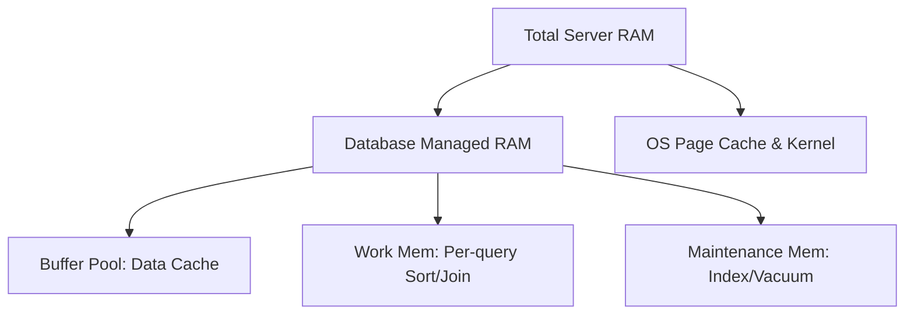

# 🧠 Memory and Cache Tuning: Feeding the Beast
> **Objective:** Master the critical memory settings of a database (Buffer Pool, Shared Buffers, Work Mem) to ensure maximum throughput and minimum disk I/O | **Language:** Hinglish | **Standard:** 2026 Expert Framework

---

## 🧭 1. Beginner-Friendly Hinglish Explanation
Memory and Cache Tuning ka matlab hai "Database ke RAM ka sahi istemal".

- **The Problem:** Database RAM ka bhuka hota hai. Agar aapne use sahi RAM nahi diya, toh wo baar-baar disk par jayega (slow). Par agar aapne zyada RAM de diya, toh OS crash ho sakta hai.
- **The Solution:** Humein key settings ko adjust karna hai:
  1. **Buffer Pool / Shared Buffers:** Data ko cache karne ke liye. (Sabse bada part).
  2. **Work Mem:** Sorting aur Joins ke liye. (Har query ke liye alag se).
  3. **Maintenance Mem:** Index building aur Vacuum ke liye.
- **Intuition:** Ye ek "Chef" jaisa hai. Chef ko ek bada "Counter" (Buffer Pool) chahiye saaman rakhne ke liye, aur har dish ke liye ek "Chopping Board" (Work Mem) chahiye. Agar counter chota hai toh Chef baar-baar fridge (Disk) jayega.

---

## 🧠 2. Deep Technical Explanation
### 1. The Buffer Pool (The Main Cache):
This is where the DB stores the most recently used 8KB data pages.
- **Target:** High "Cache Hit Ratio" ($>95\%$).
- **Setting:** `innodb_buffer_pool_size` (MySQL) or `shared_buffers` (Postgres).
- **Rule of thumb:** Set to $70-80\%$ of total RAM on a dedicated server.

### 2. Work Mem (The Query Workspace):
Used for `ORDER BY`, `DISTINCT`, and `JOIN`.
- If a query needs more memory than `work_mem`, it will "Spill to Disk" (creating a temporary file), which is $100x$ slower.
- **Danger:** This is *per connection*. If you have 100 connections and `work_mem` is 100MB, you could use 10GB RAM!

### 3. OS Page Cache:
Modern DBs rely on the Linux kernel's cache too. You must leave some RAM for the OS ($20-25\%$).

---

## 🏗️ 3. Database Diagrams (The Memory Hierarchy)


---

## 💻 4. Query Execution Examples (Tuning Commands)
```sql
-- 1. Checking Postgres memory settings
SHOW shared_buffers; -- e.g., '4GB'
SHOW work_mem;       -- e.g., '4MB'

-- 2. Changing work_mem for a specific heavy query session
SET work_mem = '64MB';
SELECT * FROM large_table ORDER BY expensive_column;
-- This prevents the query from writing to disk.

-- 3. Checking Cache Hit Ratio
SELECT 
  sum(heap_blks_hit) / (sum(heap_blks_hit) + sum(heap_blks_read)) AS ratio
FROM pg_statio_user_tables;
```

---

## 🌍 5. Real-World Production Examples
- **SaaS Platform:** Increased `work_mem` from 4MB to 32MB, and suddenly all complex reports that used to take 2 minutes started finishing in 10 seconds.
- **E-commerce:** During a sale, the "Cache Hit Ratio" dropped to 70%. The DB was dying. **Fix: Vertical scale the server to 128GB RAM and increase Buffer Pool.**

---

## ❌ 6. Failure Cases
- **The OOM Killer (Out of Memory):** You set `work_mem` too high. 500 users run a sort query at once. The Linux kernel sees 0% free RAM and "Kills" the database process to save itself.
- **Double Buffering:** Setting Buffer Pool too small, so the DB relies on OS cache. Data is now stored in RAM twice (once in DB, once in OS). This is a waste of memory.
- **Cold Starts:** After a restart, the cache is empty. The DB is slow for the first 15 minutes. **Fix: Use 'pg_prewarm' or 'innodb_buffer_pool_dump_at_shutdown'.**

---

## 🛠️ 7. Debugging Guide
| Problem | Diagnostic | Solution |
| :--- | :--- | :--- |
| **High Disk Reads** | Low Cache Hit Ratio | Increase `shared_buffers` or `innodb_buffer_pool_size`. |
| **Temporary Files in Logs** | `work_mem` spill | Increase `work_mem` for the offending queries. |
| **DB Crashes randomly** | Check `dmesg` for 'OOM' | Reduce memory settings or add more physical RAM. |

---

## ⚖️ 8. Tradeoffs
- **Large Memory (Fast / Expensive / Risk of OOM)** vs **Small Memory (Slow / Cheap / Safe).**

---

## 🛡️ 9. Security Concerns
- **Sensitive Data in RAM:** Memory dumps can expose plain-text data. **Fix: Use 'Memory Encryption' on modern CPUs (AMD SME / Intel TME).**

---

## 📈 10. Scaling Challenges
- **Memory Contention:** On servers with 128+ CPU cores, a single large Buffer Pool can become a bottleneck because of "Lock Contention". **Fix: Use multiple 'Buffer Pool Instances' (MySQL).**

---

## ✅ 11. Best Practices
- **Monitor RAM usage constantly.**
- **Leave $25\%$ of RAM for the OS.**
- **Start with small `work_mem` and increase only for specific heavy queries.**
- **Use 'Huge Pages' (Linux)** to improve memory management performance for large DBs.

---

## ⚠️ 13. Common Mistakes
- **Setting Buffer Pool to $100\%$ of RAM.**
- **Assuming that "More RAM" always fixes everything** (sometimes the problem is just a missing index).

---

## 📝 14. Interview Questions
1. "What is a 'Cache Hit Ratio' and what's a good target?"
2. "Difference between `shared_buffers` and `work_mem`?"
3. "How do you prevent a database from crashing due to Out of Memory (OOM)?"

---

## 🚀 15. Latest 2026 Production Database Patterns
- **Direct I/O:** Modern engines (like ScyllaDB) bypassing the OS page cache entirely to have full control over every byte in RAM.
- **Tiered Memory (CXL):** Using new high-speed hardware interconnects (CXL) to add Terabytes of external RAM to a database server at near-native speeds.
漫
