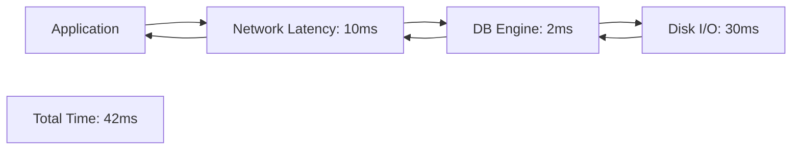

# ⚡ Performance Basics: The Speed Checklist
> **Objective:** Master the core principles of database performance—how to measure it, what to look for, and the first steps to fixing a slow system | **Language:** Hinglish | **Standard:** 2026 Expert Framework

---

## 🧭 1. Beginner-Friendly Hinglish Explanation
Performance Basics ka matlab hai "Database ko fast banane ki pehli sidhi".

- **The Problem:** Site slow hai. Har koi keh raha hai "Database slow hai". Par kya cheez slow hai? Query? Network? Disk?
- **The Solution:** Humein 3 cheezon ko monitor karna hai:
  1. **Latency:** Ek query kitna time le rahi hai? (Target: < 50ms).
  2. **Throughput:** Ek second mein kitni queries handle ho rahi hain?
  3. **Utilization:** CPU, RAM aur Disk kitna busy hain?
- **The "Low Hanging Fruit":** $80\%$ performance problems sirf 2 cheezon se solve hoti hain: **Missing Indexes** aur **Connection Management**.
- **Intuition:** Ye ek "Gadi ki service" jaisa hai. Pehle check karo tel (RAM) sahi hai ya nahi, aur phir engine (Queries) ki tuning karo.

---

## 🧠 2. Deep Technical Explanation
### 1. The 4 Golden Signals:
- **Latency:** Time spent waiting for a response.
- **Traffic:** Demand placed on the system (Queries per second).
- **Errors:** Rate of requests that fail.
- **Saturation:** How "Full" your resources are. (If CPU is 90%, latency will increase exponentially).

### 2. IOPS vs Throughput:
- **IOPS (Input/Output Operations Per Second):** How many small "Read/Write" operations the disk can do. (Crucial for OLTP/Apps).
- **Throughput:** How much total data (MB/s) can be moved. (Crucial for Analytics/Reports).

### 3. The Performance Hierarchy:
1. **Query Level:** Best way to fix performance (Rewriting SQL).
2. **Database Level:** Tuning settings like Buffer Pool.
3. **OS Level:** Kernel settings and disk management.
4. **Hardware Level:** Buying a bigger server (Last resort).

---

## 🏗️ 3. Database Diagrams (The Latency Breakdown)


---

## 💻 4. Query Execution Examples (Diagnostic SQL)
```sql
-- 1. Checking the top slow queries
-- (Postgres example)
SELECT query, total_exec_time, calls, mean_exec_time 
FROM pg_stat_statements 
ORDER BY total_exec_time DESC 
LIMIT 10;

-- 2. Checking if your CPU is busy with 'Sequential Scans'
-- This usually means you are missing an index.
SELECT relname, seq_scan, seq_tup_read 
FROM pg_stat_user_tables 
ORDER BY seq_tup_read DESC;
```

---

## 🌍 5. Real-World Production Examples
- **E-commerce:** A 100ms delay in database response can lead to a 1% drop in sales. Performance is directly related to money.
- **Twitter:** They spend millions on "Performance Tuning" to ensure your feed loads in milliseconds, even during big events like the World Cup.

---

## ❌ 6. Failure Cases
- **Over-tuning:** Changing 5 settings at once. Now the DB is faster, but you don't know which setting fixed it, or if one of them will cause a crash tomorrow. **Fix: Change only 1 thing at a time.**
- **Ignoring the Network:** The query takes 1ms in the DB, but 100ms to reach the user. Optimization won't help; you need a CDN or local region.
- **Benchmark Fallacy:** Testing with 100 rows and thinking it will work the same with 100 million.

---

## 🛠️ 7. Debugging Guide
| Tool | Action | Goal |
| :--- | :--- | :--- |
| **`EXPLAIN ANALYZE`** | Run on query | Find where the time is being spent. |
| **`iotop` / `iostat`** | Check Disk | See if the disk is at 100% load. |
| **`top` / `htop`** | Check CPU | Find which process is eating the CPU. |

---

## ⚖️ 8. Tradeoffs
- **Write Speed** vs **Read Speed.** (Adding an index makes reads faster but writes slower).

---

## 🛡️ 9. Security Concerns
- **Timing Attacks:** An attacker can guess if a user exists by measuring if the DB takes 10ms vs 12ms to respond (due to internal checks).

---

## 📈 10. Scaling Challenges
- **The "Law of Diminishing Returns":** Going from 10s to 1s is easy. Going from 10ms to 1ms can cost millions in hardware and engineering time.

---

## ✅ 11. Best Practices
- **Measure first, then optimize.**
- **Set a "Performance Budget"** (e.g., No query should take more than 100ms).
- **Use Caching** (Redis) for the most frequent reads.
- **Optimize the schema** before buying more CPU.

---

## ⚠️ 13. Common Mistakes
- **Applying "Best Practice" settings from the internet** without understanding your own data.
- **Not checking for 'Database Bloat'** (Dead rows slowing down everything).

---

## 📝 14. Interview Questions
1. "How do you identify a slow query?"
2. "What is the difference between Latency and Throughput?"
3. "What is the first thing you check if a database is slow?"

---

## 🚀 15. Latest 2026 Production Database Patterns
- **AI-Powered Tuning:** Databases that use Machine Learning to automatically adjust their own memory and index settings based on real-time traffic.
- **eBPF Monitoring:** Using ultra-low-level kernel probes to see exactly how much time a query spends in the "Network Buffer" vs the "Engine".
漫
