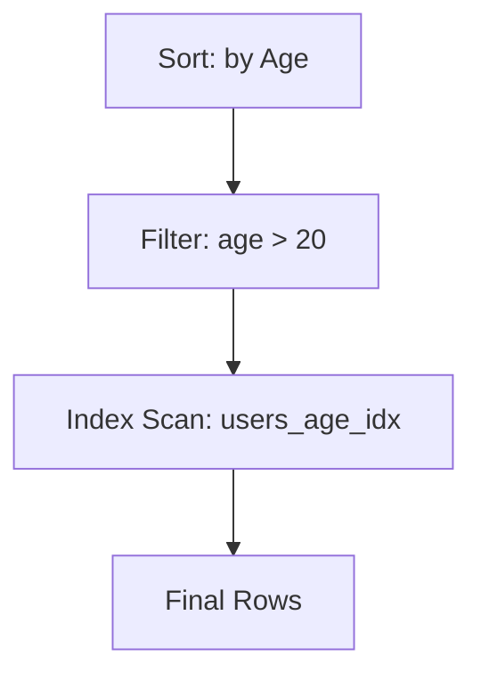

# 🔍 Query Plan Deep Dive: Thinking Like the Optimizer
> **Objective:** Master the art of reading and interpreting Query Execution Plans to understand exactly how the database engine executes your SQL | **Language:** Hinglish | **Standard:** 2026 Expert Framework

---

## 🧭 1. Beginner-Friendly Hinglish Explanation
Query Plan Deep Dive ka matlab hai "Database ke 'Dimaag' ko padhna".

- **The Problem:** Aapne query likhi `SELECT * FROM users WHERE age > 20`. Aapko laga ye fast hai, par ye 5 second le rahi hai. Kyun?
- **The Solution:** `EXPLAIN` command.
- **What is a Query Plan?** Jab aap SQL bhejte hain, toh database ka **Optimizer** ek "Map" banata hai ki:
  - Pehle "Users" table ko scan karo.
  - Phir "Age" filter karo.
  - Phir results sort karo.
- **The Goal:** Humein ye dekhna hai ki Optimizer "Full Table Scan" (slow) kar raha hai ya "Index Scan" (fast).
- **Intuition:** Ye ek "Google Maps" route jaisa hai. Aapne destination dala, aur Maps ne rasta dikhaya. Query Plan batata hai ki database "Highways" (Indexes) use kar raha hai ya "Galiyan" (Full Scan).

---

## 🧠 2. Deep Technical Explanation
### 1. The Cost Model:
The Optimizer assigns a "Cost" to every possible way of running the query. It chooses the path with the lowest cost.
- **Cost units:** Usually based on disk page reads and CPU cycles.

### 2. Common Plan Operators:
- **Seq Scan (Sequential Scan):** Reading the entire table. (Bad for large tables!).
- **Index Scan:** Using an index to find specific rows. (Good).
- **Index Only Scan:** The index has all the data we need; no need to touch the main table at all! (Best).
- **Nested Loop Join:** Joining tables by looping through one and searching the other. (Good for small sets).
- **Hash Join:** Building a hash map in RAM for joining. (Good for large sets).

### 3. Explain vs Explain Analyze:
- **EXPLAIN:** Shows the "Estimated" plan (The DB's guess).
- **EXPLAIN ANALYZE:** Actually **runs** the query and shows the "Actual" time and rows found. (Much more accurate).

---

## 🏗️ 3. Database Diagrams (The Execution Tree)


---

## 💻 4. Query Execution Examples (Postgres)
```sql
-- 1. Get the plan for a simple query
EXPLAIN ANALYZE SELECT * FROM orders WHERE user_id = 500;

-- 2. Reading the output:
-- Seq Scan on orders  (cost=0.00..169.00 rows=100 width=45) (actual time=0.015..0.018 rows=100 loops=1)
-- Filter: (user_id = 500)
-- Rows Removed by Filter: 9900
-- Total runtime: 0.045 ms

-- Analysis: 
-- "Seq Scan" is bad! 9900 rows were removed by filter. 
-- Fix: CREATE INDEX idx_orders_user_id ON orders(user_id);
```

---

## 🌍 5. Real-World Production Examples
- **Database Drift:** A query was fast for 6 months, but suddenly became slow. `EXPLAIN` showed that the Optimizer stopped using the index because the table became too large and the "Statistics" were old. **Fix: Run `ANALYZE` to update stats.**
- **Join Re-ordering:** Changing the order of tables in a 5-table join based on the Query Plan reduced execution time from 10s to 50ms.

---

## ❌ 6. Failure Cases
- **Stale Statistics:** The DB thinks there are 100 rows, but there are 10 million. It chooses the wrong plan.
- **Function on Indexed Column:** `WHERE YEAR(created_at) = 2024` will ignore the index on `created_at`. The plan will show a `Seq Scan`. **Fix: `WHERE created_at >= '2024-01-01'`.**
- **Implicit Casting:** Comparing a string column with a number (`WHERE string_id = 123`) can disable the index.

---

## 🛠️ 7. Debugging Guide
| Keyword in Plan | Meaning | Solution |
| :--- | :--- | :--- |
| **Seq Scan** | Entire table was read | Add an index. |
| **Materialize** | Data was copied to temp memory | The query is complex; try breaking it down or adding indexes for Joins. |
| **External Merge Disk** | RAM was too small for sorting | Increase `work_mem` or add an index that is already sorted. |

---

## ⚖️ 8. Tradeoffs
- **Optimization Time** vs **Execution Time.** (The DB doesn't spend 5 minutes finding the "Perfect" plan; it finds a "Good enough" plan in milliseconds).

---

## 🛡️ 9. Security Concerns
- **Plan Leakage:** In some systems, the query plan might reveal information about hidden rows or table structures to an unauthorized user.

---

## 📈 10. Scaling Challenges
- **Parallel Query Plan:** In modern DBs, the plan might show `Parallel Seq Scan` where 4 workers read the table together. This is fast but uses $4x$ more CPU.

---

## ✅ 11. Best Practices
- **Always use `EXPLAIN ANALYZE` for debugging.**
- **Look for the highest "Cost" or "Time" node in the tree.**
- **Update your Statistics regularly (`ANALYZE`).**
- **Prefer 'Index Only Scans' for performance-critical queries.**

---

## ⚠️ 13. Common Mistakes
- **Only looking at the "Cost" (Estimate) instead of "Actual Time".**
- **Ignoring the "Rows Removed by Filter" stat.**

---

## 📝 14. Interview Questions
1. "Difference between Seq Scan and Index Scan?"
2. "How do you read a Query Plan tree (Top-down or Bottom-up)?" (Bottom-up).
3. "What causes the optimizer to ignore a perfectly good index?"

---

## 🚀 15. Latest 2026 Production Database Patterns
- **Adaptive Query Execution:** The database changes the plan *while the query is running* if it realizes the initial estimates were wrong.
- **Visual Explain Tools:** Modern IDEs (like DBeaver or PGAdmin) showing the query plan as a color-coded heat map to instantly find the "Hot" nodes.
漫
