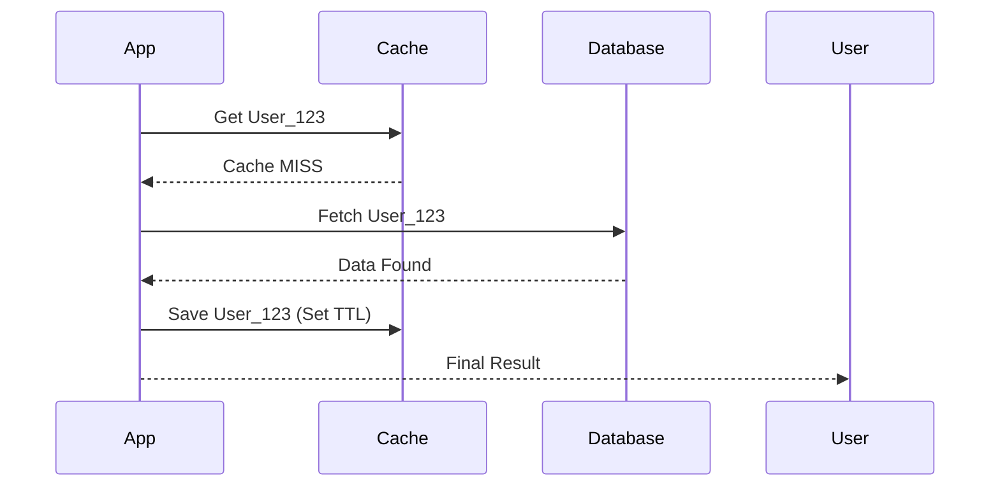

# 🧠 Caching Strategies and Eviction: The Art of Speed
> **Objective:** Master the patterns of data caching (Cache-Aside, Write-Through) and memory management (Eviction Policies) to build resilient, ultra-fast applications | **Language:** Hinglish | **Standard:** 2026 Expert Framework

---

## 🧭 1. Beginner-Friendly Hinglish Explanation
Caching Strategies aur Eviction ka matlab hai "Data ko kab, kaise aur kitni der tak cache mein rakhna hai".

- **The Problem:** Database slow hai. Humein data ko Redis (Cache) mein rakhna hai. Par challenge ye hai ki:
  - Cache mein naya data kaise aayega?
  - Agar database update hua, toh cache ko kaise pata chalega?
  - Agar Redis ki RAM full ho gayi, toh kaunsa data delete hoga?
- **The Solution:** Algorithms aur Patterns.
- **Intuition:** Ye ek "Library" jaisa hai. Sabse zyada padhi jane wali books "Front Desk" (Cache) par hoti hain. Jab koi nayi popular book aati hai, toh purani wali ko hata diya jata hai (Eviction).

---

## 🧠 2. Deep Technical Explanation

### 1. Caching Strategies:
- **Cache-Aside (Lazy Loading):** App pehle cache check karti hai. Agar data nahi hai (**Cache Miss**), toh DB se leti hai aur cache mein save kar deti hai. (Most Common).
- **Write-Through:** App data ko cache aur DB dono mein ek saath likhti hai. (Consistent, but slow writes).
- **Write-Behind (Write-Back):** App sirf cache mein likhti hai, aur cache background mein DB ko update karta hai. (Fastest writes, but risk of data loss).

### 2. Eviction Policies (When RAM is full):
- **LRU (Least Recently Used):** Jo data sabse purana "Last used" hai, use hata do. (Most Common).
- **LFU (Least Frequently Used):** Jise sabse kam baar use kiya gaya hai, use hata do.
- **TTL (Time To Live):** Har key ki ek expiry date hoti hai.

---

## 🏗️ 3. Database Diagrams (Cache-Aside Pattern)


---

## 💻 4. Query Execution Examples (Implementing Logic)
```javascript
// Pseudo-code for Cache-Aside
async function getUser(id) {
    // 1. Try Cache
    let user = await redis.get(`user:${id}`);
    
    if (user) {
        console.log("CACHE HIT");
        return JSON.parse(user);
    }
    
    // 2. Cache MISS -> Go to DB
    console.log("CACHE MISS");
    user = await db.users.findUnique({ where: { id } });
    
    // 3. Save to Cache for 1 hour
    if (user) {
        await redis.set(`user:${id}`, JSON.stringify(user), 'EX', 3600);
    }
    
    return user;
}
```

---

## 🌍 5. Real-World Production Examples
- **Twitter Feed:** Using **Cache-Aside** to store the latest tweets of a user.
- **Banking Balance:** Using **Write-Through** to ensure the balance in the cache is NEVER different from the database.
- **Log Analytics:** Using **Write-Behind** to buffer thousands of logs in Redis and only writing to a heavy DB (like ClickHouse) every 1 minute.

---

## ❌ 6. Failure Cases
- **Cache Stampede (Thundering Herd):** A popular key (e.g., "Trending_News") expires. Suddenly 10,000 users hit the Database at the same time. **Fix: Use 'Cache Locking' or 'Randomized TTL'.**
- **Cache Penetration:** An attacker queries for IDs that don't exist in the DB (e.g., `-1`). Every request hits the DB. **Fix: Use a 'Bloom Filter' or cache the 'NULL' value.**
- **Stale Data:** You updated the DB but forgot to delete the Cache. User sees old price. **Fix: Use 'Cache Invalidation' triggers.**

---

## 🛠️ 7. Debugging Guide
| Problem | Reason | Solution |
| :--- | :--- | :--- |
| **Database is dying** | Cache Hit Ratio is low | Check if your TTL is too short or if your cache keys are inconsistent. |
| **Out of Memory (OOM)** | No eviction policy | Set `maxmemory-policy allkeys-lru` in `redis.conf`. |

---

## ⚖️ 8. Tradeoffs
- **High Consistency (Write-Through)** vs **High Performance (Write-Behind).**

---

## ✅ 11. Best Practices
- **Always monitor your Cache Hit Ratio** (Aim for $>80\%$).
- **Use 'Jitter' (Randomness)** in your TTL to prevent all keys from expiring at the same time.
- **Cache small chunks** rather than entire complex objects.
- **Design a clear Invalidation strategy.**

漫
---

## 📝 14. Interview Questions
1. "Explain the Cache-Aside pattern."
2. "What is a Cache Stampede and how do you prevent it?"
3. "Difference between LRU and LFU eviction?"

---

## 🚀 15. Latest 2026 Production Database Patterns
- **Probabilistic Caching:** Using AI to predict which data will be needed next and "Pre-warming" the cache before the user even asks for it.
- **Sidecar Caching:** Running a small Redis instance as a sidecar container in every Kubernetes pod for zero-latency local caching.
漫
