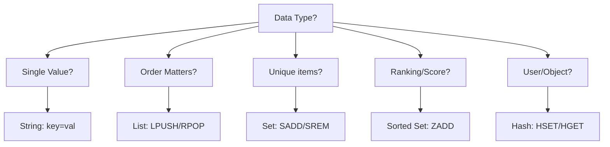

# ⚡ Redis Data Types and Usage: Beyond Key-Value
> **Objective:** Master the versatile data structures of Redis, from simple Strings to advanced Sorted Sets and HyperLogLogs, for ultra-low latency applications | **Language:** Hinglish | **Standard:** 2026 Expert Framework

---

## 🧭 1. Beginner-Friendly Hinglish Explanation
Redis Data Types ka matlab hai "Redis sirf ek simple key-value store nahi hai".

- **The Philosophy:** Redis ko log sirf "Cache" samjhte hain, par ye ek **In-Memory Data Structure Store** hai.
- **Why use it?** 
  - **Speed:** Sara data RAM mein hota hai ($<1ms$ response).
  - **Versatility:** Aap sirf string nahi, balki Lists, Sets, aur Maps bhi store kar sakte hain.
- **Intuition:** Redis ek "Super-fast Notebook" jaisa hai jisme aap tables bana sakte hain, lists likh sakte hain, aur rankings track kar sakte hain, aur sab kuch turant mil jata hai.

---

## 🧠 2. Deep Technical Explanation

### 1. The Core Data Types:
- **Strings:** The basics. Can store text, numbers, or even images (binary).
- **Lists:** Ordered list of strings. Perfect for "Latest 10 Tweets".
- **Sets:** Unordered unique items. Great for "Unique Visitors" or "Friend List".
- **Hashes:** Key-value pairs inside a key. Best for "User Profile" (name, age, city).
- **Sorted Sets (ZSETs):** Sets where every item has a **Score**. Redis keeps them sorted. King of "Leaderboards".

### 2. Advanced Types:
- **Bitmaps:** Efficient way to store Booleans (True/False) for millions of users.
- **HyperLogLog:** Probabilistic data structure to count billions of unique items with very little memory.

---

## 🏗️ 3. Database Diagrams (Which Type to Choose?)


---

## 💻 4. Query Execution Examples (Redis Commands)
```bash
# 1. Strings: Session Storage
SET session:user:123 "active" EX 3600  # Expires in 1 hour

# 2. Hashes: User Profile
HSET user:123 name "Sameer" age 25 city "Delhi"
HGETALL user:123

# 3. Sorted Sets: Gaming Leaderboard
ZADD leaderboard 100 "Player_A"
ZADD leaderboard 150 "Player_B"
ZRANGE leaderboard 0 -1 WITHSCORES  # Get all ranked

# 4. Lists: Task Queue
LPUSH tasks "Email_User_1"
RPOP tasks  # Process task
```

---

## 🌍 5. Real-World Production Examples
- **Real-time Leaderboards:** Gaming apps use **Sorted Sets** to update global rankings in milliseconds.
- **Session Management:** Storing login tokens with an **Expiry (TTL)** so they automatically disappear after 24 hours.
- **Rate Limiting:** Preventing a user from hitting an API more than 10 times per minute using **Strings** and `INCR`.

---

## ❌ 6. Failure Cases
- **Big Keys:** Storing a 500MB list in a single Redis key will block the server (Redis is single-threaded!). **Fix: Keep keys small (<1MB).**
- **Memory Exhaustion:** Since it's all in RAM, if you run out of memory, Redis will crash or delete data. **Fix: Set a `maxmemory-policy`.**

---

## 🛠️ 7. Debugging Guide
| Problem | Reason | Solution |
| :--- | :--- | :--- |
| **High Latency** | Using slow commands (KEYS *) | Use `SCAN` instead of `KEYS`. |
| **Data Disappearing** | TTL expired / Memory limit | Check the `EXPIRE` time and `maxmemory-policy`. |

---

## ⚖️ 8. Tradeoffs
- **Redis (Ultra Fast / Data Structure Rich)** vs **Memcached (Simpler / Multi-threaded but only Strings).**

---

## ✅ 11. Best Practices
- **Use meaningful namespaces** (e.g., `user:123:profile`).
- **Always set a TTL (Time-To-Live)** for cache data.
- **Avoid slow commands** like `KEYS *` or `HGETALL` on massive hashes.
- **Use Hashes instead of multiple Strings** to save memory.

漫
---

## 📝 14. Interview Questions
1. "What makes Redis different from a simple key-value store?"
2. "How do you implement a leaderboard in Redis?"
3. "Is Redis single-threaded? If yes, how is it so fast?" (Uses IO Multiplexing).

---

## 🚀 15. Latest 2026 Production Database Patterns
- **Redis JSON:** Using the RedisJSON module to store and query JSON documents with near-zero latency.
- **Redis Stack:** Combining Redis with Search, Graph, and Vector capabilities in a single unified engine.
漫
