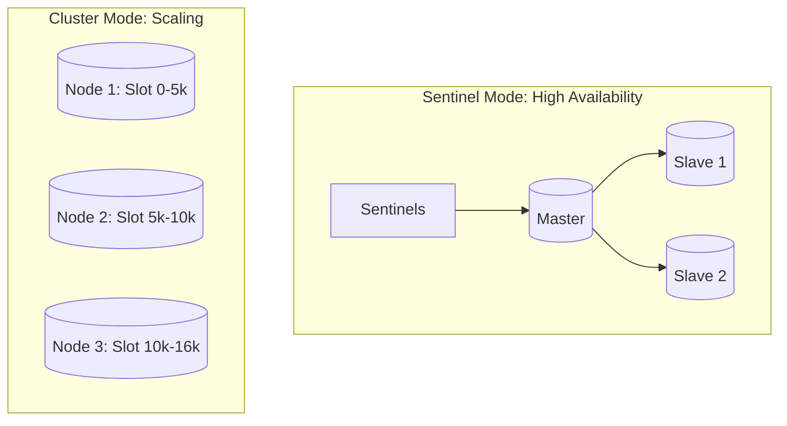

# 🔒 Redis Persistence and HA: Making Memory Permanent
> **Objective:** Master how to ensure your Redis data survives restarts (Persistence) and server failures (High Availability) using RDB, AOF, Sentinels, and Clusters | **Language:** Hinglish | **Standard:** 2026 Expert Framework

---

## 🧭 1. Beginner-Friendly Hinglish Explanation
Redis Persistence aur HA ka matlab hai "Data ko RAM se disk par lana aur system ko kabhi band na hone dena".

- **The Problem:** Redis sara data RAM mein rakhta hai. Agar server restart hua, toh data khatam. Agar server crash hua, toh app band.
- **The Solution:** 
  - **Persistence:** Data ko regular intervals par disk par save karna.
  - **HA (High Availability):** Ek se zyada Redis nodes rakhna takki agar ek mare toh dusra sambhaal le.
- **Intuition:** 
  - **Persistence** ek "Diary" jaisa hai jahan aap apna din likhte hain takki agle din yaad rahe. 
  - **HA** ek "Inverter/UPS" jaisa hai jo light jane par turant chalu ho jata hai.

---

## 🧠 2. Deep Technical Explanation

### 1. Persistence Options:
- **RDB (Redis Database):** Snapshot of data at specific intervals (e.g., every 5 mins). (Fast recovery, but risk of losing last few mins of data).
- **AOF (Append Only File):** Records every single write operation. (Zero data loss, but slow recovery and huge file size).
- **Hybrid (RDB + AOF):** The 2026 standard. Use RDB for fast boot and AOF for data integrity.

### 2. High Availability (Sentinels):
Redis Sentinels monitor your master. If the master dies, they automatically promote a slave to master and tell your app the new address.

### 3. Redis Cluster:
Scaling horizontally. It splits your data across multiple master nodes using **Hash Slots** (16,384 slots).

---

## 🏗️ 3. Database Diagrams (Redis Cluster vs Sentinel)


---

## 💻 4. Query Execution Examples (Configuring Durability)
```bash
# 1. RDB Config (Save if 100 changes in 60 seconds)
save 60 100

# 2. AOF Config (Record every second)
appendonly yes
appendfsync everysec

# 3. Checking persistence info
redis-cli INFO persistence
```

---

## 🌍 5. Real-World Production Examples
- **Gaming Platform:** Using **RDB** for game state. If it crashes, players can lose 1 minute of progress, which is acceptable for speed.
- **Banking Ledger:** Using **AOF with fsync=always**. No transaction can ever be lost, even if the building loses power.
- **Global App:** Using **Redis Cluster** to handle 10 Million requests per second by splitting the load across 50 nodes.

---

## ❌ 6. Failure Cases
- **AOF Rewriting failure:** If the AOF file becomes too huge and the disk is full, Redis might stop accepting writes. **Fix: Monitor disk usage and enable `auto-aof-rewrite-percentage`.**
- **Split Brain (Sentinel):** Two masters exist because of a network partition. **Fix: Use `min-replicas-to-write` config.**

---

## 🛠️ 7. Debugging Guide
| Problem | Reason | Solution |
| :--- | :--- | :--- |
| **Redis is using 100% CPU** | Background saving (BGSAVE) | Check your disk I/O performance and RDB frequency. |
| **Data loss after restart** | No persistence enabled | Enable RDB or AOF in `redis.conf`. |

---

## ⚖️ 8. Tradeoffs
- **RDB (Performance / Faster Restart)** vs **AOF (Data Safety / Slower Restart).**

---

## ✅ 11. Best Practices
- **Enable both RDB and AOF.**
- **Use Sentinels** for High Availability.
- **Monitor the 'Memory Fragmentation'** ratio.
- **Never run Redis without a 'Max Memory' limit.**

漫
---

## 📝 14. Interview Questions
1. "Difference between RDB and AOF?"
2. "How does Redis Sentinel handle a master failure?"
3. "What is a Hash Slot in Redis Cluster?"

---

## 🚀 15. Latest 2026 Production Database Patterns
- **Active-Active Redis:** Multi-region Redis where you can write in India and read in USA with sub-100ms sync using CRDTs.
- **Redis on NVMe:** Using the latest SSD technology to make Redis "Disk-Persistent" as fast as RAM.
漫
