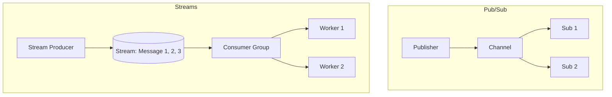

# 📣 Redis as a Message Broker: Pub/Sub and Streams
> **Objective:** Master how to use Redis for asynchronous communication between services using Pub/Sub, Lists, and the high-performance Redis Streams | **Language:** Hinglish | **Standard:** 2026 Expert Framework

---

## 🧭 1. Beginner-Friendly Hinglish Explanation
Redis as a Message Broker ka matlab hai "Redis ko do services ke beech ki 'Chitthi-baazi' ke liye use karna".

- **The Problem:** Ek "Order Service" ko "Email Service" ko batana hai ki order confirm ho gaya. Agar Order Service khud email bhejegi, toh site slow ho jayegi.
- **The Solution:** Messaging.
  - Order Service ek message "Queue" mein daal degi.
  - Email Service use "Listen" karegi aur jab free hogi toh email bhej degi.
- **Intuition:** Ye ek "Radio Station" jaisa hai. Station (Producer) gaana bajata hai, aur jiske paas Radio (Subscriber) hai wo sun leta hai.

---

## 🧠 2. Deep Technical Explanation

### 1. Pub/Sub (Fire and Forget):
- **Publisher:** Sends message to a "Channel".
- **Subscriber:** Listens to the "Channel".
- **Catch:** If the subscriber is offline, the message is **LOST**. Good for real-time chat but bad for critical tasks.

### 2. Lists (Task Queues):
- Use `LPUSH` to add tasks and `RPOP` (or `BRPOP` for blocking) to take them out.
- **Reliable:** The message stays in the list until someone takes it.

### 3. Redis Streams (The Modern Standard):
The 2026 standard for high-performance messaging (Like a mini-Kafka).
- **Persistent:** Messages are saved.
- **Consumer Groups:** Multiple workers can share the load.
- **Acknowledgments (ACK):** Ensures a message is processed successfully.

---

## 🏗️ 3. Database Diagrams (Pub/Sub vs Streams)


---

## 💻 4. Query Execution Examples (Broker Commands)
```bash
# 1. Pub/Sub: Simple broadcast
PUBLISH news "New version released!"
SUBSCRIBE news

# 2. Lists: Reliable Queue
LPUSH email_queue '{"to": "user@ex.com", "body": "Welcome!"}'
BRPOP email_queue 0  # Wait forever for a message

# 3. Redis Streams: Producer
XADD orders * user_id 123 amount 500

# 4. Redis Streams: Consumer Group
XREADGROUP GROUP myGroup worker1 COUNT 1 STREAMS orders >
```

---

## 🌍 5. Real-World Production Examples
- **Real-time Chat:** Using **Pub/Sub** to send messages to all users in a chat room instantly.
- **Background Jobs:** Using **Lists** to handle image processing or sending thousands of emails.
- **Event Sourcing:** Using **Redis Streams** to record every action a user takes (Click, Scroll, Buy) for future analysis.

---

## ❌ 6. Failure Cases
- **Pub/Sub Data Loss:** You sent an important payment notification but the email service was restarting. The message is gone. **Fix: Use Streams or Lists.**
- **Consumer Crash:** A worker took a task from a List but crashed before finishing. The task is lost. **Fix: Use `RPOPLPUSH` (Reliable Queue) or Redis Streams with ACKs.**

---

## 🛠️ 7. Debugging Guide
| Problem | Reason | Solution |
| :--- | :--- | :--- |
| **Messages are piling up** | Workers are slow | Scale up your workers (Consumer Group). |
| **High Memory Usage** | Stream is too long | Use `XTRIM` to delete old messages. |

---

## ⚖️ 8. Tradeoffs
- **Redis Streams (Fast / Simple / NoSQL integration)** vs **RabbitMQ/Kafka (More features / Better for massive, persistent event logs).**

---

## ✅ 11. Best Practices
- **Use Streams for anything critical.**
- **Monitor the 'Queue Length'.**
- **Use Consumer Groups** for horizontal scaling of workers.
- **Implement 'Dead Letter Queues'** for failed messages.

漫
---

## 📝 14. Interview Questions
1. "Difference between Pub/Sub and Redis Streams?"
2. "How do you implement a reliable task queue in Redis?"
3. "What is an ACK in Redis Streams?"

---

## 🚀 15. Latest 2026 Production Database Patterns
- **Serverless Event Bus:** Connecting Redis Streams directly to AWS Lambda for a completely serverless event-driven architecture.
- **Real-time Analytics at the Edge:** Using Redis Streams on edge servers to calculate live traffic stats before sending them to the central DB.
漫
