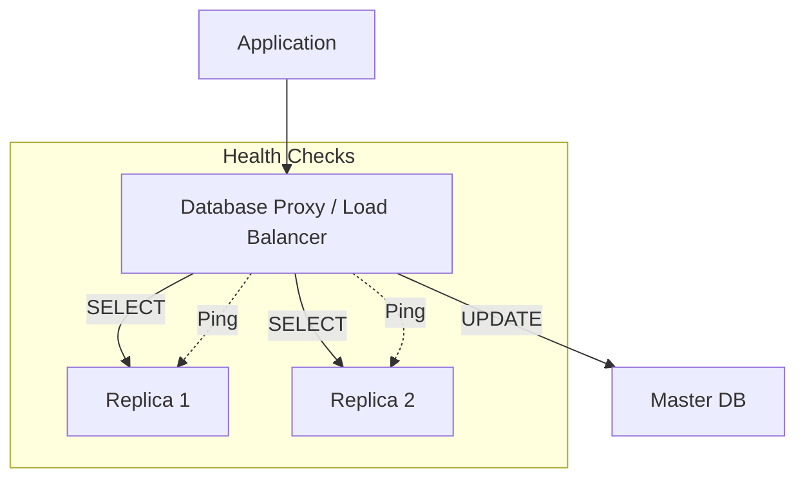

# ⚖️ Database Load Balancing: Distributing the Load
> **Objective:** Master the strategies for distributing database traffic across multiple nodes to ensure high availability, fault tolerance, and optimal performance | **Language:** Hinglish | **Standard:** 2026 Expert Framework

---

## 🧭 1. Beginner-Friendly Hinglish Explanation
Database Load Balancing ka matlab hai "Database ke traffic ko multiple servers par barabari se baantna".

- **The Problem:** Aapke paas 5 Read Replicas hain. Par agar app sirf pehle replica ko hi sara traffic bhej rahi hai, toh wo crash ho jayega aur baaki 4 khali baithe rahenge.
- **The Solution:** Load Balancer.
  - Ye ek "Traffic Police" jaisa hai jo har nayi query ko check karta hai aur use "Khali" server par bhej deta hai.
- **Intuition:** Ye "Bank ki Queue" jaisa hai. Bahar ek guard khada hai jo batata hai ki "Counter 3 khali hai, wahan jao".

---

## 🧠 2. Deep Technical Explanation

### 1. Algorithms:
- **Round Robin:** बारी-बारी से सबको काम दो. (Simple, but doesn't care if a server is already busy).
- **Least Connections:** Jiske paas sabse kam active queries hain, use naya kaam do. (Better).
- **Weight-based:** Agar ek server bada hai (32GB RAM) aur dusra chota (8GB), toh bade wale ko zyada queries bhejo.

### 2. Layers:
- **L4 (Transport Layer):** Simple TCP balancing. Fast but doesn't know what's inside the query.
- **L7 (Application Layer):** Database-aware proxies (like **ProxySQL** or **PgBouncer**). Ye jante hain ki query `SELECT` hai ya `INSERT`.

---

## 🏗️ 3. Database Diagrams (The Load Balancing Stack)


---

## 💻 4. Query Execution Examples (ProxySQL Logic)
```sql
-- ProxySQL Configuration (Example)
-- 1. Defining a Reader Hostgroup (1)
INSERT INTO mysql_servers(hostgroup_id, hostname, port) VALUES (1, 'replica-1', 3306);
INSERT INTO mysql_servers(hostgroup_id, hostname, port) VALUES (1, 'replica-2', 3306);

-- 2. Defining a Writer Hostgroup (0)
INSERT INTO mysql_servers(hostgroup_id, hostname, port) VALUES (0, 'master-1', 3306);

-- 3. Routing Rules
-- All SELECTs to Hostgroup 1
INSERT INTO mysql_query_rules(rule_id, active, match_pattern, destination_hostgroup) 
VALUES (1, 1, '^SELECT.*', 1);

-- All other queries to Hostgroup 0
INSERT INTO mysql_query_rules(rule_id, active, match_pattern, destination_hostgroup) 
VALUES (2, 1, '.*', 0);
```

---

## 🌍 5. Real-World Production Examples
- **Large Social Apps:** Use **HAProxy** or **Keepalived** to ensure the Load Balancer itself doesn't become a single point of failure.
- **Cloud-Native Apps:** Use **AWS ELB (Elastic Load Balancer)** or **GCP Internal Load Balancer** to distribute traffic to their RDS/Cloud SQL clusters.

---

## ❌ 6. Failure Cases
- **The "Sticking" Problem:** A long-running query keeps a connection open, and the LB keeps sending more traffic to that same server. **Fix: Use 'Least Connections' algorithm.**
- **False Health Checks:** The server is "Up" (responds to ping) but the database service is "Down" or "Read-Only". **Fix: Use 'Deep Health Checks' that run a dummy query like `SELECT 1`.**

---

## 🛠️ 7. Debugging Guide
| Problem | Reason | Solution |
| :--- | :--- | :--- |
| **Uneven Traffic** | Sticky sessions or bad algorithm | Switch to 'Least Connections' or tune weights. |
| **"Connection Refused"** | LB is overwhelmed | Increase connection limits or add another LB node. |

---

## ⚖️ 8. Tradeoffs
- **External Proxy (Better Control / Failover)** vs **Direct Connection (Lower Latency / Simpler setup).**

---

## ✅ 11. Best Practices
- **Always use a Database-aware Proxy** for complex clusters.
- **Enable Health Checks** with a frequency of 1-5 seconds.
- **Use 'Warm-up' periods** when adding a new server so it doesn't get flooded instantly.
- **Implement 'Circuit Breakers'** to stop sending traffic to a failing server.

漫
---

## 📝 14. Interview Questions
1. "What is the difference between Round Robin and Least Connections?"
2. "Why is a L7 proxy better for databases than a L4 load balancer?"
3. "How do you handle health checks for a database node?"

---

## 🚀 15. Latest 2026 Production Database Patterns
- **Service Mesh Integration:** Using **Istio** or **Linkerd** to handle database load balancing at the network level between microservices.
- **Geo-aware Balancing:** Automatically routing users to the geographically closest database node to reduce latency.
漫
