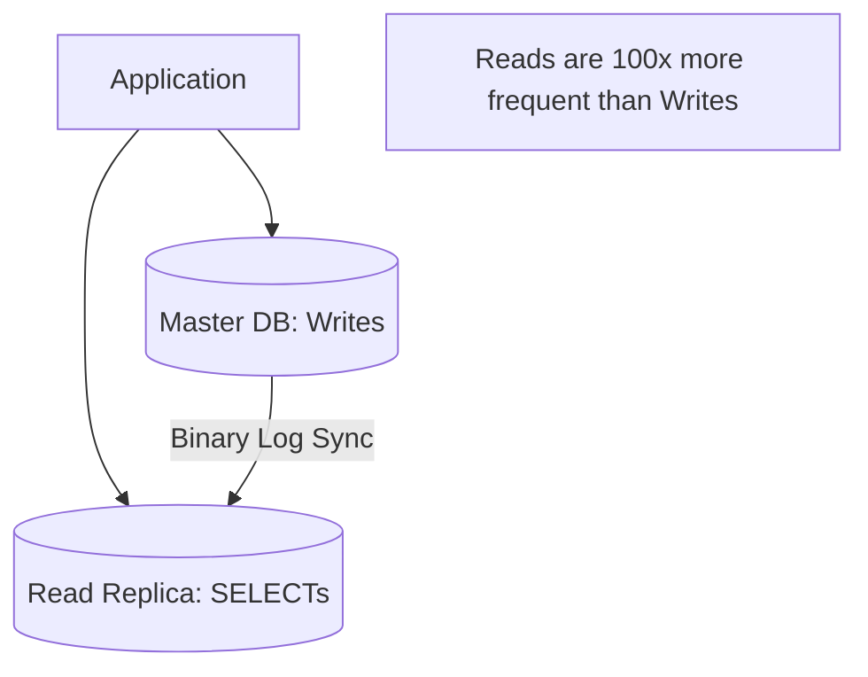

# 📖 Read Replica and Write Split: Boosting Read Throughput
> **Objective:** Master the concept of replicating data for read-only access and implementing Write Splitting in applications to scale read-heavy workloads | **Language:** Hinglish | **Standard:** 2026 Expert Framework

---

## 🧭 1. Beginner-Friendly Hinglish Explanation
Read Replica aur Write Split ka matlab hai "Database ke kaam ko baantna".

- **The Problem:** Ek hi server par "Read" (SELECT) aur "Write" (INSERT/UPDATE) dono ho rahe hain. Jab site par dher saare log aate hain, toh server load nahi jhel pata.
- **The Solution:** 
  1. **Read Replicas:** Main DB ki dher saari "Read-Only" copies banao.
  2. **Write Split:** Application ko batao ki agar data badalna hai toh **Master** ke paas jao, aur agar sirf dekhna hai toh **Replica** ke paas jao.
- **Intuition:** Ye ek "Teacher aur Students" jaisa hai. Teacher (Master) notes likhwayega, aur Students (Replicas) ki copies se baaki log padh sakte hain.

---

## 🧠 2. Deep Technical Explanation

### 1. Asynchronous Replication:
Most replicas are **Asynchronous**.
- Master writes the data -> Success.
- Background process copies data to Replica -> Takes 50ms - 2 seconds.
- **The Risk:** Replication Lag. A user might write their status and then refresh, but the replica doesn't have it yet!

### 2. Implementation: The Proxy vs The App
- **App-level Splitting:** The code has two connections: `masterPool` and `replicaPool`.
- **Proxy-level Splitting:** Using a tool like **MaxScale** or **ProxySQL** that automatically sends SELECTs to replicas and UPDATEs to master.

---

## 🏗️ 3. Database Diagrams (The Write Split Workflow)


---

## 💻 4. Query Execution Examples (Pseudo-code logic)
```javascript
// Database Client with Read/Write Splitting
const db = {
    master: createPool('master-url'),
    replica: createPool('replica-url'),
    
    async query(sql, params) {
        if (sql.startsWith('SELECT')) {
            console.log("Routing to REPLICA");
            return this.replica.execute(sql, params);
        } else {
            console.log("Routing to MASTER");
            return this.master.execute(sql, params);
        }
    }
};

// Usage
await db.query("UPDATE users SET bio = ? WHERE id = ?", ["Hello", 1]); // Master
await db.query("SELECT * FROM users WHERE id = ?", [1]); // Replica
```

---

## 🌍 5. Real-World Production Examples
- **News Sites:** $99.9\%$ of traffic is "Read". They use 1 Master for writers and 50 Replicas for readers.
- **E-commerce:** Reading product details from Replicas, but placing the final order on the Master to ensure money is handled correctly.

---

## ❌ 6. Failure Cases
- **Replication Lag:** The biggest enemy. User updates their profile, clicks "Save", and the next page (Read from Replica) shows the OLD profile. **Fix: Use 'Read-your-own-writes' strategy (Redirect to Master for a few seconds after a write).**
- **Master Down:** Replicas are read-only. If the Master dies, the app becomes "View Only". **Fix: Implement Failover (Promote a Replica to Master).**

---

## 🛠️ 7. Debugging Guide
| Problem | Reason | Solution |
| :--- | :--- | :--- |
| **"Deadlock" on Master** | Too many reads blocking writes | Move all SELECT queries to Replicas immediately. |
| **Data is out of sync** | Network lag / Heavy writes | Check `Seconds_Behind_Master` in MySQL or `pg_stat_replication` in Postgres. |

---

## ⚖️ 8. Tradeoffs
- **High Read Speed (Replicas)** vs **Eventual Consistency (Lag risks).**

---

## ✅ 11. Best Practices
- **Use Replicas for all reporting/analytics queries.**
- **Monitor Replication Lag alerts.**
- **Implement a Failover mechanism** (AWS RDS handles this automatically).
- **Use a Database Proxy** for cleaner code.

漫
---

## 📝 14. Interview Questions
1. "What is Replication Lag and how do you handle it in the application?"
2. "Why can't we write to a Read Replica?"
3. "What is the difference between Synchronous and Asynchronous replication?"

---

## 🚀 15. Latest 2026 Production Database Patterns
- **Global Read Replicas:** Placing replicas in different continents (India, USA, Europe) so local users get $<10ms$ read latency.
- **Consistency-Aware Proxies:** Smart proxies that detect if a user just wrote data and automatically route their next read to the Master to avoid lag issues.
漫
