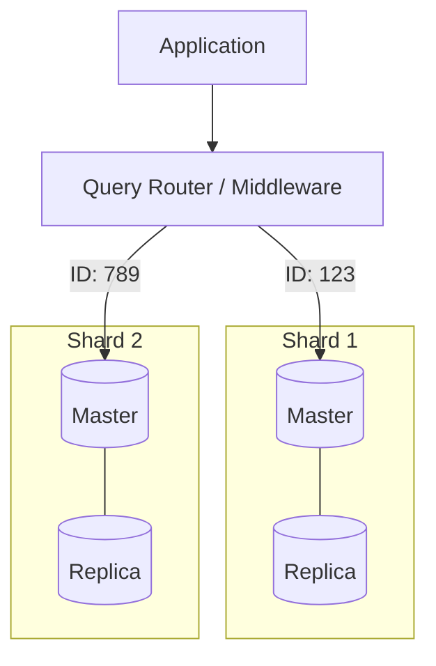

# ✂️ Sharding Architecture Deep Dive: Data Distribution
> **Objective:** Master the complex world of database sharding, from choosing shard keys to handling cross-shard queries and rebalancing | **Language:** Hinglish | **Standard:** 2026 Expert Framework

---

## 🧭 1. Beginner-Friendly Hinglish Explanation
Sharding Architecture ka matlab hai "Ek badi table ko dher saari choti tables mein baantna aur alag-alag servers par rakhna".

- **The Problem:** Ek table mein 1 Billion rows hain. Search slow ho gaya hai aur disk full ho rahi hai. 
- **The Solution:** Sharding.
  - Data ko kisi "Logic" ke base par divide karo.
  - Maan lo: 
    - Server 1: Users (1-1 Million)
    - Server 2: Users (1M-2 Million)
  - Ab har server par sirf 1 Million rows hain, jo bahut fast handle ho sakti hain.
- **Intuition:** Ye "Phone Book" jaisa hai. Ek hi kitab mein poore India ke numbers nahi hote. Har city ki apni ek choti phone book (Shard) hoti hai.

---

## 🧠 2. Deep Technical Explanation

### 1. The Shard Key:
The column used to distribute data. 
- **Range Sharding:** Based on ranges (e.g., Alphabet A-M). (Pros: Good for range queries. Cons: Hotspots if everyone starts with 'A').
- **Hash Sharding:** `hash(user_id) % num_shards`. (Pros: Even distribution. Cons: Hard to do range queries).
- **Directory-based Sharding:** A central service tells where the data is. (Pros: Flexible. Cons: Extra network hop).

### 2. Challenges:
- **Joins:** Joining data across two different servers is EXTREMELY slow and hard. **Fix: Denormalize or avoid cross-shard joins.**
- **Transactions:** Ensuring ACID across multiple shards requires **2PC (Two-Phase Commit)**, which is slow.
- **Rebalancing:** Adding a new shard is a nightmare because data has to move.

---

## 🏗️ 3. Database Diagrams (The Sharding Router)


---

## 💻 4. Query Execution Examples (Sharding Logic)
```javascript
// Pseudo-code for a Sharding Router
function getShard(userId) {
    // 1. Hash the ID
    const hashValue = crypto.createHash('md5').update(userId).digest('hex');
    // 2. Map to a shard (Assuming 4 shards)
    const shardIndex = parseInt(hashValue, 16) % 4;
    return `shard_connection_${shardIndex}`;
}

// App Logic
const connection = await pool.getConnection(getShard(user.id));
await connection.query("SELECT * FROM orders WHERE user_id = ?", [user.id]);
```

---

## 🌍 5. Real-World Production Examples
- **Instagram:** Shards its Postgres databases by `user_id`. Every bit of your profile data lives on one specific shard.
- **Discord:** Used **Cassandra** and then moved to **ScyllaDB** to shard billions of messages across a massive cluster using `channel_id` as the shard key.

---

## ❌ 6. Failure Cases
- **The Hot Shard:** You sharded by `country_id`. $80\%$ of your users are from 'India'. Now the India shard is dying while the others are empty. **Fix: Choose a better Shard Key (e.g., User ID).**
- **Celebrity Problem:** One user has 100M followers. All their activity hits one shard. **Fix: Use 'Resharding' or 'Read Replicas' specifically for high-load keys.**

---

## 🛠️ 7. Debugging Guide
| Problem | Reason | Solution |
| :--- | :--- | :--- |
| **Uneven Storage** | Low cardinality shard key | Reshard using a more diverse key (e.g., UUID). |
| **High Latency for Joins** | Cross-shard query | Duplicate the required data on both shards (Denormalization). |

---

## ⚖️ 8. Tradeoffs
- **Sharding (Infinite Scale)** vs **Operational Nightmware (Complex migrations / No global joins).**

---

## ✅ 11. Best Practices
- **Pick the Shard Key early.** It's the hardest thing to change later.
- **Always have replicas** for every shard.
- **Avoid global queries** (queries without a shard key) at all costs.
- **Use Middleware** like **Vitess** (MySQL) or **Citus** (Postgres) to handle the complexity.

漫
---

## 📝 14. Interview Questions
1. "What is a Shard Key and how do you choose a good one?"
2. "How do you handle a 'Hot Shard'?"
3. "Explain the difference between Range-based and Hash-based sharding."

---

## 🚀 15. Latest 2026 Production Database Patterns
- **Transparent Sharding:** Modern databases (like TiDB or CockroachDB) that handle sharding automatically internally. You just see "One Big Table".
- **Dynamic Resharding:** Using AI to move data between shards in real-time without taking the database offline.
漫
