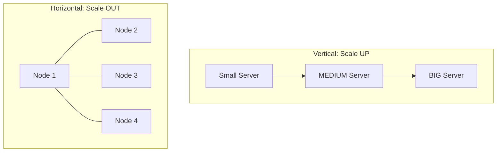

# 📈 Vertical vs Horizontal Scaling: Choosing the Growth Path
> **Objective:** Master the fundamental concepts of database scaling, understanding when to upgrade a single server (Vertical) and when to distribute data across many (Horizontal) | **Language:** Hinglish | **Standard:** 2026 Expert Framework

---

## 🧭 1. Beginner-Friendly Hinglish Explanation
Vertical vs Horizontal Scaling ka matlab hai "Apne database ko badhte hue traffic ke liye kaise bada karein".

- **Vertical Scaling (Scaling Up):** Ek hi server ko bada karna.
  - Maan lo aapke paas 8GB RAM wala server hai, aapne use 64GB kar diya.
  - **Pros:** Bahut simple hai. Code change nahi karna padta.
  - **Cons:** Ek "Limit" aa jati hai. Aap unlimited RAM nahi daal sakte.
- **Horizontal Scaling (Scaling Out):** Naye servers add karna.
  - Ek bada server lene ki bajaye, 10 chote servers laga dena.
  - **Pros:** Theoretically unlimited scaling.
  - **Cons:** Bahut complex hai. Data ko baantna (Sharding) padta hai.
- **Intuition:** 
  - **Vertical** ek "Badi Bus" kharidne jaisa hai. 
  - **Horizontal** 5 "Choti Cars" kharidne jaisa hai.

---

## 🧠 2. Deep Technical Explanation

### 1. Vertical Scaling (The Quick Fix):
- **Mechanism:** Increase CPU, RAM, or IOPS of the existing instance.
- **Downtime:** Usually requires a restart (unless using advanced cloud features).
- **Cost:** Becomes exponentially expensive at high levels (e.g., a $128$-core machine is very costly).

### 2. Horizontal Scaling (The Cloud Native Way):
- **Mechanism:** Add more nodes to a cluster.
- **Challenges:** 
  - **Data Consistency:** How to keep all nodes in sync?
  - **Network Latency:** Servers talking to each other takes time.
  - **App Complexity:** App must know which server has which data.

---

## 🏗️ 3. Database Diagrams (Scale Comparison)

---

## 💻 4. Decision Matrix (Which one to pick?)
| Requirement | Vertical Scaling | Horizontal Scaling |
| :--- | :--- | :--- |
| **Complexity** | Low (No code changes) | High (Requires Sharding/Replication) |
| **Cost (at scale)** | Very High | Lower (Commodity hardware) |
| **Downtime** | Required for upgrade | Zero downtime possible |
| **Reliability** | Single Point of Failure | High Availability (Redundancy) |

---

## 🌍 5. Real-World Production Examples
- **Early Stage Startup:** Starts with **Vertical Scaling**. Just upgrade the AWS RDS instance from `t3.micro` to `m5.large`.
- **Hypergrowth (Twitter/Uber):** Must use **Horizontal Scaling**. They have thousands of small database nodes working together.
- **Modern Managed DBs:** Databases like **AWS Aurora** do Vertical scaling automatically in the background (Serverless v2).

---

## ❌ 6. Failure Cases
- **The Ceiling:** You are on the largest machine AWS offers, and it's still slow. If you didn't plan for Horizontal scaling, you are in big trouble.
- **Network Overhead:** In Horizontal scaling, a query that used to take 1ms now takes 10ms because it has to talk to 3 different servers over the network.

---

## 🛠️ 7. Debugging Guide
| Symptom | Reason | Solution |
| :--- | :--- | :--- |
| **CPU is at 100% consistently** | Vertical limit reached | Either upgrade the server or move heavy reads to a Replica. |
| **Database is slow but CPU is 20%** | I/O or Lock contention | Scaling up CPU won't help. Look at Indexing or Disk IOPS. |

---

## ⚖️ 8. Tradeoffs
- **Ease of Use (Vertical)** vs **Unlimited Potential (Horizontal).**

---

## ✅ 11. Best Practices
- **Scale Vertically as much as you can** before it becomes too expensive or slow. It's much simpler.
- **Design your app to be 'Horizontally Ready'** (e.g., use `user_id` as a partitioning key from day one).
- **Use Managed Services** that handle scaling for you.

漫
---

## 📝 14. Interview Questions
1. "When would you prefer Vertical scaling over Horizontal scaling?"
2. "What are the biggest challenges of Horizontal scaling?"
3. "What is 'Elasticity' in cloud databases?"

---

## 🚀 15. Latest 2026 Production Database Patterns
- **Serverless Auto-scaling:** Databases that scale their CPU and RAM up and down every second based on actual query load (e.g., Neon, Aurora Serverless).
- **Storage Disaggregation:** Separation of Compute and Storage, allowing you to scale your disks and your processors independently.
漫
