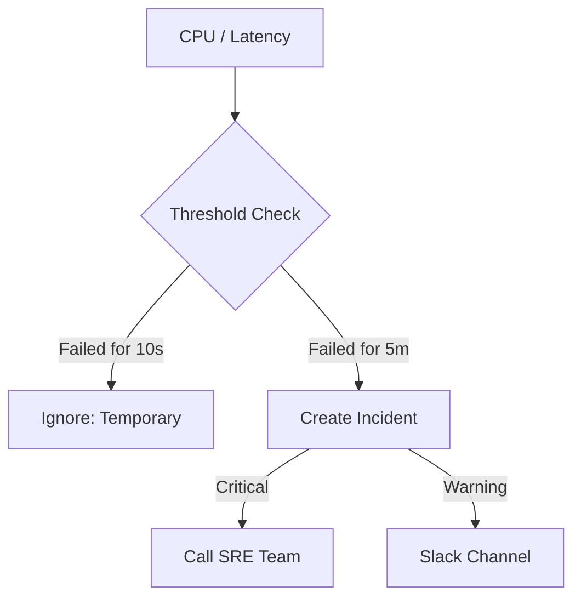

# 🚨 Alerting Strategies: Don't Sleep on Failures
> **Objective:** Master how to design an effective alerting system that notifies the right people about database issues without causing "Alert Fatigue" | **Language:** Hinglish | **Standard:** 2026 Expert Framework

---

## 🧭 1. Beginner-Friendly Hinglish Explanation
Alerting Strategies ka matlab hai "Problem hote hi 'Shor' machana par sahi tareeke se".

- **The Problem:** Database down hai, par kisi ko pata hi nahi. Ya phir, database sahi hai par har minute "CPU 50% hai" ka faltu message aa raha hai.
- **The Solution:** Humein 2 tarah ke alerts chahiye:
  1. **Critical (Wake me up):** Database down hai, Disk 95% full hai. (PagerDuty/Call).
  2. **Warning (Check during office hours):** Slow queries badh rahi hain, Backup fail ho gaya. (Slack/Email).
- **The Rule:** Har alert "Actionable" hona chahiye. Agar aap alert dekh kar kuch nahi kar sakte, toh wo alert hona hi nahi chahiye.
- **Intuition:** Ye ek "Fire Alarm" jaisa hai. Ghar mein dhuaan hai toh alarm bajna chahiye (Critical). Par agar sirf kitchen mein thoda sa dhuaan hai (Toast jal gaya), toh sirf ek notification kaafi hai (Warning).

---

## 🧠 2. Deep Technical Explanation
### 1. Symptom-based vs Cause-based Alerting:
- **Symptom-based (Better):** Alerting on what the user sees. (e.g., "Latency is high", "Success rate is low"). This tells you that something is WRONG.
- **Cause-based:** Alerting on a specific resource. (e.g., "CPU is 90%"). This tells you WHY something might be wrong, but it can be noisy.

### 2. Thresholds and Durations:
Don't alert on a single spike.
- **Bad:** Alert if CPU > 90%.
- **Good:** Alert if CPU > 90% for **5 consecutive minutes**.

### 3. Alert Fatigue:
When there are too many alerts, humans start ignoring them. 
- **The Solution:** Grouping, Deduplication, and proper Severity levels.

---

## 🏗️ 3. Database Diagrams (The Alerting Logic)


---

## 💻 4. Query Execution Examples (Prometheus Alert Rules)
```yaml
# 1. Alert for Database being Down
- alert: PostgresDown
  expr: up{job="postgres"} == 0
  for: 1m
  labels:
    severity: critical
  annotations:
    summary: "Database is DOWN on {{ $labels.instance }}"

# 2. Alert for low Disk Space
- alert: LowDiskSpace
  expr: (node_filesystem_avail_bytes / node_filesystem_size_bytes) * 100 < 10
  for: 5m
  labels:
    severity: warning
  annotations:
    summary: "Disk is almost full (< 10% left)"
```

---

## 🌍 5. Real-World Production Examples
- **Black Friday Sale:** The DB hits 90% CPU. No alert was sent because it only stayed there for 1 minute (Spike). This saved the engineers from "Alert Fatigue".
- **Silent Failure:** The DB was running, but the "Success Rate" dropped to 0% because of a networking issue. A **Symptom-based alert** on the app side saved the day.

---

## ❌ 6. Failure Cases
- **The "Flapping" Alert:** CPU goes from 89% to 91% and back every second. You get 50 Slack messages in 1 minute. **Fix: Use 'Hysteresis' (Wait for it to drop below 80% before clearing).**
- **Missing Alerts:** You forgot to set an alert for "Backup Failure". You only find out the backup was failing for 6 months when you actually need it.
- **Dependency Alert Storm:** The network is down. Now you get 100 alerts from 50 databases and 50 apps, even though the problem is just 1 router.

---

## 🛠️ 7. Debugging Guide
| Tool | Purpose | Goal |
| :--- | :--- | :--- |
| **PagerDuty** | Incident Management | Ensure someone is "On-call" and awake. |
| **Alertmanager** | Alert Routing | Group 100 small alerts into 1 summary message. |
| **Grafana Alerting** | Visual Alerts | See the "Line" on the graph that triggers the alert. |

---

## ⚖️ 8. Tradeoffs
- **Sensitive Alerting (Fast detection / High noise)** vs **Broad Alerting (Slow detection / High signal).**

---

## 🛡️ 9. Security Concerns
- **Sensitive Data in Alerts:** Alert titles like "Order #1234 from Sameer Malik failed" might leak PII to Slack. **Fix: Use generic IDs in alert titles.**

---

## 📈 10. Scaling Challenges
- **Monitoring many environments:** Differentiating between "Dev DB is down" (Ignore) and "Prod DB is down" (Critical).

---

## ✅ 11. Best Practices
- **Every alert must be ACTIONABLE.** (Include a link to a "Runbook").
- **Alert on Symptoms, not just Causes.**
- **Use different channels for different Severities.**
- **Set up "Quiet Hours"** for non-critical alerts.
- **Review your alerts every month** and delete the noisy ones.

---

## ⚠️ 13. Common Mistakes
- **Alerting on a single CPU spike.**
- **Not having a "Runbook" (Instructions)** for the person who receives the alert.

---

## 📝 14. Interview Questions
1. "What is Alert Fatigue and how do you prevent it?"
2. "Difference between Symptom-based and Cause-based alerting?"
3. "How would you set up an alert for a database disk getting full?"

---

## 🚀 15. Latest 2026 Production Database Patterns
- **Auto-remediation:** The alerting system detects "Disk 95% full" and **automatically** runs a script to clear temporary logs or resize the EBS volume without human intervention.
- **AI-driven Thresholds:** Systems that learn that "High CPU on Monday morning" is normal (Peak traffic) and don't alert, but "High CPU on Sunday night" is weird and alerts immediately.
漫
