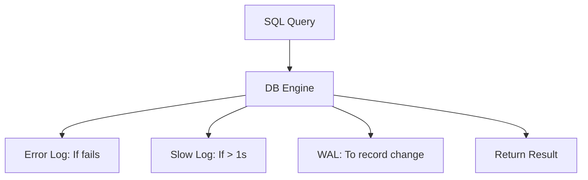

# 📜 Database Logging: Recording the Truth
> **Objective:** Master the different types of database logs (Error, General, Slow, Binary) and how to use them for debugging, auditing, and recovery | **Language:** Hinglish | **Standard:** 2026 Expert Framework

---

## 🧭 1. Beginner-Friendly Hinglish Explanation
Database Logging ka matlab hai "Database ki har harqat ko record karna".

- **The Problem:** Database crash ho gaya. Kyun? Query slow chal rahi hai. Kaunsi? Kisi ne data delete kar diya. Kisne? In sab ke jawab sirf "Logs" mein milte hain.
- **The Solution:** Alag-alag kaam ke liye alag-alag logs hote hain.
- **The 4 Main Logs:** 
  1. **Error Log:** Database ne "Error" diya ya crash hua (Serious stuff).
  2. **Slow Query Log:** Wo queries jo bohot zyada time le rahi hain (Performance stuff).
  3. **General Log:** Har ek query jo database par chali (Good for debugging, bad for production speed).
  4. **Binary Log / WAL:** Data mein kya badlav hue (For recovery and replication).
- **Intuition:** Ye ek "Black Box" (Flight Recorder) jaisa hai. Jab tak flight sahi chal rahi hai, koi nahi dekhta. Par "Crash" hote hi sabse pehle ise hi dhoondha jata hai.

---

## 🧠 2. Deep Technical Explanation
### 1. Error Log (The First Stop):
Contains information about server startup and shutdown, and critical errors that occurred during operation.
- **Format:** Usually a plain text file.
- **Location:** Defined by `log_error` (MySQL) or `logging_collector` (Postgres).

### 2. Slow Query Log (The Performance Goldmine):
Records queries that exceed a predefined `long_query_time` threshold.
- **Key Stats:** Execution time, Lock time, Rows sent, Rows examined.
- **Optimization:** Use `pt-query-digest` to analyze millions of slow log lines.

### 3. Binary Log / WAL (The Data Record):
Essential for Replication and Point-in-Time Recovery.
- **Row-based Logging:** Records the actual data change. (Very safe).
- **Statement-based Logging:** Records the SQL command. (Fast, but risky for non-deterministic functions like `NOW()`).

---

## 🏗️ 3. Database Diagrams (The Log Pipeline)


---

## 💻 4. Query Execution Examples (Postgres/MySQL)
```sql
-- 1. Enable Slow Query Logging (MySQL)
SET GLOBAL slow_query_log = 'ON';
SET GLOBAL long_query_time = 2; -- Log queries slower than 2 seconds

-- 2. Finding the Error Log Path (Postgres)
SHOW log_directory;
SHOW log_filename;

-- 3. Viewing logs via SQL (Postgres system views)
SELECT * FROM pg_log_viewer; -- (if extension installed)
```

---

## 🌍 5. Real-World Production Examples
- **Security Audit:** "Hacker" ne entry delete ki, par unhe ye nahi pata tha ki `Binary Log` mein unki IP aur timestamp record ho gaye.
- **Performance Tuning:** Every week, the DBA team reviews the "Top 10 Slowest Queries" from the Slow Log and adds missing indexes.

---

## ❌ 6. Failure Cases
- **Disk Full due to Logs:** General logging was turned on in a high-traffic production server. The log file grew to 500GB in 2 days and crashed the whole server. **Fix: Use 'Log Rotation'.**
- **Logging Sensitive Data:** Credit card numbers or passwords appearing in the General/Slow log because the app doesn't use Prepared Statements.
- **Log Lag:** Writing heavy logs can actually slow down the database performance by $5-10\%$.

---

## 🛠️ 7. Debugging Guide
| Log Type | When to use? | Goal |
| :--- | :--- | :--- |
| **Error Log** | DB doesn't start | Find the specific OS or config error. |
| **Slow Log** | App is laggy | Find the SQL queries that need an index. |
| **Binary Log** | Data is lost | Replay the log to recover data until a specific second. |

---

## ⚖️ 8. Tradeoffs
- **Deep Logging (High Debuggability / High Disk & CPU cost)** vs **Minimal Logging (Fast / Hard to debug).**

---

## 🛡️ 9. Security Concerns
- **Log Access:** Whoever can read the database logs can potentially see all your data. **Fix: Encrypt log files and restrict OS-level permissions.**

---

## 📈 10. Scaling Challenges
- **Log Aggregation:** In a cluster of 50 databases, checking logs on every server is impossible. **Fix: Stream logs to a central system like ELK (Elasticsearch, Logstash, Kibana) or Splunk.**

---

## ✅ 11. Best Practices
- **Enable Slow Query Logging with a reasonable threshold (e.g., 200ms-1s).**
- **Use Log Rotation** to prevent disk full issues.
- **Never enable General Log in production** unless debugging a very specific issue.
- **Encrypt and Backup your Binary/WAL logs.**
- **Centralize logs** for easier searching and alerting.

---

## ⚠️ 13. Common Mistakes
- **Assuming logs are permanent.** (Old logs get deleted unless you back them up).
- **Ignoring "Warnings" in the error log.**

---

## 📝 14. Interview Questions
1. "Difference between Binary Log and General Log?"
2. "How would you find a query that is taking 5 seconds to run?"
3. "What is Log Rotation and why is it necessary?"

---

## 🚀 15. Latest 2026 Production Database Patterns
- **Structured Logging (JSON):** Databases now outputting logs in JSON format directly, making them 10x easier to parse by ELK or Datadog.
- **Streaming Audit Logs:** Sending audit logs directly to a "Cloud Watch" or "Cloud Logging" service in real-time, bypassing the local disk to ensure an attacker can't delete them.
漫
