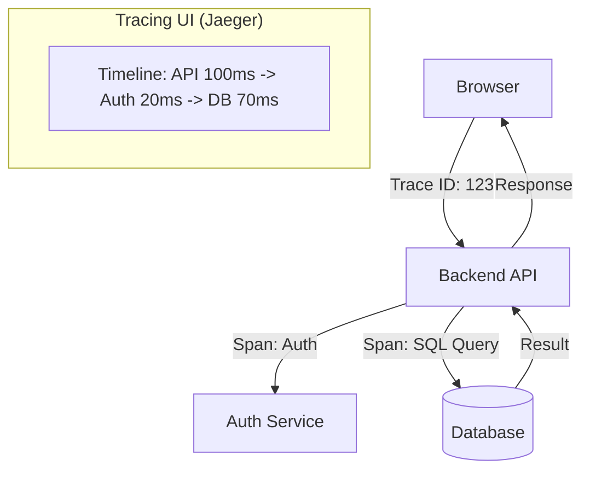

# 🕵️ Distributed Tracing: Tracking the Query Journey
> **Objective:** Master how to trace a single user request across multiple microservices and into the database to find exactly where the latency is occurring | **Language:** Hinglish | **Standard:** 2026 Expert Framework

---

## 🧭 1. Beginner-Friendly Hinglish Explanation
Distributed Tracing ka matlab hai "Ek user request ka pura rasta (Path) follow karna".

- **The Problem:** Ek user ne "Buy Now" click kiya aur loading ho rahi hai. Site slow hai. Ab aap kaise jaanoge ki slow kaun hai? 
  - Frontend?
  - Backend API?
  - Payment Service?
  - Database?
- **The Solution:** Distributed Tracing. 
- **How it works:** Har ek request ko ek unique **Trace ID** di jati hai. Wo request jahan-jahan jayegi, wahan apna "Time Stamp" chhodti jayegi.
- **Intuition:** Ye ek "Parcel Tracking" jaisa hai. Aapko pata hota hai ki parcel abhi "Warehouse" mein hai, ya "Transit" mein, ya "Delivery" ke liye nikla hai. Agar parcel late hai, toh aapko exact location pata hoti hai.

---

## 🧠 2. Deep Technical Explanation
### 1. Spans and Traces:
- **Trace:** The entire journey of a request.
- **Span:** A single unit of work within that journey (e.g., A single SQL query, a single API call).
- **Parent/Child Relationship:** An API call (Parent) can have multiple SQL queries (Children) inside it.

### 2. Context Propagation:
The Trace ID must be passed from the App to the Database. 
- Many modern drivers support **SQL Comments** to pass the Trace ID: `SELECT * FROM users /* traceparent=00-abc... */`.

### 3. OpenTelemetry (The Standard):
The industry-standard framework for collecting traces, metrics, and logs across different languages and databases.

---

## 🏗️ 3. Database Diagrams (The Request Path)


---

## 💻 4. Query Execution Examples (OpenTelemetry in Node.js)
```javascript
// Automatically tracing database queries
const { NodeTracerProvider } = require('@opentelemetry/sdk-trace-node');
const { PgInstrumentation } = require('@opentelemetry/instrumentation-pg');

const provider = new NodeTracerProvider();
provider.register();

// This will automatically create 'Spans' for every Postgres query
const instrumentation = new PgInstrumentation();
instrumentation.setTracerProvider(provider);

// Now every 'pool.query()' will be visible in your tracing dashboard (Jaeger/HoneyComb)
```

---

## 🌍 5. Real-World Production Examples
- **Uber:** They have thousands of microservices. Without tracing, finding the cause of a "Slow Trip" would take days. With tracing, it takes seconds.
- **Fintech:** Tracing a single transaction from the "Swipe" to the "Bank DB" to ensure it happened within 2 seconds.

---

## ❌ 6. Failure Cases
- **Broken Context:** One service in the middle forgets to pass the Trace ID. Now your trace is split into two, and you lose the connection.
- **Sampling Overhead:** Tracing *every single* request uses too much CPU and storage. **Fix: Use 'Head/Tail Sampling' (e.g., Trace only 1% of successful requests but 100% of errors).**
- **Cluttered Dashboard:** So many spans that the waterfall chart becomes unreadable.

---

## 🛠️ 7. Debugging Guide
| Tool | Purpose | Goal |
| :--- | :--- | :--- |
| **Jaeger / Zipkin** | Trace Visualization | See the "Waterfall" chart of the request. |
| **Honeycomb** | Observability | Analyze traces to find patterns (e.g., "Only users in India are slow"). |
| **OpenTelemetry** | Data Collection | Standard way to instrument your code. |

---

## ⚖️ 8. Tradeoffs
- **High Visibility (Easy debugging)** vs **Performance Overhead (Slightly slower requests / More storage).**

---

## 🛡️ 9. Security Concerns
- **PII in Traces:** Traces often record the full SQL query. If the query has `WHERE email = 'user@example.com'`, that email is now in your tracing system. **Fix: Use 'Attribute Scrubbing' to remove sensitive data.**

---

## 📈 10. Scaling Challenges
- **Massive Trace Volumes:** If you have 1 million requests/sec, your tracing system needs to handle 1 million traces. This is often more expensive than the actual application!

---

## ✅ 11. Best Practices
- **Use OpenTelemetry** (Don't use vendor-specific libraries).
- **Trace only a 'Sample' of traffic** to save costs.
- **Add 'Database Tags'** to your spans (e.g., `db.system=postgresql`, `db.statement=SELECT...`).
- **Link Traces to Logs** so you can jump from a slow span to the exact log line.

---

## ⚠️ 13. Common Mistakes
- **Not passing the Trace ID to the database.** (The database becomes a "Black Box" in your trace).
- **Tracing every single tiny function.** (Only trace meaningful work like API/DB calls).

---

## 📝 14. Interview Questions
1. "What is a Trace ID vs a Span ID?"
2. "How do you trace a request across three different microservices?"
3. "What is 'Sampling' and why is it used in distributed tracing?"

---

## 🚀 15. Latest 2026 Production Database Patterns
- **Database-Native Tracing:** New databases like **SurrealDB** or **CockroachDB** that have OpenTelemetry built-in, so they automatically emit spans to your dashboard.
- **Wasm-instrumentation:** Using WebAssembly to intercept and trace database calls at the kernel level with almost $0\%$ performance overhead.
漫
