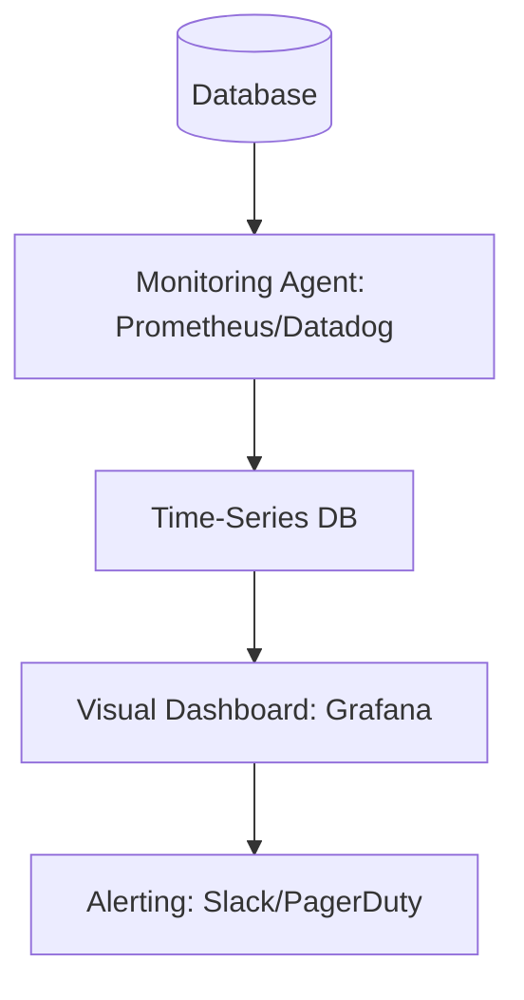

# 📊 Key Metrics to Monitor: The Dashboard of Truth
> **Objective:** Master the essential health indicators of a database to proactively detect and solve performance issues before they affect users | **Language:** Hinglish | **Standard:** 2026 Expert Framework

---

## 🧭 1. Beginner-Friendly Hinglish Explanation
Key Metrics ka matlab hai "Database ki 'Health Report' ke zaroori points".

- **The Problem:** Database kab crash hoga ya kab slow hoga, ye guess karna mushkil hai agar aapke paas data nahi hai.
- **The Solution:** Dashboard. Humein kuch "Vital Signs" ko track karna hai.
- **The Core Metrics:** 
  1. **CPU Usage:** Kya database engine bohot zyada mehnat kar raha hai?
  2. **Memory (Buffer Pool):** Kya data RAM mein hai ya disk se aa raha hai?
  3. **Disk I/O:** Disk kitni busy hai? (IOPS).
  4. **Active Connections:** Kitne log abhi jude hue hain?
- **Intuition:** Ye ek "Car Dashboard" jaisa hai. Aapko Speedometer (Throughput), Fuel (RAM), aur Engine Temperature (CPU) par nazar rakhni hoti hai takki car raste mein band na ho jaye.

---

## 🧠 2. Deep Technical Explanation
### 1. The USE Method (Resource Focused):
- **U**tilization: How busy is the resource? (e.g., CPU is 70% busy).
- **S**aturation: How much "Extra" work is waiting? (e.g., 50 queries in the queue).
- **E**rrors: Are there any hardware or software errors?

### 2. The RED Method (Request Focused):
- **R**ate: Number of requests per second.
- **E**rrors: Number of failed requests.
- **D**uration: Time taken for requests (Latency).

### 3. Database-Specific Metrics:
- **Cache Hit Ratio:** Should be $>95\%$.
- **Index Usage:** Are your indexes actually being used?
- **Lock Wait Time:** How long are queries waiting for other transactions to finish?
- **Replication Lag:** How far behind is the Slave from the Master?

---

## 🏗️ 3. Database Diagrams (The Monitoring Stack)


---

## 💻 4. Query Execution Examples (Diagnostic Checks)
```sql
-- 1. Checking Active vs Idle Connections (Postgres)
SELECT state, count(*) 
FROM pg_stat_activity 
GROUP BY state;

-- 2. Checking Disk Read vs Cache Hit (MySQL)
SHOW GLOBAL STATUS LIKE 'Innodb_buffer_pool_read_requests'; -- Hits
SHOW GLOBAL STATUS LIKE 'Innodb_buffer_pool_reads';         -- Misses (Disk reads)

-- 3. Checking for Bloat (Dead rows)
SELECT relname, n_dead_tup, last_vacuum 
FROM pg_stat_user_tables;
```

---

## 🌍 5. Real-World Production Examples
- **Incident Response:** An engineer sees a spike in "Lock Wait Time" on Grafana. They instantly know that a "Migration Script" is locking the `Users` table and kill it before the site goes down.
- **Capacity Planning:** Seeing that "Disk Usage" increases by 10GB every week. This helps them plan a disk upgrade 1 month before it hits 100%.

---

## ❌ 6. Failure Cases
- **Metric Blindness:** Monitoring "Average Latency" but ignoring the "p99 Latency". (The average is 10ms, but for 1% of users, it's 10 seconds!). **Fix: Always monitor Percentiles (p50, p95, p99).**
- **Over-Alerting:** Setting an alert for 50% CPU. Every time a small backup runs, you get a Slack notification. You start ignoring alerts. **Fix: Alert only on "Actionable" thresholds (e.g., 90% CPU for 5 minutes).**
- **Stale Metrics:** Monitoring every 5 minutes. A "Connection Storm" happens and kills the DB in 30 seconds. You miss it. **Fix: Use 10-second or 1-minute intervals.**

---

## 🛠️ 7. Debugging Guide
| Metric Spike | Possible Reason | Immediate Action |
| :--- | :--- | :--- |
| **CPU Spike** | Missing Index / Heavy Join | Check `EXPLAIN` for the top queries. |
| **Disk I/O Spike** | Full Table Scan / Massive Update | Find the query reading the most blocks. |
| **Connection Spike** | App scaling up / Connection Leak | Check app logs and connection pool settings. |

---

## ⚖️ 8. Tradeoffs
- **Granular Monitoring (High Insight / High Storage cost for logs)** vs **Basic Monitoring (Low cost / Missing details).**

---

## 🛡️ 9. Security Concerns
- **Sensitive Data in Metrics:** Metrics like "Query String" might contain credit card numbers if your app doesn't use placeholders. **Fix: Sanitize metric data.**

---

## 📈 10. Scaling Challenges
- **Monitoring a 1000-node Cluster:** Aggregating metrics from thousands of nodes without slowing down the monitoring system itself.

---

## ✅ 11. Best Practices
- **Monitor the 4 Golden Signals (Latency, Traffic, Errors, Saturation).**
- **Establish a 'Baseline'** (What does "Normal" look like on a Monday at 2 PM?).
- **Use Percentiles (p99)** for latency.
- **Monitor Replication Lag** if you use Slaves.
- **Track 'Dead Rows' (Bloat)** for Postgres.

---

## ⚠️ 13. Common Mistakes
- **Only monitoring CPU.**
- **Not setting up Alerts.**
- **Ignoring the 'Slow Query Log'.**

---

## 📝 14. Interview Questions
1. "What metrics would you put on a database dashboard?"
2. "Explain the difference between Average and p99 Latency."
3. "What does a low 'Cache Hit Ratio' indicate?"

---

## 🚀 15. Latest 2026 Production Database Patterns
- **Query Performance Insights:** Cloud providers (AWS/GCP) now provide a "Heatmap" of your database performance, showing exactly which row and which hour caused the bottleneck.
- **Anomaly Detection:** AI systems that learn your DB's patterns and only alert you if the behavior is "Strange" for that specific time of day.
漫
