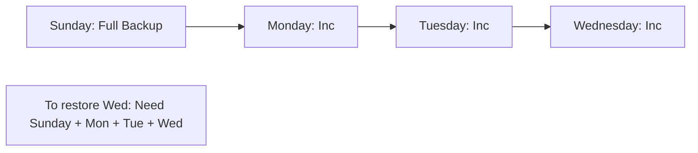

# 🛡️ Backup Strategies Deep Dive: Protecting the Assets
> **Objective:** Master the technical details of database backups, comparing Logical vs Physical backups and Incremental vs Differential strategies for enterprise environments | **Language:** Hinglish | **Standard:** 2026 Expert Framework

---

## 🧭 1. Beginner-Friendly Hinglish Explanation
Backup Strategies Deep Dive ka matlab hai "Data bachane ke sahi aur galat tareeke".

- **The Problem:** Har backup ek jaisa nahi hota. Kuch fast hote hain par restore slow, kuch slow hote hain par restore fast.
- **The Solution:** Sahi strategy chunna based on your **RPO** (Data loss limit) aur **RTO** (Time to restore).
- **Key Concepts:**
  - **Logical Backup:** Data ko SQL queries (`INSERT INTO...`) mein save karna.
  - **Physical Backup:** Database ki files (`.ibd`, `.db`) ko copy karna.
- **Intuition:** 
  - **Logical** ek "Recipe" likhne jaisa hai. 
  - **Physical** pura "Cake" fridge mein rakhne jaisa hai.

---

## 🧠 2. Deep Technical Explanation

### 1. Logical vs Physical:
| Feature | Logical (e.g., mysqldump / pg_dump) | Physical (e.g., Percona XtraBackup / pg_basebackup) |
| :--- | :--- | :--- |
| **Speed** | Slow (Converts to SQL) | Fast (Copies files directly) |
| **Portability** | High (Can restore to any version) | Low (Needs same DB version/OS) |
| **Storage** | Highly compressed | Large (Exactly matches DB size) |

### 2. Snapshot-based Backups:
Most cloud providers (AWS/GCP) use **Block-level snapshots**.
- They freeze the disk for a millisecond and copy the blocks.
- Very fast, but you must ensure "Write Consistency" (Flushing buffers).

### 3. Incremental vs Differential:
- **Incremental:** Backup changes since the *last* backup. (Saves space).
- **Differential:** Backup changes since the last *Full* backup. (Easier to restore).

---

## 🏗️ 3. Database Diagrams (The Backup Chain)


---

## 💻 4. Query Execution Examples (Enterprise Tools)
```bash
# 1. Postgres Logical Backup (Custom format for parallel restore)
pg_dump -Fc -f mydb_backup.dump mydb

# 2. MySQL Physical Backup (Percona XtraBackup)
xtrabackup --backup --target-dir=/data/backups/

# 3. Restoring only one table from a full backup
pg_restore -t my_table -d mydb mydb_backup.dump
```

---

## 🌍 5. Real-World Production Examples
- **Small Startup:** Uses daily `pg_dump` to S3. Easy to manage, works for 50GB data.
- **Large Bank:** Uses **Physical Streaming Backups** every hour and **Incremental WAL archiving** every minute. They cannot lose more than 60 seconds of data.

---

## ❌ 6. Failure Cases
- **Silent Corruption:** Your backup finishes with "Success", but the file is corrupted. **Fix: Always run a 'Checksum' or a test restore.**
- **Disk Full during Restore:** You have a 1TB backup but your restore server only has 500GB disk.
- **The Missing WAL:** You have the backup, but the transaction logs (WAL) for the last hour are missing. You can't do PITR.

---

## 🛠️ 7. Debugging Guide
| Problem | Reason | Solution |
| :--- | :--- | :--- |
| **Backup is taking too long** | Single-threaded process | Use parallel backup tools (e.g., `pg_dump -j 4`). |
| **Restore failed (Version mismatch)** | Logical vs Physical conflict | Always use Logical backups if moving across major versions. |

---

## ⚖️ 8. Tradeoffs
- **Incremental (Low Storage / High Restore Risk)** vs **Differential (Higher Storage / Faster Restore).**

---

## ✅ 11. Best Practices
- **Encrypt backups** before uploading to S3/Cloud.
- **Store backups in a different Region** (Cross-Region Replication).
- **Keep a 'Cold' copy** (Immutable) that hackers can't delete.
- **Automate the Restore Test** once a week.

漫
---

## 📝 14. Interview Questions
1. "Difference between a Logical and a Physical backup?"
2. "Why is a Physical backup faster for large databases?"
3. "What is an Incremental backup and how do you restore it?"

---

## 🚀 15. Latest 2026 Production Database Patterns
- **Zero-Copy Snapshots:** Databases that can create an instant, zero-cost snapshot of a 100TB database for testing.
- **Continuous Backup:** Not having "Scheduled" backups, but every single write being streamed to a secure backup vault in real-time.
漫
