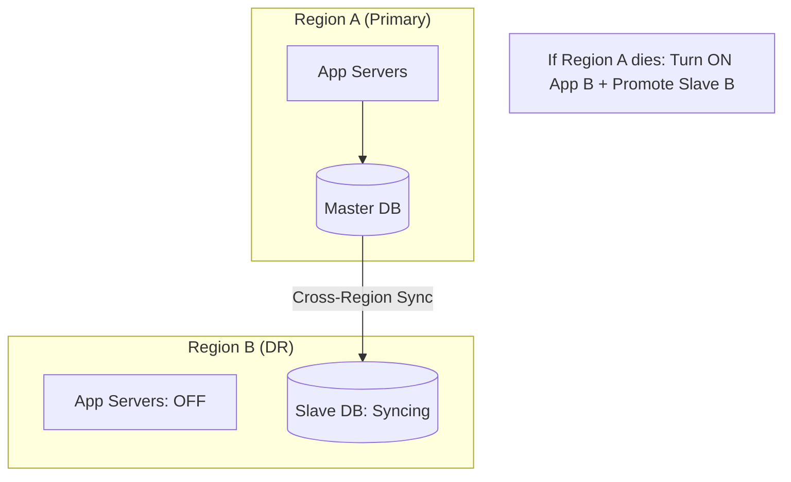

# 🌋 Disaster Recovery (DR) Planning: The Survival Guide
> **Objective:** Master the architectural patterns for Disaster Recovery, ensuring your data survives earthquakes, cloud outages, or massive hacking attempts | **Language:** Hinglish | **Standard:** 2026 Expert Framework

---

## 🧭 1. Beginner-Friendly Hinglish Explanation
Disaster Recovery (DR) Planning ka matlab hai "Sab kuch barbaad hone ke baad wapas khade hona".

- **The Problem:** Agar pura AWS region (e.g., Virginia) down ho jaye, toh kya aapki app chalegi? Agar hacker ne aapka account delete kar diya, toh kya aapka data bachega?
- **The Solution:** DR Plan. 
  - Data ko dusre physical location (Shehar/Country) mein rakhna.
  - Wapas chalu karne ka process "Documented" hona.
- **Intuition:** Ye ek "Fire Drill" jaisa hai. Building mein aag lagne se pehle sabko pata hona chahiye ki kaunsa darwaza kholna hai.

---

## 🧠 2. Deep Technical Explanation

### 1. The DR Metrics (RPO vs RTO):
- **RPO (Recovery Point Objective):** "Kitna purana data loss challega?" (e.g., 5 mins).
- **RTO (Recovery Time Objective):** "Kitni der mein system wapas chalu hona chahiye?" (e.g., 1 hour).

### 2. DR Architectures:
- **Backup & Restore (The Cold DR):** Lowest cost. You restore from a backup in a new region. (RTO: Hours/Days).
- **Pilot Light (The Warm DR):** The database is running and syncing in another region, but the app servers are off. (RTO: Minutes).
- **Warm Standby:** Fully functional but smaller servers. (RTO: Seconds).
- **Multi-Site (Active-Active):** Live systems in two regions. (RTO: Zero).

### 3. Data Sync:
- **Cross-Region Replication (CRR):** Automatically syncing every write to a different geographic region.

---

## 🏗️ 3. Database Diagrams (The Pilot Light Architecture)

---

## 💻 4. DR Checklist (Enterprise Level)
- [ ] **Cross-Account Backups:** Store backups in a separate AWS/GCP account so a hacked main account doesn't lose everything.
- [ ] **Infrastructure as Code (IaC):** Use Terraform to recreate your DB servers in 5 minutes.
- [ ] **Documented Runbooks:** Step-by-step instructions (e.g., "Step 1: Update DNS. Step 2: Promote Replica").
- [ ] **Game Days:** Simulate a region failure once a quarter to test your plan.

---

## 🌍 5. Real-World Production Examples
- **Goldman Sachs:** Uses **Active-Active** across 3 continents. If one continent goes dark, the other two take the load instantly.
- **Medium Startup:** Uses **Pilot Light**. They keep a read-replica in a different region and Terraform scripts to spin up the backend in 15 minutes.

---

## ❌ 6. Failure Cases
- **The "Broken Bridge":** You assumed the cross-region sync was working, but it failed 30 days ago. You have no data in the DR region. **Fix: Monitor 'Replication Lag' across regions.**
- **DNS TTL:** You switched to the DR region, but the internet still remembers the old IP for 24 hours. **Fix: Use 'Global Accelerator' or 'Route53 Failover' with low TTL.**

---

## 🛠️ 7. Debugging Guide
| Problem | Reason | Solution |
| :--- | :--- | :--- |
| **Failover is taking too long** | Manual steps are too slow | Automate everything using Scripts or Cloud-native Failover tools. |
| **Data Mismatch in DR** | Split Brain during testing | Always use 'Fencing' to ensure only one Master is active at a time. |

---

## ⚖️ 8. Tradeoffs
- **Active-Active (Zero Downtime / Extremely Expensive)** vs **Backup & Restore (Cheap / High Downtime).**

---

## ✅ 11. Best Practices
- **Test your DR Plan regularly.**
- **Use Cross-Region Replication.**
- **Automate Failover** if possible.
- **Keep your DR infrastructure separate** from your production environment.

漫
---

## 📝 14. Interview Questions
1. "Difference between RPO and RTO?"
2. "Explain the Pilot Light DR strategy."
3. "How do you handle data consistency in a Multi-Region setup?"

---

## 🚀 15. Latest 2026 Production Database Patterns
- **Chaos Engineering for DBs:** Using tools like **Chaos Mesh** to intentionally kill database nodes in production to verify that the DR plan works automatically.
- **AI-Managed Failover:** Databases that can detect a regional latency spike and preemptively move traffic to a healthier region before an actual outage occurs.
漫
