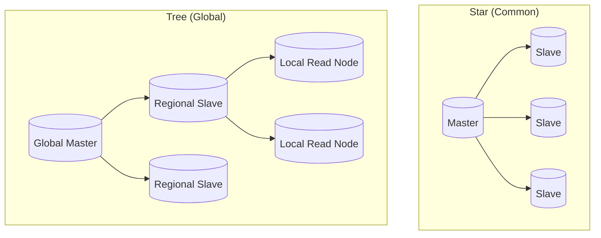

# 🗺️ Replication Topology and Lag: Scaling and Sync
> **Objective:** Master the different ways to connect database nodes and understand the critical issue of Replication Lag in distributed systems | **Language:** Hinglish | **Standard:** 2026 Expert Framework

---

## 🧭 1. Beginner-Friendly Hinglish Explanation
Replication Topology aur Lag ka matlab hai "Database nodes ko kaise jodein aur data sync hone ki deri (Lag) ko kaise handle karein".

- **The Topology:** Ye "Nakshe" jaisa hai ki data kahan se kahan jayega.
  - **Master-Slave:** Ek likhta hai, baaki sirf padhte hain.
  - **Master-Master:** Dono likh sakte hain (Very complex!).
  - **Chain Replication:** A bhejta hai B ko, B bhejta hai C ko.
- **The Lag:** Jab Master par data save ho gaya, par Slave par abhi tak nahi pahuncha. Ye jo 2 second ki deri hai, ise hi **Replication Lag** kehte hain.
- **Intuition:** Ye ek "News Channel" jaisa hai. Studio (Master) mein news aa gayi, par aapke TV (Slave) par wo 10 second baad dikhti hai.

---

## 🧠 2. Deep Technical Explanation

### 1. Common Topologies:
- **Star Topology:** One master, many slaves. (Best for read-heavy apps).
- **Ring Topology:** Each node replicates to the next. (Risky: If one node dies, the ring breaks).
- **Tree Topology:** Master -> Intermediary Slaves -> Final Slaves. (Used for massive scaling across regions).

### 2. Synchronous vs Asynchronous:
- **Synchronous:** Master waits for Slave to confirm before saying "Success" to the user. (No data loss, but very slow).
- **Asynchronous:** Master writes and immediately tells the user "Success". It syncs to Slaves in the background. (Fast, but risk of data loss if Master dies).

---

## 🏗️ 3. Database Diagrams (The Topologies)


---

## 💻 4. Query Execution Examples (Checking Lag)
```sql
-- 1. MySQL: Show replication status
SHOW SLAVE STATUS\G;
-- Look for 'Seconds_Behind_Master'

-- 2. Postgres: Check replication lag in bytes/time
SELECT 
    client_addr, 
    pg_wal_lsn_diff(pg_current_wal_lsn(), replay_lsn) AS lag_bytes 
FROM pg_stat_replication;
```

---

## 🌍 5. Real-World Production Examples
- **Facebook:** Uses a massive **Tree Topology**. A post in USA is synced to a regional master in Europe, which then syncs to local read nodes in every city.
- **Stock Trading:** Uses **Synchronous Replication** because even 1ms of lag could mean millions of dollars in wrong trades.

---

## ❌ 6. Failure Cases
- **Lag Spike:** A heavy update on the Master (like `DELETE FROM logs WHERE date < ...`) generates millions of log entries. The Slaves take 10 minutes to process them. **Fix: Break large deletions into smaller chunks.**
- **Network Partition:** Master can't talk to Slaves. Writes continue, but Slaves fall hours behind.
- **Clock Skew:** If nodes have different times, calculating lag becomes impossible. **Fix: Use NTP (Network Time Protocol).**

---

## 🛠️ 7. Debugging Guide
| Problem | Reason | Solution |
| :--- | :--- | :--- |
| **Seconds_Behind_Master is growing** | Slave CPU/Disk is slow | Upgrade Slave hardware or reduce the number of queries hitting it. |
| **Replication Stopped** | Error on Slave (e.g., Duplicate Key) | Fix the data on Slave and run `START SLAVE`. |

---

## ⚖️ 8. Tradeoffs
- **Master-Slave (Simplicity / Fast Reads)** vs **Master-Master (High Write Availability / Complex Conflict Resolution).**

---

## ✅ 11. Best Practices
- **Use Asynchronous replication** for 95% of web apps.
- **Set alerts** if Replication Lag exceeds 5 seconds.
- **Use dedicated network links** between Master and Slaves.
- **Monitor Oplog/Binary Log size** to ensure they don't fill up the disk.

漫
---

## 📝 14. Interview Questions
1. "What is Replication Lag and what are its common causes?"
2. "Why is Master-Master replication considered dangerous?"
3. "Explain the difference between Statement-based and Row-based replication."

---

## 🚀 15. Latest 2026 Production Database Patterns
- **Conflict-free Replicated Data Types (CRDTs):** Used in Master-Master setups to automatically merge changes from different nodes without errors.
- **Latency-aware Routing:** Smart applications that automatically stop reading from a Slave if its lag is too high.
漫
