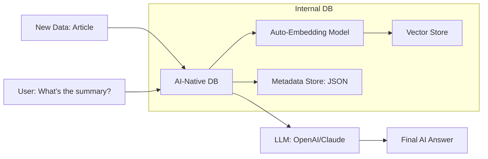

# 🤖 AI-Native Databases: The Intelligence Inside
> **Objective:** Master the new generation of databases that are built from the ground up to support AI, Vectors, and self-optimizing capabilities | **Language:** Hinglish | **Standard:** 2026 Expert Framework

---

## 🧭 1. Beginner-Friendly Hinglish Explanation
AI-Native Databases ka matlab hai "Aise databases jo AI ke dimaag ko samajhte hain".

- **The Problem:** Purane databases (SQL) sirf "Exactly match" hone wale data ko dhoondhte hain. Par aaj kal humein "Similar" (Milta-julta) data chahiye (e.g., Image search, AI Chatbots).
- **The Solution:** AI-Native DBs. 
  - Ye **Vector Search** (Similarity) natively support karte hain.
  - Ye **LLMs** (Chatbots) ke saath integrate hote hain.
  - Ye **Self-Healing** hote hain—agar database slow ho raha hai, toh AI use apne aap theek kar deta hai.
- **Intuition:** Ye ek "Smart Assistant" database jaisa hai. Ye sirf data store nahi karta, balki ye bhi samajhta hai ki us data ka "Matlab" kya hai.

---

## 🧠 2. Deep Technical Explanation
### 1. Unified Storage:
AI-Native databases (like **Weaviate** or **Chroma**) store the **Metadata** (Text/JSON) and the **Vector** (AI Embedding) together in the same record.
- You can query them at the same time: `Find a car that is 'Red' (Metadata) AND 'looks like this image' (Vector)`.

### 2. Built-in Embedding Pipelines:
You don't need to call OpenAI API manually. You just send the text, and the database calls the AI model to create the vector automatically.

### 3. Key Examples:
- **Weaviate:** Open-source, supports hybrid search (Keyword + Vector).
- **Chroma:** Simple, developer-first AI database for LLM apps.
- **Milvus:** Built for massive, billion-scale vector search.

---

## 🏗️ 3. Database Diagrams (The AI-Native Pipeline)


---

## 💻 4. Query Execution Examples (Weaviate / Chroma)
```javascript
// 1. Semantic Search (Finding meaning, not just words)
const result = await client.graphql.get()
  .withClassName('Articles')
  .withNearText({ concepts: ['Distributed Systems'] })
  .withLimit(2)
  .do();

// 2. Hybrid Search (Keyword 'Postgres' + Semantic 'Scaling')
const hybrid = await client.graphql.get()
  .withClassName('Posts')
  .withHybrid({ query: 'Postgres scaling', alpha: 0.5 }) 
  .do();
```

---

## 🌍 5. Real-World Production Examples
- **Customer Support Bots:** Using an AI-native DB to store all company documentation and finding the exact answer for a user's question in seconds.
- **E-commerce:** "Shop by look" feature where you upload a photo of a dress and the database finds similar dresses.
- **Search Engines:** Modern search that understands "Intent" (e.g., "How to fix a leaky tap") rather than just matching keywords.

---

## ❌ 6. Failure Cases
- **Hallucinations (RAG):** If the database finds the "Wrong" document, the AI will give a confidently wrong answer. **Fix: Use 'Reranking' to double-check the results.**
- **Index Latency:** Updating a billion-vector index takes time. If your data changes every second, the AI might give "Old" information.
- **Cost of Embeddings:** Every time you insert data, you have to pay for the AI model to "Embed" it.

---

## 🛠️ 7. Debugging Guide
| Problem | Reason | Solution |
| :--- | :--- | :--- |
| **Irrelevant Results** | Low Alpha in Hybrid Search | Increase the `alpha` to give more weight to Keyword match or change the Embedding model. |
| **High Memory Usage** | Vector Index (HNSW) in RAM | Use "Product Quantization" (PQ) to compress vectors and save RAM. |

---

## ⚖️ 8. Tradeoffs
- **Intelligence (High Accuracy / Meaningful Search)** vs **Simplicity (Higher Cost / New tech to learn).**

---

## 🛡️ 9. Security Concerns
- **Data Poisoning:** If an attacker can insert "Malicious Data" into the AI-native DB, they can manipulate the answers given by your company's AI chatbot.

---

## 📈 10. Scaling Challenges
- **Billions of Vectors:** Scaling a vector search to billions of records while keeping $<100ms$ latency is the biggest challenge in 2026.

---

## ✅ 11. Best Practices
- **Use Hybrid Search** (Keyword + Semantic) for the best results.
- **Version your Embedding Models** (If you change the model, you must re-embed all your data!).
- **Chunk your data properly** (Keep paragraphs together).
- **Monitor LLM Costs.**

---

## ⚠️ 13. Common Mistakes
- **Thinking Vector Search replaces SQL.** (It doesn't; it complements it).
- **Not using 'Metadata Filters'** to speed up vector search.

---

## 📝 14. Interview Questions
1. "What is the difference between a Keyword search and a Semantic search?"
2. "Why do AI-native databases need an 'Embedding Model'?"
3. "What is RAG (Retrieval-Augmented Generation)?"

---

## 🚀 15. Latest 2026 Production Database Patterns
- **Database as a Prompt:** Databases that can "Talk" directly to an LLM to generate SQL queries from natural language (Text-to-SQL).
- **In-Database LLMs:** Databases that have a small LLM model running *inside* the engine to classify and summarize data as it's being inserted.
漫
