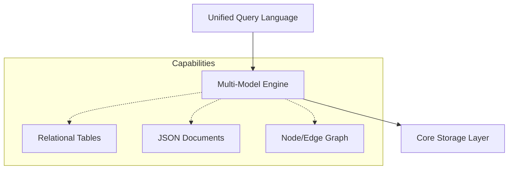

# 🎭 Multi-Model Databases: The Swiss Army Knife
> **Objective:** Master the concept of databases that support multiple data models (Relational, Document, Graph, Key-Value) within a single engine | **Language:** Hinglish | **Standard:** 2026 Expert Framework

---

## 🧭 1. Beginner-Friendly Hinglish Explanation
Multi-Model Databases ka matlab hai "Ek aisa database jo har tarah ka data handle kar sakta hai".

- **The Problem (Polyglot Persistence):** Aksar log ek app ke liye 3 databases use karte hain: Postgres (SQL), MongoDB (Document), aur Redis (Cache). Isse system bohot complex ho jata hai (Data sync karna, backup lena, etc.).
- **The Solution:** Multi-Model DB. 
- **What they offer:** 
  1. Ek hi engine ke andar aap **Tables** (SQL) bhi bana sakte hain.
  2. **JSON Documents** (NoSQL) bhi rakh sakte hain.
  3. Aur **Relationships** (Graph) bhi dhoondh sakte hain.
- **Intuition:** Ye ek "Smartphone" jaisa hai. Pehle humein Camera, Phone aur MP3 Player alag chahiye the. Ab ek hi device sab kuch perfectly karta hai.

---

## 🧠 2. Deep Technical Explanation
### 1. The Unified Core:
Internally, the database usually has one storage format (e.g., Key-Value or ARS). The SQL/Document/Graph interfaces are just "Views" or "APIs" on top of that core.

### 2. Cross-Model Queries:
This is the superpower. You can JOIN a SQL Table with a JSON Document in a single query.
- `SELECT users.name, doc.hobbies FROM users JOIN documents doc ON users.id = doc.user_id`

### 3. Key Examples:
- **ArangoDB:** Native Document, Graph, and Search.
- **SurrealDB:** (Modern 2026 Star) SQL, Document, Graph, and Real-time subscriptions.
- **Azure CosmosDB:** Supports SQL, Mongo, Cassandra, and Gremlin APIs.

---

## 🏗️ 3. Database Diagrams (The Unified Engine)


---

## 💻 4. Query Execution Examples (SurrealDB / ArangoDB)
```sql
-- 1. SurrealDB: Creating data (SQL + Document)
CREATE person:sameer SET
    name = 'Sameer',
    tags = ['developer', 'sre'], -- Array (Document style)
    address = { city: 'Delhi' }; -- Object

-- 2. SurrealDB: Graph Relationship
RELATE person:sameer->follows->person:kishore;

-- 3. Cross-Model Query
SELECT name, ->follows->person.name AS friends 
FROM person:sameer;
```

---

## 🌍 5. Real-World Production Examples
- **SaaS Platforms:** Using a multi-model DB to handle User Profiles (Document), Relationships (Graph), and Billing (SQL) in one place.
- **Inventory Management:** Storing product details (Document) and tracking the supply chain (Graph) to see which component failure affects which product.

---

## ❌ 6. Failure Cases
- **Jack of all trades, Master of none:** A multi-model DB might be $20\%$ slower than a dedicated SQL DB for SQL, and $20\%$ slower than Neo4j for Graph queries.
- **Complex Learning Curve:** You have to learn a new query language that tries to do everything (e.g., AQL or SurrealQL).
- **Index Management:** Managing indexes across different models can be tricky and consume a lot of RAM.

---

## 🛠️ 7. Debugging Guide
| Problem | Reason | Solution |
| :--- | :--- | :--- |
| **Join is slow** | Mixed models without index | Ensure that the field you are joining (e.g., `user_id` inside JSON) is indexed as a top-level field. |
| **Memory Spike** | Graph traversal depth | Limit the depth of your graph queries (`*1..3` instead of `*`). |

---

## ⚖️ 8. Tradeoffs
- **Simplicity (1 DB to manage / 1 Backup / 1 API)** vs **Specialization (Top performance for specific tasks).**

---

## 🛡️ 9. Security Concerns
- **Unified Permissions:** Ensuring that if a user has access to the "SQL View", they don't accidentally get access to the "Graph View" of sensitive data.

---

## 📈 10. Scaling Challenges
- **Vertical Bottlenecks:** Since everything is in one engine, a heavy "Graph Search" could slow down your critical "SQL Billing" transactions. **Fix: Use 'Resource Isolation'.**

---

## ✅ 11. Best Practices
- **Use Multi-model DBs to reduce "Architectural Complexity".**
- **Start with the model that fits 80% of your data** and use others sparingly.
- **Monitor performance carefully** as you start mixing models in single queries.
- **Use SurrealDB** for modern, real-time web/mobile apps.

---

## ⚠️ 13. Common Mistakes
- **Using every feature "just because it's there".**
- **Not realizing the performance cost of cross-model Joins.**

---

## 📝 14. Interview Questions
1. "What is Polyglot Persistence and how does Multi-Model solve it?"
2. "Can you join a JSON document with a SQL table in a Multi-Model DB?"
3. "Name 3 Multi-Model databases."

---

## 🚀 15. Latest 2026 Production Database Patterns
- **Edge Multi-model:** Databases like **SurrealDB** running as a single binary on tiny edge servers (like Raspberry Pi) providing full SQL/Graph power.
- **Embedded Multi-model:** Using multi-model databases directly inside the application process (like DuckDB or SurrealDB in-memory) for ultra-fast local data processing.
漫
