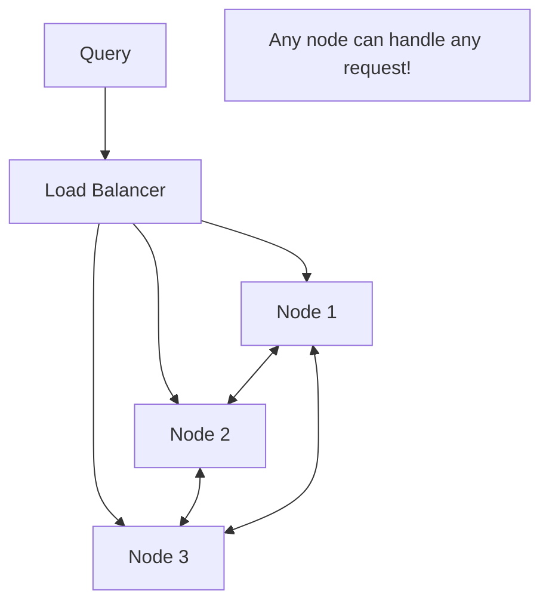

# 🚀 NewSQL Databases: SQL Scale, NoSQL Speed
> **Objective:** Master the concept of NewSQL—databases that provide the relational model and ACID guarantees of SQL but scale horizontally like NoSQL | **Language:** Hinglish | **Standard:** 2026 Expert Framework

---

## 🧭 1. Beginner-Friendly Hinglish Explanation
NewSQL Databases ka matlab hai "SQL aur NoSQL ka sabse accha combination".

- **The Problem:** 
  - **SQL (Postgres/MySQL):** Bahut acche hain, but single server par limited hain. Inhe scale karna mushkil hai.
  - **NoSQL (Cassandra/Mongo):** Scale toh ho jate hain, but ACID (Consistency) aur Joins mein thode kachche hain.
- **The Solution:** NewSQL. 
- **What they offer:** 
  1. **SQL Interface:** Aap standard SELECT/JOIN use karte hain.
  2. **ACID Transactions:** Paisa katne ki guarantee 100% hai.
  3. **Horizontal Scaling:** Bas naya server add karo aur database apne aap bada ho jayega.
- **Intuition:** Ye "SQL ka interface" aur "NoSQL ka engine" jod dene jaisa hai.

---

## 🧠 2. Deep Technical Explanation
### 1. Distributed SQL:
NewSQL databases are "Cloud-Native". They don't have a single "Master" node. Every node can process queries and the data is automatically sharded (distributed) across all nodes.
- **Automatic Sharding:** You don't have to write sharding logic in your app. The DB handles it.

### 2. Distributed Consensus (Raft/Paxos):
They use algorithms like **Raft** to ensure that when you write data, it's copied to a majority of nodes before saying "Success". This prevents data loss.

### 3. Key Examples:
- **CockroachDB:** High availability, survives even if a whole data center dies.
- **TiDB:** MySQL compatible, huge in Asia.
- **YugabyteDB:** Postgres compatible, built for high performance.

---

## 🏗️ 3. Database Diagrams (Shared-Nothing Architecture)


---

## 💻 4. Query Execution Examples (CockroachDB / TiDB)
```sql
-- 1. Standard SQL (Works exactly like Postgres)
CREATE TABLE accounts (
    id UUID PRIMARY KEY DEFAULT gen_random_uuid(),
    balance DECIMAL
);

-- 2. Distributed Transaction
BEGIN;
UPDATE accounts SET balance = balance - 100 WHERE id = 'A';
UPDATE accounts SET balance = balance + 100 WHERE id = 'B';
COMMIT; 
-- The DB ensures this is consistent even across 5 servers.

-- 3. Scaling (External to SQL)
-- 'cockroach node status'
-- Shows 10 nodes working together as one DB.
```

---

## 🌍 5. Real-World Production Examples
- **DoorDash:** Uses **CockroachDB** to manage millions of real-time orders across the US with zero downtime.
- **Zhihu (China's Quora):** Uses **TiDB** to handle trillions of records with millisecond latency.
- **Banks:** Using NewSQL to move away from old, expensive Mainframes to a cloud-native, scalable architecture.

---

## ❌ 6. Failure Cases
- **Latency Overhead:** Because data is replicated across nodes using Consensus (Raft), a write might take 5-10ms instead of 1ms on a local DB. **Fix: Use 'Locality-aware' replication.**
- **Complex Debugging:** When a query is slow, you have to find which of the 10 nodes is struggling.
- **Hardware Cost:** NewSQL needs more RAM and CPU than a simple SQLite or MySQL instance to manage the distributed state.

---

## 🛠️ 7. Debugging Guide
| Problem | Reason | Solution |
| :--- | :--- | :--- |
| **Transaction Retry Errors** | Optimistic Locking conflict | Implement "Retry Logic" in your application code. |
| **Hot Spots** | Non-random Primary Keys | Use **UUIDs** or **Hash-Sharded** indexes instead of incrementing IDs. |

---

## ⚖️ 8. Tradeoffs
- **Scale & Safety (Excellent)** vs **Latency & Cost (Higher than single-node SQL).**

---

## 🛡️ 9. Security Concerns
- **Intra-node Traffic:** Data moves constantly between nodes. If this traffic is not encrypted with TLS, it's a security hole. **Fix: Use 'Secure Mode' with certificates.**

---

## 📈 10. Scaling Challenges
- **The 100-node limit:** While NewSQL scales well, once you hit 100+ nodes, the coordination between nodes (Gossip protocol) can start eating significant CPU.

---

## ✅ 11. Best Practices
- **Use UUIDs for Primary Keys** to avoid "Hot Spots".
- **Keep transactions short** to avoid locking many nodes.
- **Use 'Follower Reads'** for data that doesn't need to be 100% fresh (saves latency).
- **Test failovers regularly.**

---

## ⚠️ 13. Common Mistakes
- **Using NewSQL for a tiny app.** (Just use Postgres/SQLite).
- **Ignoring "Secondary Index" performance** (They are distributed too!).

---

## 📝 14. Interview Questions
1. "What is NewSQL and why do we need it?"
2. "How does CockroachDB handle horizontal scaling while keeping ACID?"
3. "Difference between Sharding (Manual) and Distributed SQL (Automatic)?"

---

## 🚀 15. Latest 2026 Production Database Patterns
- **Postgres compatibility as the new standard:** Almost all NewSQL databases (Yugabyte, Cockroach) are adopting the Postgres wire protocol to leverage its massive ecosystem.
- **Multi-Cloud NewSQL:** Running one single database cluster where some nodes are in AWS and some in Azure to survive a whole cloud provider's outage.
漫
