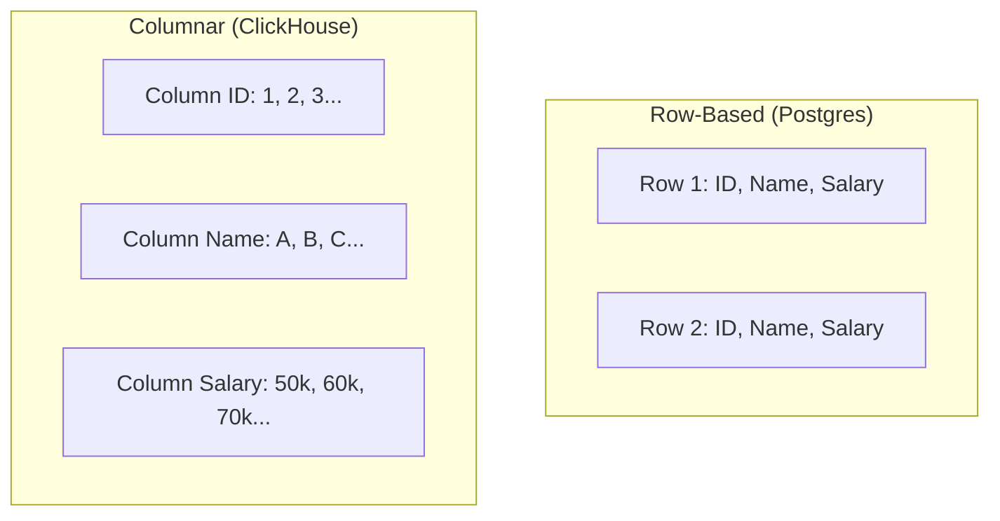

# 🧱 Columnar Databases and Storage: The Analytics Engine
> **Objective:** Master the internals of Columnar storage, understanding how it differs from Row storage and why it's the foundation of modern data warehousing and big data | **Language:** Hinglish | **Standard:** 2026 Expert Framework

---

## 🧭 1. Beginner-Friendly Hinglish Explanation
Columnar Databases aur Storage ka matlab hai "Data ko rows ki bajaye columns mein save karna".

- **The Problem:** Ek table mein 50 columns hain. Aapko sirf "Total Sales" (1 column) chahiye. Row-based database (Postgres) ko poori row padhni padegi har baar, jo ki bahut bada "I/O Waste" hai.
- **The Solution:** Columnar Storage.
  - Data ko column-wise save karo.
  - Agar aapko "Sales" chahiye, toh database sirf "Sales" wali file kholega aur baaki 49 columns ko touch bhi nahi karega.
- **Intuition:** Ye ek "Excel Sheet" jaisa hai jise aapne "Upar se niche" (Column) kaat diya hai, bajaye "Side by side" (Row) ke.

---

## 🧠 2. Deep Technical Explanation

### 1. Row vs Columnar Layout:
- **Row-oriented (NSM - N-ary Storage Model):**
  - Page 1: [ID1, Name1, Age1], [ID2, Name2, Age2]
  - Best for: `INSERT`, `UPDATE`, and fetching a full single record.
- **Column-oriented (DSM - Decomposition Storage Model):**
  - Page 1 (IDs): [1, 2, 3...]
  - Page 2 (Names): [Sameer, Rahul, Amit...]
  - Best for: `SUM`, `AVG`, `MAX` and scanning a few columns across millions of rows.

### 2. Compression Power:
Since one column usually has similar data (e.g., all 'Ages' are numbers between 1-100), the database can compress it heavily using **RLE (Run-Length Encoding)** or **Delta Encoding**. 
- A 1TB Row-based DB can often become a 100GB Columnar DB!

### 3. Key Examples:
- **ClickHouse:** The fastest open-source columnar DB for real-time analytics.
- **Apache Parquet:** A columnar file format used in Big Data (Spark/Hadoop).
- **Snowflake:** Cloud-native columnar data warehouse.

---

## 🏗️ 3. Database Diagrams (Storage Layout)


---

## 💻 4. Query Execution Examples (ClickHouse Syntax)
```sql
-- 1. Create a Columnar Table
CREATE TABLE sales (
    id UInt64,
    order_date Date,
    amount Float64,
    user_id UInt64
) ENGINE = MergeTree()
ORDER BY order_date;

-- 2. Fast Aggregation
-- ClickHouse will only read the 'amount' column from disk.
SELECT SUM(amount) FROM sales WHERE order_date > '2024-01-01';
```

---

## 🌍 5. Real-World Production Examples
- **Logs Management:** Storing billions of error logs. When searching for "error_code = 500", a columnar DB only scans the `error_code` column, making it $100x$ faster than SQL.
- **Financial Reporting:** Calculating global revenue across millions of transactions in seconds.

---

## ❌ 6. Failure Cases
- **Frequent Updates:** Updating a single row in a columnar database is EXTREMELY expensive because it has to find and update data in 50 different column files. **Fix: Use Columnar DBs for 'Append-only' data.**
- **Fetching all Columns:** Running `SELECT * FROM columnar_table` is slower than a Row-based DB because the engine has to "Assemble" the row from 50 different files.

---

## 🛠️ 7. Debugging Guide
| Problem | Reason | Solution |
| :--- | :--- | :--- |
| **High Latency for single inserts** | Small writes are bad for columnar | Buffer your data and write in batches of $1,000-10,000$ rows. |
| **High Memory during Aggregation** | Sorting too much data | Use 'Materialized Views' to pre-calculate aggregates. |

---

## ⚖️ 8. Tradeoffs
- **Analytical Speed (Columnar)** vs **Transactional Speed (Row-based).**

---

## ✅ 11. Best Practices
- **Write in Batches.** Never insert 1 row at a time.
- **Choose the 'Sorting Key' carefully.** It defines how data is ordered on disk.
- **Avoid `SELECT *`.** Only select what you need.
- **Use compressed formats** like Parquet/ORC for long-term storage.

漫
---

## 📝 14. Interview Questions
1. "Why is compression more effective in Columnar databases?"
2. "When would you choose a Row-based DB over a Columnar one?"
3. "What is an 'I/O amplification' in the context of row storage for analytics?"

---

## 🚀 15. Latest 2026 Production Database Patterns
- **Arrow Data Format:** Using **Apache Arrow** to move data between different systems (e.g., Python to DB) in a columnar format without any serialization overhead.
- **DuckDB:** An in-process columnar database (like SQLite for Analytics) that allows you to run high-speed SQL queries directly on your local Parquet files.
漫
