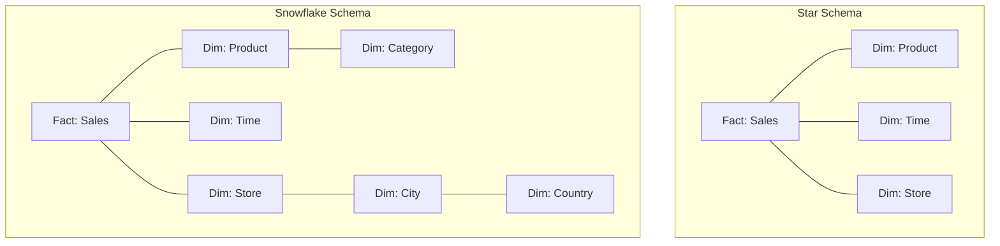

# 🏛️ Data Warehousing Architecture: Star and Snowflake Schemas
> **Objective:** Master the architectural patterns of Data Warehousing, focusing on Fact and Dimension tables and comparing Star vs Snowflake schemas for optimal analytics performance | **Language:** Hinglish | **Standard:** 2026 Expert Framework

---

## 🧭 1. Beginner-Friendly Hinglish Explanation
Data Warehousing Architecture ka matlab hai "Analysis ke liye data ko organize karne ke do tareeke: Star aur Snowflake".

- **The Philosophy:** Analytics mein humein "Joins" kam karne hote hain takki queries fast chalein. Isliye hum data ko normal app DB (3NF) se alag tarah se store karte hain.
- **The Core Parts:**
  - **Fact Table:** Ye "Action" hai. (e.g., A sale, a click, a temperature reading). Isme dher saare numbers (Metrics) hote hain.
  - **Dimension Tables:** Ye "Context" hain. (e.g., Who bought it? Which city? Which date?).
- **Intuition:** 
  - **Star Schema** ek "Suraj" (Fact) jaisa hai jiske charo taraf "Grah" (Dimensions) hain. 
  - **Snowflake Schema** usi grah ke bhi dher saare "Chand" (Sub-dimensions) hain.

---

## 🧠 2. Deep Technical Explanation

### 1. Star Schema (Denormalized):
- **Structure:** A central Fact table connected directly to multiple Dimension tables.
- **Pros:** Fast queries (Single join), easy for BI tools to understand.
- **Cons:** Data redundancy (e.g., City name is repeated many times in the dimension table).

### 2. Snowflake Schema (Normalized):
- **Structure:** Dimension tables are further normalized into sub-dimensions (e.g., 'Address' dimension splits into 'City' and 'Country' tables).
- **Pros:** Saves storage space, data integrity is high.
- **Cons:** Slow queries because of multiple levels of Joins.

### 3. Comparison Table:
| Feature | Star Schema | Snowflake Schema |
| :--- | :--- | :--- |
| **Complexity** | Simple | Complex |
| **Normalization** | Low (Denormalized) | High (Normalized) |
| **Query Speed** | Faster | Slower |
| **Data Integrity** | Lower (Risk of inconsistency) | Higher |

---

## 🏗️ 3. Database Diagrams (Star vs Snowflake)


---

## 💻 4. Query Execution Examples (Fact vs Dim)
```sql
-- 1. Typical Star Schema Query
-- Find total sales for 'Laptops' in 'Mumbai'
SELECT 
    SUM(f.amount), 
    p.category, 
    s.city
FROM fact_sales f
JOIN dim_product p ON f.product_id = p.id
JOIN dim_store s ON f.store_id = s.id
WHERE p.category = 'Laptops' AND s.city = 'Mumbai'
GROUP BY p.category, s.city;
```

---

## 🌍 5. Real-World Production Examples
- **Retail (Walmart):** Uses **Star Schema** for daily sales reporting. Every night, millions of sales are moved from OLTP to the `fact_sales` table.
- **Financial Systems:** Often use **Snowflake Schema** because data accuracy and storage efficiency across billions of transactions are more important than query speed.

---

## ❌ 6. Failure Cases
- **The Jumbo Fact Table:** Trying to put descriptive text (like a 500-word review) into the Fact table. **Fix: Move all text to Dimension tables; only keep IDs and Numbers in the Fact table.**
- **Dimension Bloat:** A dimension table (like `Users`) becoming so large that joining it is as slow as scanning the fact table. **Fix: Use 'Slowing Changing Dimensions' (SCD) patterns.**

---

## 🛠️ 7. Debugging Guide
| Problem | Reason | Solution |
| :--- | :--- | :--- |
| **Query is taking 10+ minutes** | Too many joins in Snowflake | Flatten the schema into a Star Schema (Denormalize). |
| **Data Inconsistency** | Update failed in Star schema | Use a 'Master Data Management' (MDM) tool to sync dimensions. |

---

## ⚖️ 8. Tradeoffs
- **Simplicity (Star)** vs **Efficiency (Snowflake).**

---

## ✅ 11. Best Practices
- **Use Star Schema for 90% of BI dashboards.**
- **Keep Fact tables narrow** (Only IDs and numerical metrics).
- **Use surrogate keys** (Integers) instead of strings for Joins.
- **Implement 'Slowly Changing Dimensions' (SCD)** to track history.

漫
---

## 📝 14. Interview Questions
1. "Difference between Fact and Dimension tables?"
2. "Why is Star schema generally preferred over Snowflake for speed?"
3. "What is a Surrogate Key in Data Warehousing?"

---

## 🚀 15. Latest 2026 Production Database Patterns
- **One Big Table (OBT):** With the extreme speed of columnar databases (like ClickHouse), many companies are skipping Star/Snowflake and just putting everything into one massive denormalized table.
- **Medallion Architecture:** Organizing data into Bronze (Raw), Silver (Filtered), and Gold (Business Ready/Aggregated) layers using Delta Lake.
漫
