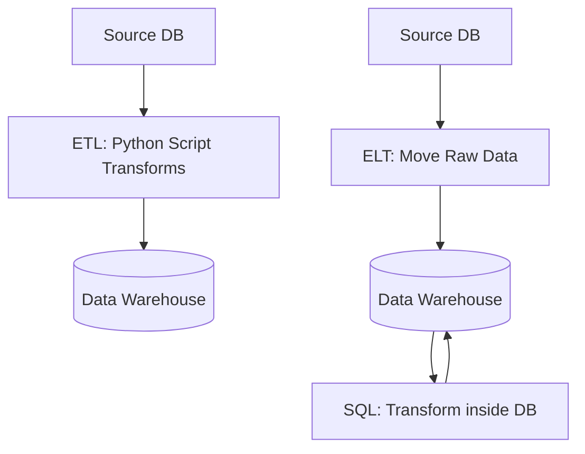

# 🔄 ETL and ELT Pipelines: Data Movement
> **Objective:** Master the two primary patterns of data integration—Extract, Transform, Load (ETL) and Extract, Load, Transform (ELT)—and choose the right one for modern data stacks | **Language:** Hinglish | **Standard:** 2026 Expert Framework

---

## 🧭 1. Beginner-Friendly Hinglish Explanation
ETL and ELT Pipelines ka matlab hai "Data ko ek jagah se dusri jagah le jana aur use useful banana".

- **The Problem:** Data raw format mein hota hai (e.g., Log files, App DB). Humein ise Clean karna hai, Format karna hai, aur Warehouse mein daalna hai.
- **ETL (The Traditional Way):** 
  - Pehle data nikalo (**E**xtract).
  - Use transform/clean karo (**T**ransform).
  - Phir warehouse mein dalo (**L**oad).
- **ELT (The Modern Way):**
  - Pehle data nikalo (**E**xtract).
  - Turant warehouse mein dalo (**L**oad).
  - Warehouse ke andar hi SQL se use transform karo (**T**ransform).
- **Intuition:** 
  - **ETL** ek "Meal Kit" jaisa hai. Sab kuch pehle se kata-kata aaya hai, aapne sirf plate mein rakha. 
  - **ELT** ek "Kitchen" jaisa hai jahan sara saaman (Raw) le aaye aur wahan hi baithkar sabzi kaati aur banayi.

---

## 🧠 2. Deep Technical Explanation

### 1. ETL (Heavy Lifting outside the DB):
- **Tooling:** Informatica, Talend, Custom Python scripts.
- **When to use?** When the target database is slow at processing or when you need to encrypt data *before* it leaves your network.

### 2. ELT (Leveraging the Cloud):
- **Tooling:** Fivetran, Airbyte (Extract/Load) + dbt (Transform).
- **When to use?** When using cloud warehouses like Snowflake/BigQuery which are $100x$ faster at SQL transformations than any external script.

### 3. Key Comparison:
| Feature | ETL | ELT |
| :--- | :--- | :--- |
| **Transform Server** | Middle-tier / Python | Target Database |
| **Volume Support** | Medium | Massive |
| **Complexity** | High | Low (Mostly SQL) |
| **Data Quality** | Checked before loading | Checked after loading |

---

## 🏗️ 3. Database Diagrams (ETL vs ELT Flow)


---

## 💻 4. Pipeline Execution Examples (Python & SQL)

### ETL Style (Python)
```python
# Extract
raw_data = db.query("SELECT * FROM orders")
# Transform
clean_data = [d.strip().upper() for d in raw_data]
# Load
warehouse.insert(clean_data)
```

### ELT Style (SQL inside Snowflake)
```sql
-- The data was already loaded raw into 'raw_orders' table
-- Now transform it using SQL
INSERT INTO final_orders
SELECT 
    order_id, 
    UPPER(product_name), 
    amount * 0.9 AS discounted_amount
FROM raw_orders;
```

---

## 🌍 5. Real-World Production Examples
- **HealthTech:** Use **ETL** to remove patient names and SSNs *before* the data ever reaches the cloud analytics platform for privacy.
- **Marketing Agency:** Use **ELT** with **Fivetran** and **Snowflake**. They sync millions of rows from Facebook Ads, Google Ads, and Shopify raw, and then use **dbt** to join them all together.

---

## ❌ 6. Failure Cases
- **The "Broken Pipe":** Source DB changed its schema (added a column). The ETL script crashes. **Fix: Use 'Schema-on-Read' or automated mapping tools.**
- **Cost Spike (ELT):** Running complex SQL transformations on 100TB of data in Snowflake can cost thousands of dollars if not optimized. **Fix: Use 'Incremental Models' to only transform new data.**

---

## 🛠️ 7. Debugging Guide
| Problem | Reason | Solution |
| :--- | :--- | :--- |
| **Data is missing for today** | Pipeline failed at Extract stage | Check credentials and network connectivity to source. |
| **Wrong calculations in report** | Logic error in Transform stage | Test your SQL/Python logic with a small subset of data. |

---

## ⚖️ 8. Tradeoffs
- **ETL (Privacy / Clean Warehouse)** vs **ELT (Speed / Flexibility / SQL-based).**

---

## ✅ 11. Best Practices
- **Use ELT for most modern cloud projects.**
- **Implement 'Idempotency':** Running the same pipeline twice should not duplicate data.
- **Always have Logging and Alerting** on your pipelines.
- **Use dbt (Data Build Tool)** for managing SQL transformations.

漫
---

## 📝 14. Interview Questions
1. "Why has ELT become more popular than ETL in the cloud era?"
2. "What is Idempotency in the context of data pipelines?"
3. "Explain the role of 'dbt' in the modern data stack."

---

## 🚀 15. Latest 2026 Production Database Patterns
- **Zero-ETL:** Modern cloud providers (like AWS) now offer Zero-ETL integrations where data from your MySQL DB automatically appears in Redshift without you writing a single line of code.
- **Real-time ELT:** Using **Kafka Connect** to stream every single change from production into the warehouse in under 1 second.
漫
