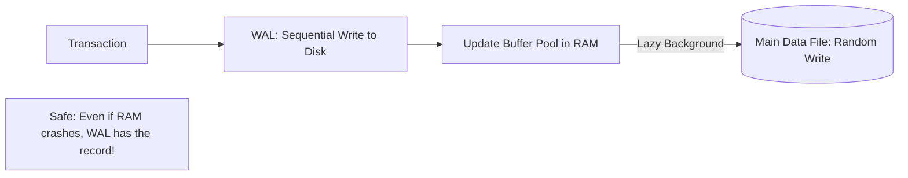

# 🏗️ Advanced Internals Questions: The Senior Engineer Level
> **Objective:** Master the complex questions about database internals, storage engines, and concurrency control that differentiate a junior from a senior engineer | **Language:** Hinglish | **Standard:** 2026 Expert Framework

---

## 🧭 1. Beginner-Friendly Hinglish Explanation
Advanced Internals Questions ka matlab hai "Database ke bonnet ke niche (Under the hood) kya ho raha hai".

- **The Focus:** Interviewer ye check kar raha hai ki kya aapko pata hai ki database "Kaise" kaam karta hai, sirf "Queries" likhna kaafi nahi hai.
- **Key Areas:** 
  1. **B-Trees vs LSM Trees:** Data disk par kaise save hota hai?
  2. **MVCC:** Multiple users ek saath kaise kaam karte hain?
  3. **WAL (Write Ahead Logging):** Crash ke baad data kaise bachta hai?
  4. **Query Optimizer:** Database rasta kaise chunta hai?

---

## 🧠 2. Deep Technical Explanation (Expert Questions)

### Q1: Why do most databases use B+ Trees instead of Binary Search Trees?
- **Disk I/O:** Binary trees are too deep. B+ Trees have a high "Fan-out" (many children per node), making them very "Flat". This means we only need 3-4 disk reads to find data in billions of rows.
- **Sequential Access:** B+ Trees have a linked list at the leaf level, making "Range Queries" (`WHERE age BETWEEN 20 AND 30`) very fast.

### Q2: Explain MVCC (Multi-Version Concurrency Control).
Instead of locking a row when someone is reading it, the database creates a "Version" (Snapshot) of that row.
- **Reader:** Reads version $X$.
- **Writer:** Creates version $X+1$.
- This allows **Readers to never block Writers**, and vice versa. This is the secret to Postgres and MySQL's high performance.

### Q3: What is the purpose of the Buffer Pool?
The Buffer Pool is a part of RAM where the DB caches data pages from the disk. 
- If the data is in the Buffer Pool (**Cache Hit**), it's $100x$ faster than reading from SSD.
- Database uses **LRU (Least Recently Used)** algorithm to decide which pages to keep in RAM.

---

## 🏗️ 3. Database Diagrams (The WAL Flow)


---

## 💻 4. Query Execution Examples (Internal State)
```sql
-- Interview Question: "What happens internally during an UPDATE?"
UPDATE users SET balance = 500 WHERE id = 1;

-- 1. Find the page containing id=1 in the Buffer Pool (or load from disk).
-- 2. Lock the row (X-Lock).
-- 3. Write the 'Before' and 'After' values to the WAL log (Synchronous write).
-- 4. Update the value in the Buffer Pool (RAM is now 'Dirty').
-- 5. Return 'Success' to the user.
-- 6. Background 'Checkpointer' will write the Dirty page to the main file later.
```

---

## 🌍 5. Real-World Production Examples
- **High Write Load:** When building a logging system, a senior engineer chooses an **LSM-Tree** based database (like Cassandra or RocksDB) because it's much faster for writes than a B-Tree.

---

## ❌ 6. Failure Cases (The "Gotchas")
- **Phantom Reads:** You read 10 rows, another user inserts the 11th row, you read again and see 11. **Fix: Use 'Serializable' isolation level.**
- **Index Bloat:** Deleting millions of rows in Postgres doesn't actually remove them from the index immediately. The index stays huge. **Fix: Run `REINDEX` or `VACUUM FULL`.**

---

## 🛠️ 7. Debugging Guide (Internals Level)
| Symptom | Internal Reason | Diagnostic |
| :--- | :--- | :--- |
| **Random slow queries** | Checkpoint SPIKE | Monitor `checkpoint_segments` and `max_wal_size`. |
| **High CPU during idle** | Vacuum / Autovacuum | Check `pg_stat_progress_vacuum` to see if the DB is cleaning itself. |

---

## ⚖️ 8. Tradeoffs
- **B-Trees (Fast Reads / Slow Writes)** vs **LSM-Trees (Super Fast Writes / Slow Reads).**

---

## ✅ 11. Best Practices for Internals Questions
- **Mention "Disk I/O"** as the biggest bottleneck.
- **Explain "WAL"** when asked about data durability.
- **Use the word "Fan-out"** when talking about B-Trees.
- **Talk about "Snapshots"** when explaining Isolation levels.

---

## ⚠️ 13. Common Mistakes
- **Thinking that `UPDATE` immediately writes to the main `.db` file.** (It writes to WAL and RAM first).
- **Not knowing the difference between a B-Tree and a B+ Tree.** (B+ Trees have data only in leaves and a linked list for range scans).

---

## 📝 14. Rapid Fire Questions
1. "What is a Dirty Page?"
2. "What is a Deadlock?"
3. "Explain 'Write Amplification'."
4. "What is a 'Full Table Scan' called in Postgres internals?" (Seq Scan).

---

## 🚀 15. Latest 2026 Interview Patterns
- **Storage Disaggregation:** How databases like AWS Aurora separate Compute from Storage.
- **Columnar Storage:** Why Parquet/ClickHouse are faster for analytics queries than MySQL.
漫
