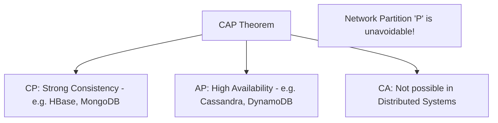

# 🌐 Distributed Systems Questions: Scaling and Consensus
> **Objective:** Master the complex questions about distributed databases, CAP theorem, replication, and consensus algorithms that are crucial for backend and SRE roles | **Language:** Hinglish | **Standard:** 2026 Expert Framework

---

## 🧭 1. Beginner-Friendly Hinglish Explanation
Distributed Systems Questions ka matlab hai "Database ko multiple servers par chalane ki challenges".

- **The Focus:** Interviewer ye dekhna chahta hai ki kya aapko pata hai ki jab data 10 servers par banta hua hota hai, toh "Sach" (Consistency) kaise dhoondha jata hai.
- **Key Areas:** 
  1. **CAP Theorem:** Kya aap sab kuch (Speed, Consistency, Availability) ek saath paa sakte hain? (Spoiler: Nahi).
  2. **Replication:** Master-Slave vs Multi-Master.
  3. **Sharding:** Data ko tukdon mein kaise baantein?
  4. **Consensus:** Servers aapas mein "Agree" kaise karte hain? (Paxos/Raft).

---

## 🧠 2. Deep Technical Explanation (Distributed Questions)

### Q1: Explain the CAP Theorem with a real-world example.
You can only have 2 out of 3:
- **Consistency (C):** Every node sees the same data.
- **Availability (A):** Every request gets a response (Success/Failure).
- **Partition Tolerance (P):** System works even if nodes can't talk to each other.
- **Example:** In a network partition (P), a bank must choose between **Consistency** (Refuse transactions to avoid double-spending) or **Availability** (Allow transactions but risk inconsistent balances).

### Q2: What is 'Eventual Consistency'?
It means if no new updates are made to a data item, eventually all accesses will return the last updated value.
- **Used in:** DNS, Social Media likes, Amazon Cart.
- **Why?** It's extremely fast and highly available.

### Q3: How does Consistent Hashing work?
Standard hashing (`key % N`) fails when you add or remove a server (all keys move!).
- **Consistent Hashing** maps keys and servers onto a "Circle" (Ring).
- When a server is added, only $1/N$ of the keys need to be moved. Essential for systems like Cassandra and DynamoDB.

---

## 🏗️ 3. Database Diagrams (The CAP Tradeoff)


---

## 💻 4. Query Execution Examples (Distributed Logic)
```javascript
// Interview Question: "How do you handle a write in an AP system (Cassandra)?"
// Quorum Write (W + R > N)
const config = {
    replicationFactor: 3,
    readConsistency: 'QUORUM',  // Wait for 2 nodes
    writeConsistency: 'QUORUM' // Wait for 2 nodes
};
// This ensures that at least 1 node will always have the latest data during a read.
```

---

## 🌍 5. Real-World Production Examples
- **Twitter 'Like' Count:** Uses **Eventual Consistency**. It's okay if you see 100 likes and your friend sees 102 for a few seconds.
- **Bank Transfer:** Uses **Strong Consistency**. It is NEVER okay for two people to see different balances for the same account.

---

## ❌ 6. Failure Cases (Distributed Pitfalls)
- **Split Brain:** Two nodes both think they are the "Master" because they can't talk to each other. They both accept writes, creating a massive data mess. **Fix: Use 'Quorum' (Majority) voting.**
- **Replication Lag:** You write to Master, but read from Slave instantly and see old data. **Fix: Use 'Read-your-own-writes' consistency or sticky sessions.**

---

## 🛠️ 7. Debugging Guide (Distributed Level)
| Problem | Reason | Solution |
| :--- | :--- | :--- |
| **Data Inconsistency** | Clock Skew | Use **Vector Clocks** or **TrueTime** (Spanner) instead of System Clock. |
| **One node is slow** | Straggler | Use **Speculative Execution** (run the same query on another node and take the first result). |

---

## ⚖️ 8. Tradeoffs
- **Synchronous Replication (Safe / Slow)** vs **Asynchronous Replication (Fast / Risk of data loss).**

---

## ✅ 11. Best Practices for Distributed Questions
- **Always ask about the 'Scale'** (How many users? How much data?).
- **Mention 'Quorum'** when talking about consensus.
- **Explain 'Last Write Wins' (LWW)** vs **CRDTs** for conflict resolution.
- **Never say 'I will build a globally consistent system without latency'.** (It's physically impossible).

---

## ⚠️ 13. Common Mistakes
- **Assuming that NoSQL always means 'No Consistency'.** (Many NoSQL DBs offer tunable consistency).
- **Ignoring the speed of light.** (Data takes time to travel between continents).

---

## 📝 14. Rapid Fire Questions
1. "What is a 'Saga Pattern' for distributed transactions?"
2. "What is a 'Heartbeat' in distributed systems?"
3. "Difference between Vertical and Horizontal Sharding?"
4. "What is 'Gossip Protocol'?"

---

## 🚀 15. Latest 2026 Interview Patterns
- **PACELC Theorem:** An extension of CAP that explains what happens when there is *no* partition (Latence vs Consistency).
- **Distributed SQL (NewSQL):** How databases like CockroachDB provide SQL consistency at NoSQL scale.
漫
