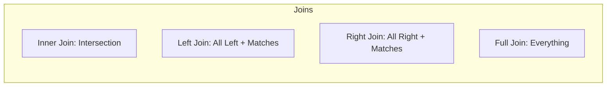

# 🎓 General DBMS Interview Questions: The Essentials
> **Objective:** Master the most common and fundamental DBMS interview questions asked at top tech companies (FAANG/MAANG) | **Language:** Hinglish | **Standard:** 2026 Expert Framework

---

## 🧭 1. Beginner-Friendly Hinglish Explanation
General DBMS Interview Questions ka matlab hai "Database ke wo basics jo har interview mein puche jate hain".

- **The Focus:** Interviewer ye dekhna chahta hai ki kya aapko database ke "Ground Rules" pata hain. 
- **Key Areas:** 
  1. **ACID Properties:** Transaction sahi se hota hai ya nahi?
  2. **Normalization:** Data organize kaise hota hai?
  3. **Keys:** Primary Key vs Foreign Key.
  4. **Joins:** Do tables ko kaise jodte hain?
- **Pro Tip:** Sirf "Definition" mat ratto. Unhe "Example" ke saath samjhao. (e.g., Bank transaction for ACID).

---

## 🧠 2. Deep Technical Explanation (Top Questions)

### Q1: What are ACID properties? Explain with an example.
- **Atomicity:** "All or Nothing". Either the whole transaction happens (Amount deducted AND credited) or none of it happens.
- **Consistency:** The DB moves from one valid state to another. (e.g., Total money in the bank remains the same before and after transfer).
- **Isolation:** Multiple transactions don't interfere with each other.
- **Durability:** Once committed, data is permanent even if the server crashes.

### Q2: Difference between SQL and NoSQL?
| Feature | SQL (Relational) | NoSQL (Non-relational) |
| :--- | :--- | :--- |
| **Schema** | Rigid (Fixed) | Flexible (Dynamic) |
| **Scaling** | Vertical (Bigger server) | Horizontal (More servers) |
| **Consistency** | Strong (ACID) | Eventual (BASE) |
| **Examples** | Postgres, MySQL | MongoDB, Cassandra |

### Q3: What is Database Normalization? Why do we need it?
It's the process of organizing data to reduce **Redundancy** (Duplication) and **Dependency**.
- **1NF:** Atomic values (No lists in columns).
- **2NF:** No partial dependencies.
- **3NF:** No transitive dependencies. (Usually enough for production).

---

## 🏗️ 3. Database Diagrams (The 4 Joins)


---

## 💻 4. Query Execution Examples (Interview Favorites)
```sql
-- 1. Find the 2nd Highest Salary (Very common)
SELECT MAX(salary) 
FROM employees 
WHERE salary < (SELECT MAX(salary) FROM employees);

-- 2. Find duplicate emails
SELECT email, COUNT(email) 
FROM users 
GROUP BY email 
HAVING COUNT(email) > 1;

-- 3. Delete duplicates (Keep only one)
DELETE FROM users 
WHERE id NOT IN (
    SELECT MIN(id) FROM users GROUP BY email
);
```

---

## 🌍 5. Real-World Production Examples
- **Normalization:** In a 2026 production app, we usually use **3NF** for the core database but **Denormalize** (1NF style) for the Analytics database to make reports faster.

---

## ❌ 6. Failure Cases (Common Interview Traps)
- **Trap:** "Is NoSQL always faster than SQL?"
  - **Answer:** NO. NoSQL is faster for simple Key-Value lookups and scaling, but SQL is much faster for complex Joins and aggregated reporting.
- **Trap:** "Can you have two Primary Keys?"
  - **Answer:** NO. You can only have ONE Primary Key, but it can be a **Composite Key** (made of two columns).

---

## 🛠️ 7. Debugging Guide (SQL Interview Errors)
| Error | Reason | Solution |
| :--- | :--- | :--- |
| **"Column must appear in GROUP BY"** | Aggregation error | Every column in `SELECT` that isn't `SUM/AVG` must be in `GROUP BY`. |
| **"Subquery returned more than 1 value"** | Logical error | Use `IN` instead of `=` for the subquery. |

漫
---

## ✅ 11. Best Practices for Interviews
- **Draw diagrams** for Joins.
- **Explain the "Why"** before the "How".
- **Write clean SQL** with indentation.
- **Mention Performance** (e.g., "I will add an index on this column").

---

## ⚠️ 13. Common Mistakes
- **Forgetting the 'WHERE' clause** in a `DELETE` or `UPDATE` question.
- **Confusing 'WHERE' with 'HAVING'.** (`WHERE` is for rows, `HAVING` is for groups).

---

## 📝 14. Rapid Fire Questions
1. "What is a Foreign Key?"
2. "What is a View in SQL?"
3. "Difference between DELETE and TRUNCATE?"
4. "What is a Stored Procedure?"

---

## 🚀 15. Latest 2026 Interview Patterns
- **SQL for Data Science:** Expect questions on Window Functions (`RANK`, `DENSE_RANK`, `LEAD/LAG`).
- **Schema Design for AI:** Questions on how to store Vector embeddings alongside relational data.
漫
