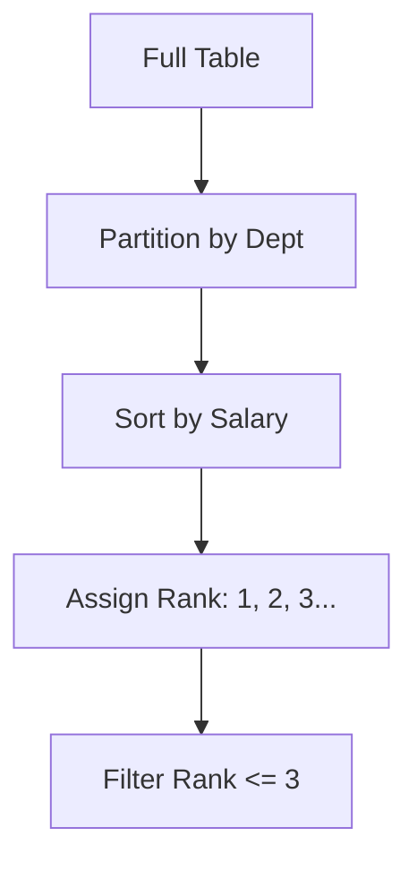

# 💻 SQL Problem Solving: Coding the Query
> **Objective:** Master the most common SQL coding challenges asked during technical interviews, from basic filtering to advanced window functions | **Language:** Hinglish | **Standard:** 2026 Expert Framework

---

## 🧭 1. Beginner-Friendly Hinglish Explanation
SQL Problem Solving ka matlab hai "SQL Queries likhne ki practice".

- **The Focus:** Interviewer aapko ek table dega aur ek "Business Problem" puchega (e.g., "Find the top 3 customers"). 
- **The Levels:** 
  1. **Basic:** SELECT, WHERE, LIKE.
  2. **Intermediate:** GROUP BY, HAVING, JOINs.
  3. **Advanced:** Subqueries, CTEs (Common Table Expressions), Window Functions.
- **Pro Tip:** Query likhne se pehle rasta (Logic) samjhao. "Pehle main groups banaunga, phir unhe sort karunga...".

---

## 🧠 2. Deep Technical Explanation (Top Coding Challenges)

### Challenge 1: The 'Top N' Problem
**Problem:** Find the top 3 highest-paid employees in each department.
```sql
-- Using Window Functions (The Modern Way)
WITH RankedEmployees AS (
    SELECT 
        name, 
        salary, 
        department_id,
        DENSE_RANK() OVER(PARTITION BY department_id ORDER BY salary DESC) as rank
    FROM employees
)
SELECT * FROM RankedEmployees WHERE rank <= 3;
```

### Challenge 2: The 'Consecutive Wins' Problem
**Problem:** Find users who have logged in for 3 consecutive days.
```sql
-- Using LEAD/LAG
SELECT DISTINCT user_id
FROM (
    SELECT 
        user_id, 
        login_date,
        LAG(login_date, 1) OVER(PARTITION BY user_id ORDER BY login_date) as prev_1,
        LAG(login_date, 2) OVER(PARTITION BY user_id ORDER BY login_date) as prev_2
    FROM logins
) t
WHERE login_date = prev_1 + 1 AND login_date = prev_2 + 2;
```

### Challenge 3: The 'Self Join' Problem
**Problem:** Find employees who earn more than their managers.
```sql
SELECT e.name 
FROM employees e
JOIN employees m ON e.manager_id = m.id
WHERE e.salary > m.salary;
```

---

## 🏗️ 3. Database Diagrams (Window Functions Logic)


---

## 💻 4. Query Execution Examples (Essential Patterns)
```sql
-- 1. Handling NULLs in math
-- Use COALESCE to provide a default value
SELECT name, (salary + COALESCE(bonus, 0)) as total_pay FROM employees;

-- 2. Case Statements (If/Else in SQL)
SELECT name,
    CASE 
        WHEN score >= 90 THEN 'A'
        WHEN score >= 80 THEN 'B'
        ELSE 'C'
    END as grade
FROM students;

-- 3. CTE vs Subquery
-- CTEs are much cleaner and more readable!
WITH ActiveUsers AS (
    SELECT user_id FROM orders WHERE date > '2024-01-01'
)
SELECT * FROM users WHERE id IN (SELECT user_id FROM ActiveUsers);
```

---

## 🌍 5. Real-World Production Examples
- **Churn Analysis:** Using `LAG` to see when a user stopped their subscription compared to their previous activity.
- **Inventory Tracking:** Using `SUM() OVER(ORDER BY date)` to calculate a running total of stock.

---

## ❌ 6. Failure Cases (Common Bugs)
- **Duplicate Ranks:** Using `RANK()` instead of `DENSE_RANK()`. `RANK()` leaves gaps (1, 2, 2, 4), while `DENSE_RANK()` does not (1, 2, 2, 3).
- **Group By Mistake:** Selecting a column that is not in the `GROUP BY` clause.
- **Join Explosion:** Joining two tables without a proper key, creating a "Cartesian Product" (Billions of rows).

---

## 🛠️ 7. Debugging Guide (SQL Level)
| Symptom | Reason | Solution |
| :--- | :--- | :--- |
| **Empty Result** | Case sensitivity / Trailing spaces | Use `LOWER(column)` and `TRIM(column)`. |
| **Wrong Sum** | Duplicate rows due to Join | Use `DISTINCT` or check your join condition. |

漫
---

## ✅ 11. Best Practices for Coding Interviews
- **Always ask about 'Edge Cases'** (e.g., "What if two people have the same salary?").
- **Use CTEs** for complex logic to keep the code readable.
- **Write keywords in UPPERCASE** (`SELECT`, `FROM`, `WHERE`).
- **Assume the data is dirty** (Use `COALESCE` and `TRIM`).

---

## ⚠️ 13. Common Mistakes
- **Forgetting `GROUP BY`** when using `COUNT` or `SUM`.
- **Using `WHERE` when you should use `HAVING`.**
- **Not handling `NULL` values.**

---

## 📝 14. Rapid Fire Practice
1. "Find the length of the longest string in a column."
2. "Convert a string date '2024-05-10' to a real DATE type."
3. "Find all users whose name starts with 'S' and ends with 'R'." (`LIKE 'S%R'`).

---

## 🚀 15. Latest 2026 SQL Features
- **JSON Path Expressions:** Querying nested JSON data directly in SQL: `SELECT data->'$.user.address.city'`.
- **Recursive CTEs:** Using SQL to traverse a tree structure (like a folder hierarchy or a family tree).
漫
