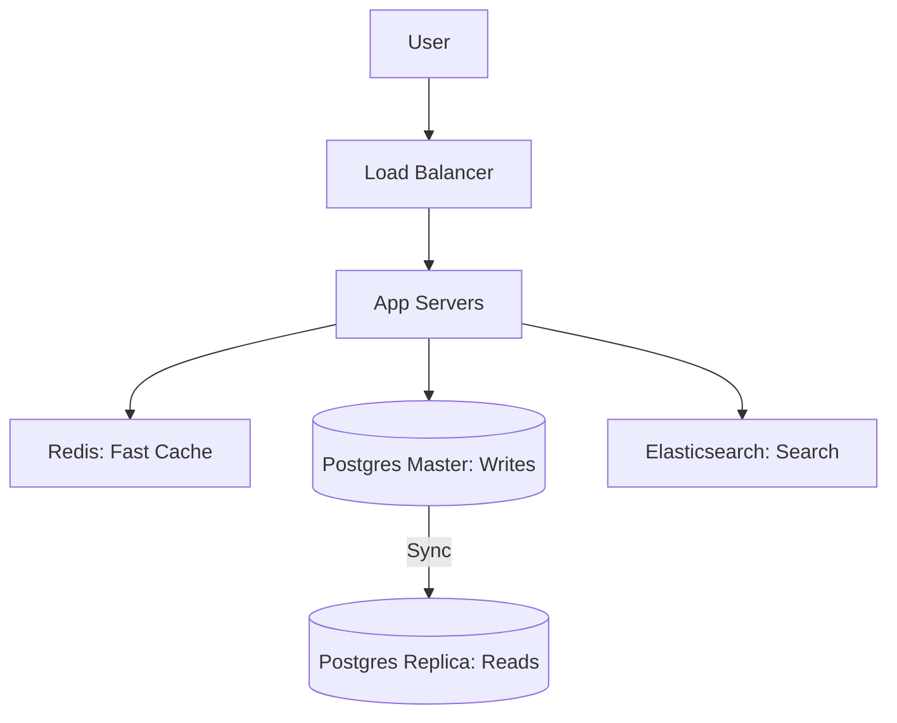

# 🏗️ System Design with Databases: Architectural Thinking
> **Objective:** Master how to choose and integrate the right databases when designing large-scale systems like Uber, Netflix, or Twitter | **Language:** Hinglish | **Standard:** 2026 Expert Framework

---

## 🧭 1. Beginner-Friendly Hinglish Explanation
System Design with Databases ka matlab hai "Puri building (App) ka nakshe (Architecture) mein database kahan aur kaise fit hoga".

- **The Focus:** Interviewer aapko ek bada system design karne ko kahega (e.g., "Design Instagram"). Aapko decide karna hai ki:
  - User profile kahan rahegi? (SQL).
  - Photos kahan rahengi? (S3).
  - Followers kahan rahengi? (Graph).
  - Feed kahan banegi? (Redis).
- **The Core Skill:** Choose the **Right Tool for the Job**. Har cheez ke liye SQL use karna galti hai, aur har cheez NoSQL mein daalna bhi galti hai.

---

## 🧠 2. Deep Technical Explanation (Design Patterns)

### Pattern 1: Polyglot Persistence
Using different databases for different features of the same app.
- **Relational (Postgres):** For Transactions, Billing, and User Metadata.
- **Document (MongoDB):** For flexible data like Product Catalog.
- **Cache (Redis):** For high-speed temporary data like Session or Leaderboards.
- **Search (Elasticsearch):** For Full-text search and filters.

### Pattern 2: CQRS (Command Query Responsibility Segregation)
Splitting "Writes" and "Reads" into different databases.
- **Write DB:** Optimized for speed and integrity.
- **Read DB:** Optimized for complex queries (e.g., a Read Replica or an Elasticsearch index).

### Pattern 3: Sharding at Scale
When one DB server isn't enough.
- **Range Sharding:** Users A-M on Server 1, N-Z on Server 2.
- **Hash Sharding (Better):** `hash(user_id) % N`. Ensures even distribution.

---

## 🏗️ 3. Database Diagrams (A High-Scale Architecture)

---

## 💻 4. Decision Matrix (Which DB to Choose?)
| Requirement | Choice | Reason |
| :--- | :--- | :--- |
| **Financial / ACID** | Postgres / MySQL | Strong consistency and transactions. |
| **High Write / Logs** | Cassandra / ClickHouse | LSM-tree based high-speed writes. |
| **Real-time Chat** | Redis / MongoDB | Low latency, flexible schema. |
| **Social Graph** | Neo4j / ArangoDB | Fast relationship traversals (Friends of Friends). |

---

## 🌍 5. Real-World Production Examples
- **Netflix:** Uses **Cassandra** for storing user viewing history globally because it's highly available and scales horizontally.
- **Uber:** Uses a custom layer on top of **MySQL** called Schemaless for storing trillions of trip records.

---

## ❌ 6. Failure Cases (Common Design Flaws)
- **Single Point of Failure (SPOF):** Not having a Read Replica. If the Master dies, the whole app dies.
- **Consistency vs Availability mismatch:** Choosing a Strong Consistent DB (CP) for a Social Media feed. If the network has a glitch, users can't see their feed. **Fix: Use AP (Eventual Consistency).**
- **Ignoring Latency:** Placing the DB in USA but having users in Australia without a Local Replica.

---

## 🛠️ 7. Debugging Guide (System Design Level)
| Problem | Reason | Solution |
| :--- | :--- | :--- |
| **Slow Reads** | No Caching / No Index | Add **Redis** or proper **Indexes**. |
| **Slow Writes** | Too many Indexes / Locks | Use **Sharding** or move to an **LSM-tree** DB. |

漫
---

## ✅ 11. Best Practices for System Design Interviews
- **Clarify the Requirements first.** (How many users? Read-heavy or Write-heavy?).
- **Estimate the Scale.** (How much storage per day?).
- **Talk about Tradeoffs.** ("I chose NoSQL because availability is more important than consistency for this feature").
- **Mention 'High Availability' and 'Disaster Recovery'.**

---

## ⚠️ 13. Common Mistakes
- **Designing for 'Google Scale' when the problem is small.**
- **Forgetting about 'Data Backup' and 'Security'.**

---

## 📝 14. Rapid Fire Practice (Which DB?)
1. "Tracking every step of a delivery package?" (Time-Series / Ledger).
2. "Storing millions of IoT sensor readings?" (TimescaleDB / InfluxDB).
3. "Implementing 'Customers who bought this also bought...'?" (Graph / Vector).

---

## 🚀 15. Latest 2026 System Design Trends
- **AI-Augmented Architecture:** Using a **Vector Database** alongside SQL for every modern app to provide "Semantic Search" and "Personalized Recommendations".
- **Database-per-Service:** In Microservices, every service has its own private DB to avoid "Tight Coupling".
漫
