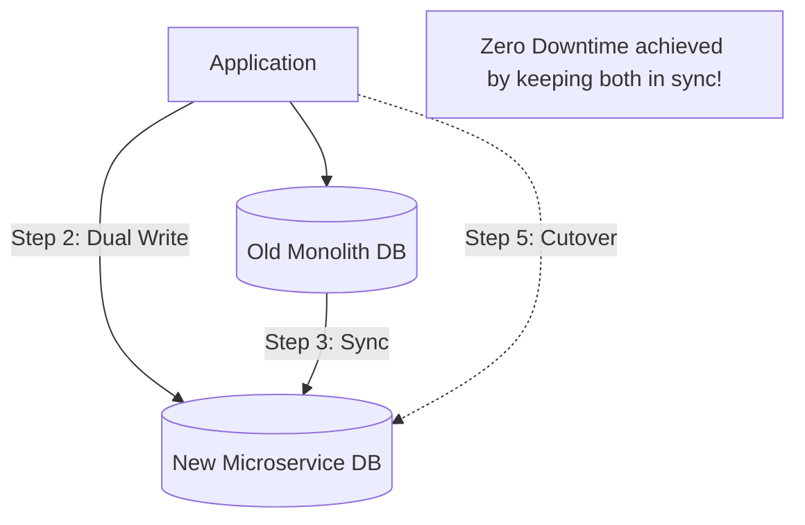

# 🏠 Case Study: Airbnb's Zero-Downtime Migration
> **Objective:** Analyze how Airbnb migrated its massive production databases to a service-oriented architecture without a single second of downtime | **Language:** Hinglish | **Standard:** 2026 Expert Framework

---

## 🧭 1. Beginner-Friendly Hinglish Explanation
Airbnb Migration ka matlab hai "Ek bahut badi chalti hui building ki foundation badalna bina kisi ko disturb kiye".

- **The Problem:** Airbnb shuru mein ek "Monolith" tha. Ek hi bada database saare kaam karta tha (Search, Booking, Payment, Messaging). Jab traffic badha, toh wo ek database "Bottleneck" ban gaya.
- **The Solution:** Migration to Microservices.
  - Ek bade database ko 50 chote databases mein todna.
  - Isme challenge ye tha ki Airbnb 24/7 chalta hai. Aap use "Maintenance Mode" mein nahi dal sakte.
- **Intuition:** Ye "Ek chalti hui car ke engine ko naye engine se badalne" jaisa hai jab car 100km/h ki speed par hai.

---

## 🧠 2. Deep Technical Explanation
### 1. The Strategy: Double Writing
1. **Phase 1: Read/Write to Old DB.** (Normal state).
2. **Phase 2: Dual Writing.** App writes to both Old DB AND New DB. But it still reads from the Old DB.
3. **Phase 3: Data Sync.** A background tool ensures that all "Old" data is also moved to the New DB.
4. **Phase 4: Dual Reading.** App reads from both and compares. If results match, we are safe.
5. **Phase 5: Cutover.** Switch completely to the New DB.

### 2. Using 'Vitess':
Airbnb used **Vitess** (a horizontal scaling layer for MySQL) to shard their databases. Vitess allows you to split one database into many without changing your application code.

### 3. Verification:
Airbnb built internal tools to compare millions of rows between the old and new databases to ensure $100\%$ accuracy before switching.

---

## 🏗️ 3. Database Diagrams (The Migration Steps)


---

## 💻 4. Query Execution Examples (Migration Logic)
```javascript
// Pseudo-code for Dual Write Phase
async function saveBooking(booking) {
    // 1. Write to Primary (Old)
    const result = await oldDB.save(booking);
    
    // 2. Write to Secondary (New) - Asynchronously or Synchronously
    try {
        await newDB.save(booking);
    } catch (e) {
        logError("Dual write failed, but primary succeeded");
    }
    
    return result;
}
```

---

## 🌍 5. Real-World Lessons
- **Migration is $90\%$ Planning and $10\%$ Execution.**
- **Verification is critical:** Never trust that your sync script worked perfectly. Always compare the data.
- **Automation is key:** You can't migrate 1000 tables manually. Use tools like **AWS DMS** or **Vitess**.

---

## ❌ 6. Failure Cases
- **The 'Out of Order' Write:** App writes to New DB, then Old DB. But because of network lag, the Old DB gets the update *after* the New DB. Now the New DB has "Old" data. **Fix: Use 'Version Numbers' or 'Timestamps' to always keep the latest.**
- **Performance Degradation:** Dual writing $2x$ the load on your application servers. If not careful, your app might slow down.

漫
---

## ✅ 11. Key Takeaways for Engineers
- **Feature Flags are your best friend:** Use a toggle to switch between Old and New DB instantly.
- **Don't rush the Cutover:** Stay in "Dual Read" mode for at least a week.
- **Monitor Latency** during dual writes.

---

## 📝 14. Interview Questions based on this Case Study
1. "How do you migrate a database with zero downtime?"
2. "What is 'Double Writing' and why is it used?"
3. "How do you verify that data in the new database is $100\%$ correct?"

---

## 🚀 15. Latest 2026 Trends
- **AI-Managed Migrations:** Using AI agents to automatically handle schema mapping and data transformation between different database types during a migration.
漫
