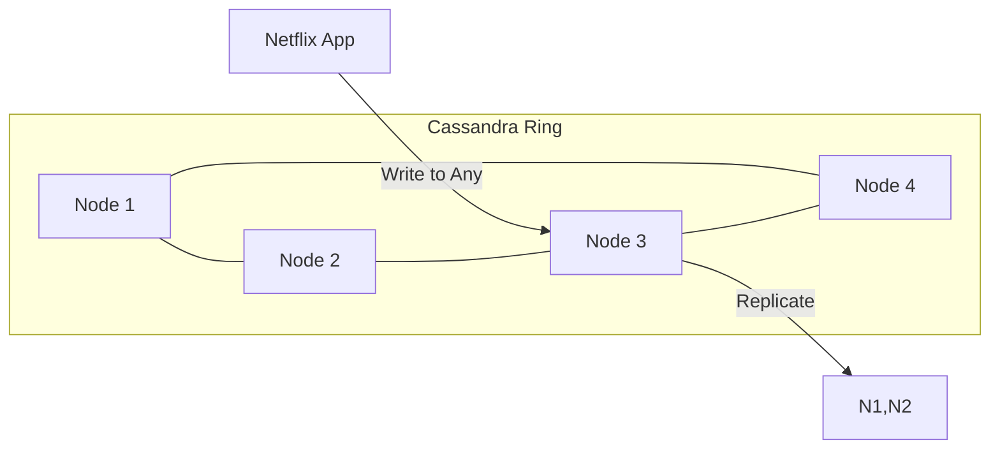

# 🎬 Case Study: Netflix and Apache Cassandra
> **Objective:** Analyze how Netflix uses Apache Cassandra to handle massive global availability and throughput for billions of user events | **Language:** Hinglish | **Standard:** 2026 Expert Framework

---

## 🧭 1. Beginner-Friendly Hinglish Explanation
Netflix aur Cassandra ka matlab hai "Duniya ke sabse bade streaming platform ka 'Dil' (Database)".

- **The Problem:** Netflix ko chahiye ek aisa database jo kabhi "Down" na ho (100% Availability) aur jo puri duniya mein ek saath sync ho. Agar aapne ek movie dekhi, toh wo aapke phone, TV aur laptop par turant sync honi chahiye, chahe aap kahin bhi hon.
- **The Solution:** Apache Cassandra. 
  - Ye ek "Masterless" database hai. Isme koi ek main server nahi hota, sab barabar hain.
  - Agar 5 servers down bhi ho jayein, toh bhi Netflix chalta rahega.
- **Intuition:** Ye ek "Team" jaisa hai jahan har player ko sab pata hai. Agar Captain (Master) bimar ho jaye, toh team rukti nahi hai, koi aur player turant handle kar leta hai.

---

## 🧠 2. Deep Technical Explanation
### 1. Masterless Architecture:
Unlike MySQL (Master-Slave), Cassandra uses a **Peer-to-Peer** ring.
- Any node can accept a write.
- Data is replicated across nodes using a **Gossip Protocol**.

### 2. High Availability (Multi-Region):
Netflix uses Cassandra's ability to replicate data across different AWS regions (USA, Europe, Asia) with low latency.
- If an entire AWS region (e.g., US-East-1) goes down, Netflix simply routes users to US-West-2, and the data is already there!

### 3. Tuning Consistency:
Netflix uses **Eventual Consistency** for most things.
- When you click "Like" on a movie, it's okay if it takes 2 seconds to show up on your TV. This makes the write instant ($<2ms$).

---

## 🏗️ 3. Database Diagrams (The Ring Architecture)


---

## 💻 4. Query Execution Examples (CQL)
```sql
-- 1. Netflix Viewing History Table
CREATE TABLE viewing_history (
    user_id UUID,
    movie_id UUID,
    watched_at TIMESTAMP,
    progress INT,
    PRIMARY KEY (user_id, watched_at)
) WITH CLUSTERING ORDER BY (watched_at DESC);

-- 2. Querying (Super fast for the latest history)
SELECT * FROM viewing_history WHERE user_id = ... LIMIT 10;
```

---

## 🌍 5. Real-World Lessons
- **Availability > Consistency:** For a video platform, showing a "Partially old" list of movies is better than showing a "Server Error" page.
- **Linear Scalability:** If Netflix gets 2x more users, they simply add 2x more Cassandra nodes. There is no complex sharding to manage.

---

## ❌ 6. Failure Cases
- **Tombstones:** In Cassandra, deleting data is "Expensive". It creates a "Tombstone" (a marker). If you delete too much data, the database slows down significantly. **Fix: Avoid frequent DELETES in Cassandra.**
- **The "Hot Partition":** If millions of people are watching "Stranger Things" and you store all that data on one node, that node will crash. **Fix: Design your 'Partition Key' carefully.**

漫
---

## ✅ 11. Key Takeaways for Engineers
- **Masterless is the way for 100% Uptime.**
- **Understand your access patterns** before designing the schema (Cassandra is Query-First).
- **Design for Failure:** Assume servers WILL die.

---

## 📝 14. Interview Questions based on this Case Study
1. "Why did Netflix choose Cassandra over a relational database like Postgres?"
2. "How does Cassandra achieve 100% availability?"
3. "What are 'Tombstones' in Cassandra and why are they bad?"

---

## 🚀 15. Latest 2026 Trends
- **Moving to Cloud-Native Cassandra:** Netflix is moving many of its internal clusters to managed services to focus on "Application Logic" rather than "Database Maintenance".
漫
