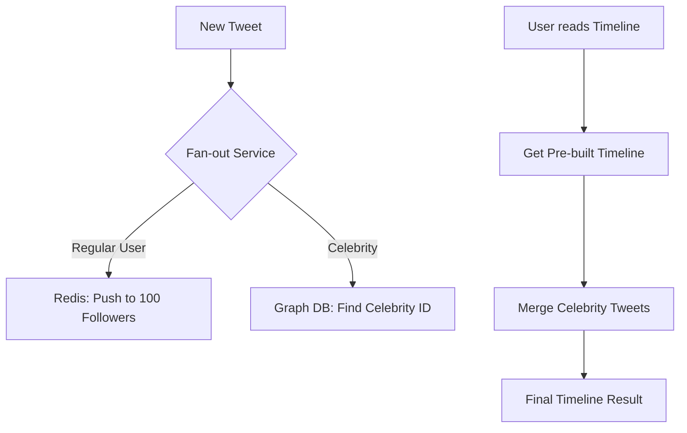

# 🐦 Case Study: Scaling Twitter's Timeline
> **Objective:** Analyze how Twitter (X) manages billions of tweets and real-time timeline delivery using a massive distributed database architecture | **Language:** Hinglish | **Standard:** 2026 Expert Framework

---

## 🧭 1. Beginner-Friendly Hinglish Explanation
Twitter Scaling ka matlab hai "Millions of users ko ek saath unka personal timeline dikhana".

- **The Problem:** Jab ek Celebrity (e.g., Narendra Modi ya Elon Musk) tweet karta hai, toh use 100 Million followers tak turant pahunchana hai. Agar hum har user ke liye `SELECT * FROM tweets WHERE user_id IN (following)` chalayein, toh database crash ho jayega.
- **The Solution:** Fan-out Strategy. 
  - Twitter timeline ko "Read" ke waqt nahi banata, balki "Write" ke waqt banata hai.
  - Har user ki ek "Timeline Cache" (Redis mein) hoti hai. Jab koi aapka dost tweet karta hai, toh wo tweet aapki cache mein "Push" kar diya jata hai.
- **Intuition:** Ye "Email" jaisa hai. Jab koi email bhejta hai, wo aapke inbox mein aa jata hai. Jab aap inbox kholte hain, toh wo pehle se wahan hota hai. Aapko dhoondhna nahi padta.

---

## 🧠 2. Deep Technical Explanation
### 1. The Push (Fan-out) Architecture:
1. User tweets.
2. The "Fan-out" service finds all followers of that user.
3. It inserts the Tweet ID into the Redis-based timeline cache of every follower.
4. **The Challenge:** For a user with 50M followers, this is 50 Million writes! This takes time.

### 2. The Pull Strategy (For Celebrities):
For "Celebrities" (Users with $>100k$ followers), the "Push" strategy fails because it's too heavy.
- Instead, Twitter uses a **Hybrid approach**.
- Celebrity tweets are NOT pushed to every follower.
- When you (the follower) load your timeline, the system "Pulls" the celebrity tweets at the last moment and merges them with your pre-built timeline.

### 3. Data Storage (Gizzard/Manhattan):
Twitter created its own framework called **Gizzard** to shard MySQL databases and later moved to **Manhattan**, a globally distributed key-value store.

---

## 🏗️ 3. Database Diagrams (The Hybrid Timeline)


---

## 💻 4. Query Execution Examples (Pseudo-logic)
```javascript
// 1. Regular Fan-out (The 'Push')
function onNewTweet(tweetId, authorId) {
    const followers = getFollowers(authorId); // e.g., 500 followers
    for (let f of followers) {
        redis.lpush(`timeline:${f.id}`, tweetId);
        redis.ltrim(`timeline:${f.id}`, 0, 799); // Keep last 800 tweets
    }
}

// 2. Reading Timeline (The 'Merge')
async function getTimeline(userId) {
    let timeline = await redis.lrange(`timeline:${userId}`, 0, 50);
    let celebrities = await getFollowingCelebrities(userId);
    let celebTweets = await getLatestTweets(celebrities);
    return mergeAndSort(timeline, celebTweets);
}
```

---

## 🌍 5. Real-World Lessons
- **Write-Heavy vs Read-Heavy:** Twitter is $100x$ more Read-heavy than Write-heavy. They optimized for "Fast Reads" by doing the heavy work during "Writes".
- **Caching is Everything:** Without Redis, Twitter cannot function.

---

## ❌ 6. Failure Cases
- **The "Justin Bieber" Problem:** When a superstar with 100M followers tweets, the "Fan-out" system can get clogged. If the system isn't fast enough, some followers might see the tweet 10 minutes later than others.
- **Cache Eviction:** If a user hasn't logged in for 6 months, their Redis cache is deleted to save space. When they return, their timeline has to be "Rebuilt" from the main DB (Slow).

漫
---

## ✅ 11. Key Takeaways for Engineers
- **Use Hybrid models** for different scales of users.
- **Pre-calculate** as much as possible if your app is read-heavy.
- **Sharding** is mandatory for billions of rows.
- **Monitoring "Fan-out lag"** is the most important metric for Twitter.

---

## 📝 14. Interview Questions based on this Case Study
1. "Why does Twitter pre-build timelines instead of using a SQL JOIN?"
2. "How do you handle a user with 100 million followers in a push-based system?"
3. "What is the role of Redis in Twitter's architecture?"

---

## 🚀 15. Latest 2026 Trends
- **AI-Ranked Timelines:** Moving away from "Chronological" (Time-based) to "Interest-based" ranking using **Vector Databases** to decide which tweet shows up first in your feed.
漫
