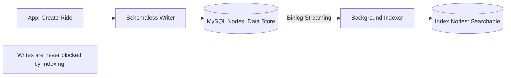

# 🚗 Case Study: Uber's Schemaless Database
> **Objective:** Analyze how Uber built a custom, distributed database layer on top of MySQL to handle trillions of records and massive write loads | **Language:** Hinglish | **Standard:** 2026 Expert Framework

---

## 🧭 1. Beginner-Friendly Hinglish Explanation
Uber Schemaless ka matlab hai "Uber ka apna banaya hua NoSQL database jo MySQL ke upar tika hai".

- **The Problem:** Shuruat mein Uber standard Postgres aur MySQL use karta tha. Par jab rides trillions mein pahunch gayi, toh SQL databases "Schema changes" aur "Indexing" mein slow ho gaye. 
- **The Solution:** Schemaless. 
  - Uber ne MySQL ko sirf ek "Storage" ki tarah use kiya.
  - Unhone SQL ke features (Joins, Constraints) ko chhod diya.
  - Unhone data ko "JSON" format mein save karna shuru kiya takki jab chahe naya field add kar sakein bina database lock kiye.
- **Intuition:** Ye "Ek kamre mein dher saare almariyan (MySQL)" rakhne jaisa hai. Uber ne har ride ka data ek chote box (JSON) mein dala aur use kisi bhi khali almari mein rakh diya.

---

## 🧠 2. Deep Technical Explanation
### 1. Architecture: The 'Cells'
Uber divided its global infrastructure into "Cells". Each cell is a self-contained unit with its own Schemaless cluster. This ensures that if the "India Cell" has an issue, the "USA Cell" is unaffected.

### 2. Data Model:
Schemaless is an append-only store of JSON objects.
- **Key-Value at Heart:** It uses a `UUID` to find the ride and then retrieves the JSON.
- **Column-Family Influence:** Similar to Cassandra, it allows versioning of data.

### 3. Asynchronous Indexing:
Uber doesn't index data while writing (which is slow).
- Instead, data is written to the "Main" store instantly.
- A background service reads the "Transaction Log" and updates the indexes separately. This is why Uber's write performance is so high.

---

## 🏗️ 3. Database Diagrams (The Schemaless Flow)


---

## 💻 4. Query Execution Examples (The Logic)
```javascript
// 1. Storing a ride (No schema needed)
db.put("ride_123", {
    "passenger": "Sameer",
    "driver": "Kishore",
    "path": [[12.1, 77.2], [12.2, 77.3]],
    "status": "completed"
});

// 2. Fetching (Key-based)
const ride = db.get("ride_123");

// 3. Adding a new field (Instant!)
db.put("ride_123", {
    "passenger": "Sameer",
    "tip": 50 // New field 'tip' added without 'ALTER TABLE'
});
```

---

## 🌍 5. Real-World Lessons
- **Operational Simplicity:** Changing a schema in a 100TB database is a nightmare. By being "Schemaless", Uber removed this problem entirely.
- **Availability over Consistency:** Uber chose **AP** (Availability and Partition Tolerance) because a driver must be able to complete a ride even if the database sync is slightly delayed.

---

## ❌ 6. Failure Cases
- **Data Integrity:** Since there is no schema, a developer might accidentally save `age: "twenty"` instead of `age: 20`. This has to be handled in the **Application Code**.
- **Query Complexity:** Without SQL Joins, the app has to make multiple calls to the DB and join data in memory.

漫
---

## ✅ 11. Key Takeaways for Engineers
- **Abstract your database:** Don't let your app talk directly to the DB; use a "Service Layer".
- **Background everything:** Move non-critical tasks (like indexing or notifications) out of the main write path.
- **MySQL is incredibly stable:** If you can't find a good NoSQL, you can build one on top of MySQL.

---

## 📝 14. Interview Questions based on this Case Study
1. "Why did Uber build Schemaless instead of using MongoDB or Cassandra?"
2. "How does asynchronous indexing work in Schemaless?"
3. "What are the risks of a schemaless architecture?"

---

## 🚀 15. Latest 2026 Trends
- **Moving to Docstore:** Uber is now evolving Schemaless into a new system called **Docstore**, which adds some SQL-like features back (like strong consistency) while keeping the horizontal scale.
漫
