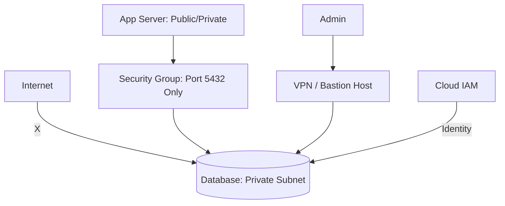

# 🛡️ Advanced Security Hardening: Locking the Vault
> **Objective:** Master the professional techniques to secure production databases against advanced threats, focusing on network isolation, identity management, and principle of least privilege | **Language:** Hinglish | **Standard:** 2026 Expert Framework

---

## 🧭 1. Beginner-Friendly Hinglish Explanation
Advanced Security Hardening ka matlab hai "Database ko ek aise tijori (Vault) mein band karna jahan parinda bhi par na maar sake".

- **The Problem:** Sirf password lagana kaafi nahi hai. Agar hacker aapke network mein ghus gaya, toh wo database uda sakta hai.
- **The Solution:** Multiple layers of defense.
  - **Network Layer:** Database ko internet se bilkul chupa do (Private Subnet).
  - **Access Layer:** Sirf unhi log ko access do jinko zaroorat hai (Least Privilege).
  - **Data Layer:** Agar data chori bhi ho jaye, toh wo hacker ke liye kachra ho (Encryption).
- **Intuition:** Ye ek "High-Security Jail" jaisa hai. Sirf ek gate (Password) nahi hai, dher saare sensors, cameras, aur guards hain.

---

## 🧠 2. Deep Technical Explanation

### 1. Network Isolation (The First Wall):
- **Private VPC:** Never give your DB a public IP.
- **Security Groups:** Allow only specific ports (e.g., 5432 for Postgres) from specific IP ranges (e.g., your App Servers).
- **SSH Tunneling:** If you need to access the DB, use a "Bastion Host" or a VPN.

### 2. Identity and Access Management (IAM):
- **IAM Authentication:** Instead of database passwords, use Cloud IAM roles. This removes the risk of "Hardcoded passwords".
- **Dynamic Secrets:** Use **HashiCorp Vault** to generate temporary database credentials that expire in 1 hour.

### 3. Principle of Least Privilege (PoLP):
The application user should NEVER be the 'Owner' of the tables. 
- The App should only have `SELECT`, `INSERT`, `UPDATE` permissions.
- It should NOT have `DROP TABLE`, `TRUNCATE`, or `ALTER TABLE`.

---

## 🏗️ 3. Database Diagrams (Defense in Depth)


---

## 💻 4. Query Execution Examples (Hardening Commands)
```sql
-- 1. Creating a Limited Application User
CREATE ROLE web_app_user WITH LOGIN PASSWORD 'strong_password';
GRANT CONNECT ON DATABASE production TO web_app_user;
GRANT USAGE ON SCHEMA public TO web_app_user;
GRANT SELECT, INSERT, UPDATE ON ALL TABLES IN SCHEMA public TO web_app_user;

-- 2. Revoking Public Permissions
REVOKE ALL ON DATABASE production FROM PUBLIC;

-- 3. Enabling Row-Level Security (RLS)
-- Users can only see their OWN data!
ALTER TABLE orders ENABLE ROW LEVEL SECURITY;
CREATE POLICY user_orders_policy ON orders 
USING (user_id = current_setting('app.current_user_id'));
```

---

## 🌍 5. Real-World Production Examples
- **Fintech (PayPal/Stripe):** Use **Database Firewalls** that analyze every SQL query in real-time. If a query looks suspicious (e.g., `SELECT * FROM users`), it is blocked automatically.
- **Healthcare:** Use **Dynamic Data Masking** so that customer support agents see `XXXX-XXXX-1234` instead of the full credit card number.

---

## ❌ 6. Failure Cases
- **The "Admin" App User:** Giving your Node.js/Python app 'Superuser' access. One SQL Injection attack and your whole DB is gone. **Fix: Use restricted roles.**
- **Exposed Port 3306/5432:** Leaving the DB port open to `0.0.0.0/0`. Scanners will find it in 5 minutes and start a brute-force attack.

---

## 🛠️ 7. Debugging Guide
| Problem | Reason | Solution |
| :--- | :--- | :--- |
| **"Connection Refused"** | Security Group / Firewall | Check if your App Server's IP is whitelisted in the Security Group. |
| **"Permission Denied"** | Missing GRANT | Identify the specific table/schema and run the `GRANT` command. |

---

## ⚖️ 8. Tradeoffs
- **High Security (Complexity / Slower Development)** vs **Low Security (Fast / High Risk).**

---

## ✅ 11. Best Practices
- **Never store passwords in plaintext.** Use a Secrets Manager.
- **Rotate keys and passwords** every 30-90 days.
- **Enable SSL/TLS** for every connection.
- **Run regular Security Audits.**
- **Use Parameterized Queries** (ALWAYS!).

漫
---

## 📝 14. Interview Questions
1. "What is the Principle of Least Privilege and how do you apply it to a database?"
2. "How do you secure a database connection in a public cloud (AWS/GCP)?"
3. "What is Row-Level Security (RLS) and why is it useful?"

---

## 🚀 15. Latest 2026 Production Database Patterns
- **Zero-Trust Database Access:** No one has permanent access to the DB. You must request "Just-in-time" access via an internal portal, which is granted for 15 minutes only after manager approval.
- **AI Intrusion Detection:** Databases that use ML to learn your "Normal" query patterns and automatically lock a user account if it starts running unusual queries.
漫
