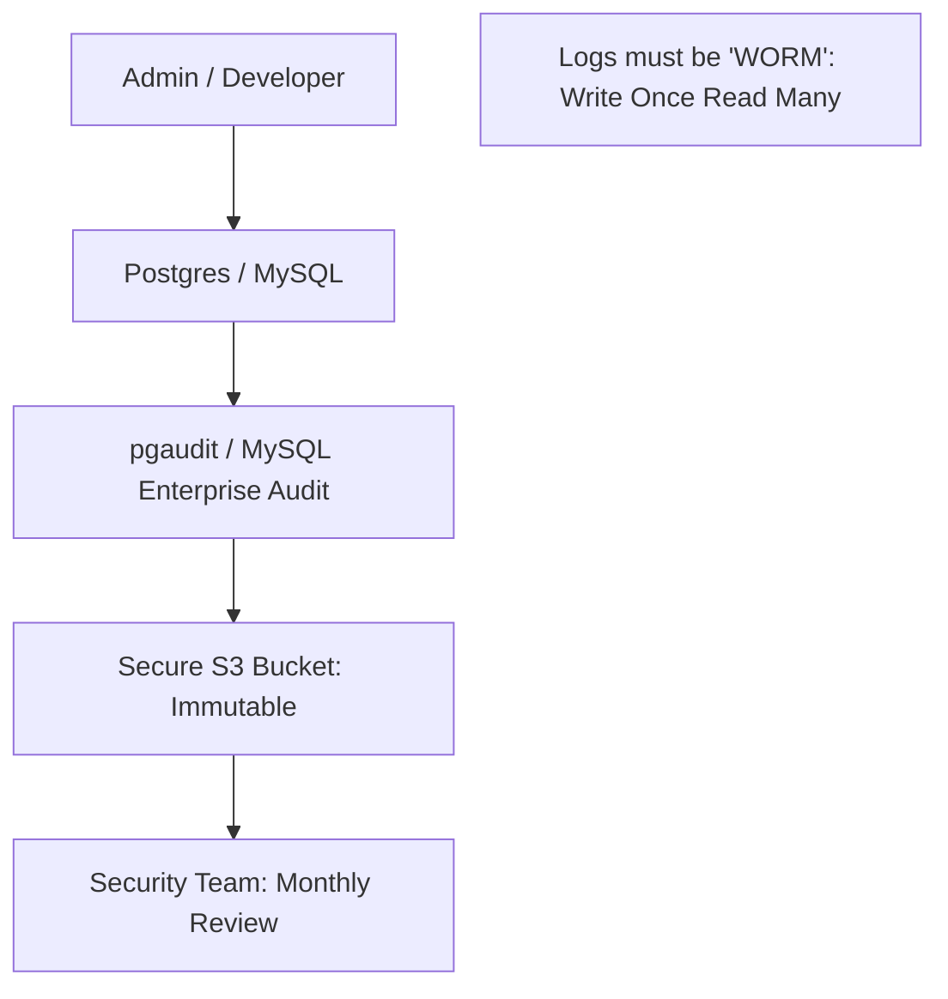

# 📜 Auditing and Compliance: GDPR, SOC2, and Beyond
> **Objective:** Master the implementation of database auditing and compliance frameworks to meet legal requirements and pass security audits | **Language:** Hinglish | **Standard:** 2026 Expert Framework

---

## 🧭 1. Beginner-Friendly Hinglish Explanation
Auditing and Compliance ka matlab hai "Database mein hone wali har harkat ka record rakhna aur sarkari rules (Laws) ko follow karna".

- **The Problem:** Agar kisi ne data delete kiya, toh kaise pata chalega ki kisne kiya? Agar hum user ka data store kar rahe hain, toh kya hum illegal kaam toh nahi kar rahe?
- **The Solution:** 
  - **Auditing:** Ek "Log" jo record kare ki "Kaun, Kab, Kahan aur Kya" kar raha hai.
  - **Compliance:** GDPR (Europe), SOC2 (Security), HIPAA (Health) jaise rules ko follow karna.
- **Intuition:** Ye ek "CCTV Camera" jaisa hai jo database ke andar laga hai.

---

## 🧠 2. Deep Technical Explanation

### 1. What to Audit?
- **Logins/Logouts:** Who connected?
- **DDL Changes:** Who changed the table structure (`ALTER`, `DROP`)?
- **Data Access:** Who saw sensitive data (e.g., `SELECT salary`)?

### 2. GDPR (The Right to be Forgotten):
You must be able to delete a user's data completely if they ask. 
- **Challenge:** Deleting from backups is hard!
- **Solution:** Encrypt every user's data with a unique key. To "Delete" them, just delete their key. (Crypto-shredding).

### 3. SOC2 Compliance:
Requires proof that your database is secure and monitored.
- You need logs of all admin actions.
- You need a "Disaster Recovery" plan.

---

## 🏗️ 3. Database Diagrams (The Auditing Chain)


---

## 💻 4. Query Execution Examples (Setting up Auditing)
```sql
-- 1. Installing pgaudit (Postgres)
CREATE EXTENSION pgaudit;
-- Audit all DDL changes and Role changes
ALTER SYSTEM SET pgaudit.log = 'ddl, role';

-- 2. Audit specific sensitive table
SET pgaudit.log_catalog = on;
-- Now every query on 'employees' will be logged to the system log.

-- 3. Querying the audit logs (using CloudWatch/ELK)
-- (Pseudo-query for logs)
SELECT timestamp, user, query 
FROM audit_logs 
WHERE query LIKE '%DROP%';
```

---

## 🌍 5. Real-World Production Examples
- **Banking:** Every single time an employee views a customer's balance, an audit log is generated. If an employee looks at too many customers, an alert is triggered.
- **SaaS Companies:** Need **SOC2 Type II** to sell to big enterprise clients. This means they must show 6 months of database audit logs.

---

## ❌ 6. Failure Cases
- **Log Bloat:** Auditing every single `SELECT` on a busy site will generate 100GB of logs per day, slowing down the DB. **Fix: Only audit 'Write' operations and access to 'Sensitive' tables.**
- **Log Tampering:** A hacker gains access and deletes the audit logs to hide their tracks. **Fix: Stream logs to a different server/account instantly (Immutable logs).**

---

## 🛠️ 7. Debugging Guide
| Problem | Reason | Solution |
| :--- | :--- | :--- |
| **Storage is full** | Logs are too detailed | Reduce audit level to only log 'DDL' and 'Error' events. |
| **Cannot find who deleted a table** | Auditing was off | Always enable 'DDL Auditing' in production from day one. |

---

## ⚖️ 8. Tradeoffs
- **High Transparency (Full Auditing)** vs **Performance/Storage Cost.**

---

## ✅ 11. Best Practices
- **Enable DDL Auditing** at a minimum.
- **Store logs in a separate, secure account.**
- **Implement 'Crypto-shredding'** for GDPR compliance.
- **Regularly review logs** using automated tools (SIEM).

漫
---

## 📝 14. Interview Questions
1. "How do you ensure GDPR's 'Right to be Forgotten' in a distributed database?"
2. "What are the performance implications of database auditing?"
3. "What is an Immutable Log and why is it important?"

---

## 🚀 15. Latest 2026 Production Database Patterns
- **Automatic PII Detection:** Databases that automatically tag columns containing PII (Personally Identifiable Information) and enable extra auditing for them.
- **Audit-as-Code:** Using tools like **Prisma** or **Drizzle** to define auditing rules directly in your application schema.
漫
