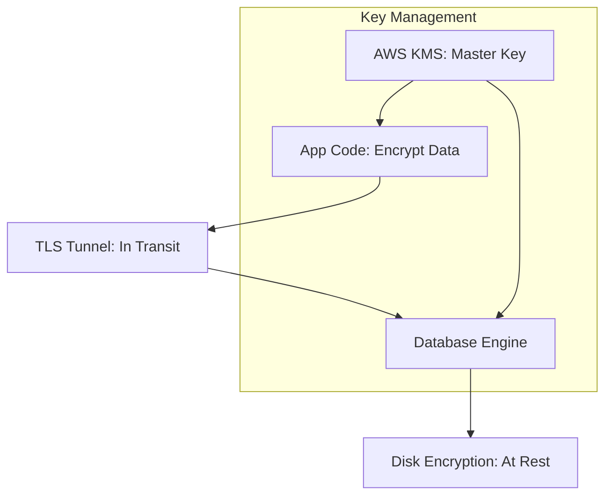

# 🔐 Database Encryption Deep Dive: Hiding the Truth
> **Objective:** Master the technical implementation of data encryption at rest, in transit, and at the application level to ensure maximum data privacy | **Language:** Hinglish | **Standard:** 2026 Expert Framework

---

## 🧭 1. Beginner-Friendly Hinglish Explanation
Database Encryption ka matlab hai "Data ko ek aisi secret language mein badalna jise bina chabi (Key) ke koi na samajh sake".

- **The Problem:** Agar koi aapki hard disk chura le, ya aapka network tap kar le, toh wo sara data dekh lega.
- **The Solution:** Encryption.
  - **In Transit:** Jab data "Safar" kar raha hai (Network par).
  - **At Rest:** Jab data "So raha hai" (Disk par).
  - **Client-Side:** Jab data database mein "Pahunchne se pehle" hi encrypt ho jaye.
- **Intuition:** Ye ek "Code language" jaisa hai. Aapne likha "Hello", par disk par save hua "xYz123".

---

## 🧠 2. Deep Technical Explanation

### 1. Encryption in Transit (TLS/SSL):
Ensures that data moving between the App and the DB is encrypted.
- **Requirement:** Database certificates and `ssl=true` in connection strings.

### 2. Encryption at Rest (TDE - Transparent Data Encryption):
The database engine automatically encrypts data before writing to disk and decrypts after reading.
- **Tools:** AWS KMS (Key Management Service), Google Cloud KMS.

### 3. Application-Level Encryption:
The most secure method. You encrypt the data in your Node.js/Python code *before* sending it to the DB.
- **Benefit:** Even the Database Administrator (DBA) cannot see the real data.
- **Drawback:** You cannot "Search" or "Sort" by that column easily.

---

## 🏗️ 3. Database Diagrams (The Encryption Layers)


---

## 💻 4. Query Execution Examples (Encryption Implementation)
```sql
-- 1. Enforcing SSL for all connections (Postgres pg_hba.conf)
-- hostssl all all 0.0.0.0/0 scram-sha-256

-- 2. Column-level Encryption (using pgcrypto)
CREATE EXTENSION pgcrypto;

INSERT INTO users (email, password_hash) 
VALUES ('sameer@ex.com', crypt('my_secret_pass', gen_salt('bf')));

-- Verifying password
SELECT * FROM users 
WHERE email = 'sameer@ex.com' 
AND password_hash = crypt('my_secret_pass', password_hash);
```

---

## 🌍 5. Real-World Production Examples
- **Healthcare (HIPAA):** All patient records must be encrypted at rest and in transit.
- **Fintech (PCI-DSS):** Credit card numbers are often encrypted at the **Application Level**. The DB only sees a random string.

---

## ❌ 6. Failure Cases
- **Key Loss:** If you lose your KMS Master Key, your data is gone FOREVER. There is no "Forgot Password" for encryption keys. **Fix: Use 'Key Rotation' and 'Redundant Key Storage'.**
- **Performance Hit:** Encryption takes CPU cycles. If you encrypt every single column, your database will be $30-50\%$ slower. **Fix: Only encrypt 'Sensitive' columns.**

---

## 🛠️ 7. Debugging Guide
| Problem | Reason | Solution |
| :--- | :--- | :--- |
| **"SSL connection error"** | Certificate mismatch | Check if the App has the correct CA certificate for the DB. |
| **"Decryption failed"** | Wrong Key version | Ensure you are using the same key version that was used to encrypt. |

---

## ⚖️ 8. Tradeoffs
- **High Security (Application Level)** vs **Searchability (SQL Joins/Filters don't work on encrypted data).**

---

## ✅ 11. Best Practices
- **Use AWS KMS or Google KMS** for key management.
- **Rotate your keys** at least once a year.
- **Enable Encryption at Rest** by default for every database.
- **Use Hashing (Bcrypt/Argon2)** for passwords, NOT encryption. (Encryption can be reversed, Hashing cannot).

漫
---

## 📝 14. Interview Questions
1. "Difference between Symmetric and Asymmetric encryption?"
2. "Why shouldn't you encrypt your own passwords using a custom algorithm?"
3. "What is Transparent Data Encryption (TDE)?"

---

## 🚀 15. Latest 2026 Production Database Patterns
- **Homomorphic Encryption:** An experimental technology that allows you to perform calculations (like SUM) on encrypted data without ever decrypting it.
- **Enclave-based Databases:** Running your database inside a secure "Enclave" (Intel SGX) where even the operating system cannot see the memory of the database.
漫
