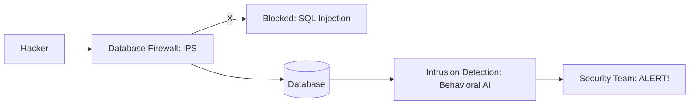

# 🚨 Intrusion Detection and Prevention: Fighting Back
> **Objective:** Master the techniques to detect and block malicious activity in your database in real-time using modern IDS/IPS tools and behavioral analysis | **Language:** Hinglish | **Standard:** 2026 Expert Framework

---

## 🧭 1. Beginner-Friendly Hinglish Explanation
Intrusion Detection aur Prevention ka matlab hai "Chor ke ghar mein ghuste hi use pakad lena aur rok dena".

- **The Problem:** Hacker ne kisi tarah password chura liya ya SQL Injection use kar raha hai. Aapko kaise pata chalega ki ye ek genuine user hai ya hacker?
- **The Solution:** 
  - **Detection (IDS):** Unusual patterns ko "Watch" karna. (e.g., Achanak se 1 million rows download hona).
  - **Prevention (IPS):** Malicious activity ko "Block" karna. (e.g., Query mein `' OR 1=1` dekhte hi use reject kar dena).
- **Intuition:** Ye ek "Guard Dog" jaisa hai jo ajnabi ko dekhte hi bhaunkta hai aur kaatne ke liye daudta hai.

---

## 🧠 2. Deep Technical Explanation

### 1. SQL Injection Prevention (The Basics):
The #1 threat. Never concatenate strings to build queries. 
- **The Wrong Way:** `query("SELECT * FROM users WHERE id = " + inputId)`
- **The Right Way:** `query("SELECT * FROM users WHERE id = ?", [inputId])` (Parameterized Queries).

### 2. Behavioral Analysis:
Modern IDS (like **AWS GuardDuty** or **Azure SQL Protection**) learn your app's behavior.
- If your app usually queries 10 rows but suddenly queries 100,000 rows, it's an alert.
- If an admin logs in from North Korea for the first time, it's an alert.

### 3. Database Firewalls:
A proxy that sits in front of the DB. It checks every SQL statement. 
- It can block queries that use `UNION` or `DROP` if those are not expected from the web app.

---

## 🏗️ 3. Database Diagrams (IDS/IPS Workflow)


---

## 💻 4. Query Execution Examples (Detection Logic)
```sql
-- 1. Monitoring for unusually large data transfers
SELECT 
    application_name, 
    client_addr, 
    sum(total_exec_time), 
    rows 
FROM pg_stat_statements 
WHERE rows > 100000 
ORDER BY rows DESC;

-- 2. Finding failed login attempts
-- (Pseudo-command for checking system logs)
grep "password authentication failed" /var/log/postgresql/postgresql.log | wc -l
-- If count > 100 in 1 minute, it's a Brute Force attack!
```

---

## 🌍 5. Real-World Production Examples
- **Cloud Databases:** **AWS GuardDuty** can detect if your database credentials are being used from an "Anonymizing Proxy" (VPN) or a "Malicious IP".
- **Enterprise Apps:** Use **Imperva** or **McAfee Database Security** to virtually "Patch" a database that has a known vulnerability but cannot be restarted immediately.

---

## ❌ 6. Failure Cases
- **False Positives:** A legitimate "Monthly Report" query is blocked because it downloaded 1 million rows. **Fix: Whitelist specific analytical queries.**
- **Performance Overhead:** Real-time inspection of every packet can add 5-10ms of latency to every query. **Fix: Use 'Async Detection' for non-critical apps.**

---

## 🛠️ 7. Debugging Guide
| Problem | Reason | Solution |
| :--- | :--- | :--- |
| **Legitimate user is blocked** | IPS rule is too strict | Check the logs for 'Blocked Query' and adjust the firewall regex. |
| **Database is slow after enabling IDS** | Deep packet inspection | Move the IDS to a separate server or use a more lightweight agent. |

---

## ⚖️ 8. Tradeoffs
- **Real-time Blocking (Safe / High Latency)** vs **Detection only (Risky / Fast).**

---

## ✅ 11. Best Practices
- **Always use Parameterized Queries.** No exceptions.
- **Set up alerts for 'Failed Logins'.**
- **Use a Web Application Firewall (WAF)** to block SQL injection *before* it even reaches the database.
- **Monitor for 'Massive Data Export'** events.

漫
---

## 📝 14. Interview Questions
1. "How do you detect a SQL injection attack in the database logs?"
2. "What is a Behavioral Baseline in database security?"
3. "Explain the difference between a Database Firewall and a regular Network Firewall."

---

## 🚀 15. Latest 2026 Production Database Patterns
- **Autonomous IPS:** Using AI to automatically create firewall rules based on the specific SQL queries generated by your ORM (Prisma/Hibernate).
- **Decoy Tables (HoneyPots):** Creating a fake table called `Credit_Cards_Full` that is empty. If anyone even tries to `SELECT` from it, the system immediately locks the whole network because a real user would never touch that table.
漫
