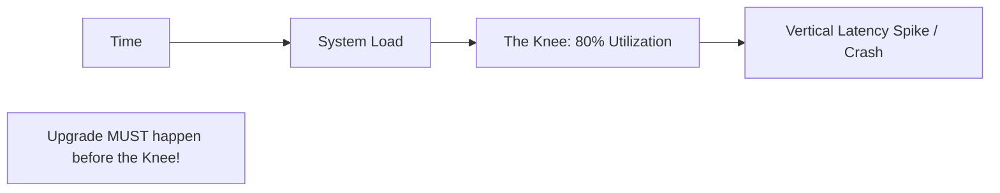

# 📈 Capacity Planning: Predicting the Future
> **Objective:** Master how to forecast the growth of your database and plan for CPU, RAM, and Disk upgrades before you hit a performance wall | **Language:** Hinglish | **Standard:** 2026 Expert Framework

---

## 🧭 1. Beginner-Friendly Hinglish Explanation
Capacity Planning ka matlab hai "Ye pehle se jaan lena ki database kab chota padne wala hai".

- **The Problem:** Database full ho gaya aur site crash ho gayi. Ab aap disk badha rahe ho, par tab tak 1 ghanta beet gaya aur millions ka nuksan ho gaya.
- **The Solution:** Data ko track karo aur trend dekho.
  - "Hum har din 1GB data add kar rahe hain."
  - "Humare paas 100GB free hai."
  - "Toh hum 100 din mein full ho jayenge."
- **The Goal:** Agle 6-12 mahine ka plan ready rakho.
- **Intuition:** Ye ek "Water Tank" jaisa hai. Aapko pata hona chahiye ki pani kitni speed se bhar raha hai takki tank bharne se pehle aap ek bada tank mangwa sakein.

---

## 🧠 2. Deep Technical Explanation
### 1. The 3 Pillars of Capacity:
- **Storage (Disk):** The easiest to track. Linear growth.
- **Throughput (IOPS):** How many operations per second? (Increases with more users).
- **Compute (CPU/RAM):** The hardest to predict. RAM needs grow as your "Active Data" (Working Set) grows.

### 2. The 'Knee of the Curve':
In every database, there is a point where adding 1 more user causes latency to spike vertically. This is called the "Knee". Capacity planning is about staying far away from this point.

### 3. Forecasting Methods:
- **Linear Regression:** Using historical data to draw a straight line into the future.
- **Envelope Calculation:** Designing for the "Worst Case" (e.g., Diwali or Black Friday sale traffic).

---

## 🏗️ 3. Database Diagrams (The Growth Curve)


---

## 💻 4. Query Execution Examples (Measuring Growth)
```sql
-- 1. Measuring Database Size Growth over time
-- (Postgres: Run this daily and save to a separate table)
SELECT pg_size_pretty(pg_database_size('mydb'));

-- 2. Checking Table Growth (Top 10 largest tables)
SELECT 
    relname AS "Table",
    pg_size_pretty(pg_total_relation_size(relid)) AS "Size"
FROM pg_catalog.pg_statio_user_tables
ORDER BY pg_total_relation_size(relid) DESC
LIMIT 10;
```

---

## 🌍 5. Real-World Production Examples
- **Hypergrowth Startups:** A company was growing at 20% *per week*. Standard capacity planning failed. They had to switch to **Distributed SQL (CockroachDB)** because it allowed them to add a new server every day without any downtime.
- **Archiving Strategy:** A company noticed that $90\%$ of their database was data older than 2 years that nobody ever looks at. Instead of buying a bigger disk, they moved that data to **S3 (Cold Storage)**, saving $80\%$ in costs.

---

## ❌ 6. Failure Cases
- **Linear Fallacy:** Assuming growth will be a straight line. Suddenly a marketing campaign goes viral, and traffic jumps $10x$ in one hour.
- **Ignoring IOPS:** You have 1TB free disk space, but you hit the "IOPS Limit" of your cloud provider. The disk is empty, but the DB is slow.
- **The "Data Bloat" Trap:** Not realizing that `DELETE` commands don't reclaim disk space instantly in Postgres (Vacuum needed).

漫
---

## ✅ 11. Best Practices for Capacity Planning
- **Monitor the 'Working Set' size** (Data that is frequently accessed). It must fit in RAM!
- **Alert at 70% and 80% disk usage.**
- **Plan for 2x Peak Traffic.**
- **Implement 'Data Retention' and 'Archiving'** from day one.
- **Regularly Load Test** your database to find the "Knee of the Curve".

---

## ⚠️ 13. Common Mistakes
- **Buying too much hardware too early** (Wasting money).
- **Thinking that Cloud means 'Infinite Scaling'** (You still have to pay for it and manage the limits).

---

## 📝 14. Interview Questions
1. "How do you decide when it's time to upgrade a database?"
2. "What is 'Working Set' and why does it matter for RAM sizing?"
3. "How would you handle a database that is growing by 1TB every week?"

---

## 🚀 15. Latest 2026 Production Database Patterns
- **Auto-expanding Storage:** (AWS Aurora) You don't choose a disk size; the DB just grows and shrinks automatically. You only pay for what you use.
- **Vertical Auto-scaling:** Databases that can detect high CPU and automatically move themselves to a more powerful server with zero downtime.
漫
