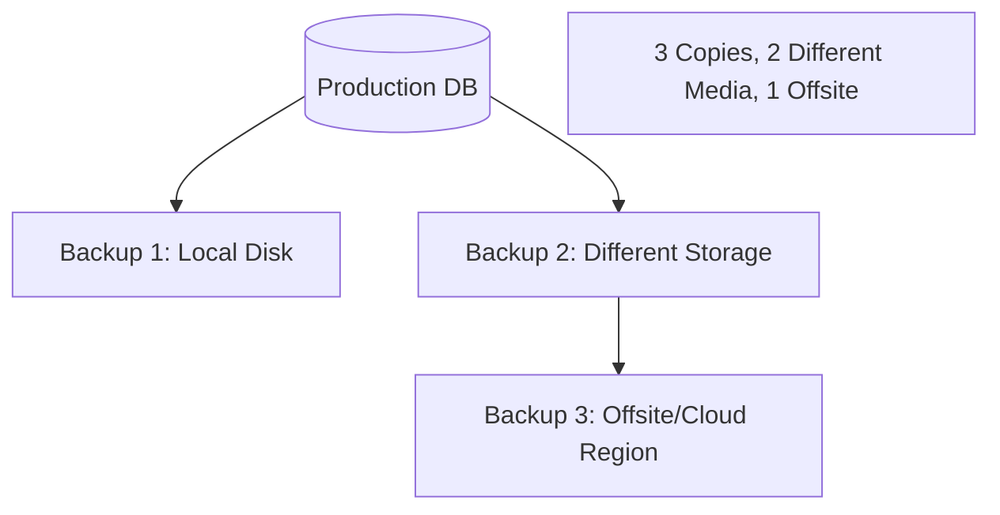

# 🛡️ Database Backups and DR: The Safety Net
> **Objective:** Master the strategies for data protection, including various backup types and Disaster Recovery (DR) planning to ensure your business survives any data loss event | **Language:** Hinglish | **Standard:** 2026 Expert Framework

---

## 🧭 1. Beginner-Friendly Hinglish Explanation
Database Backups aur DR ka matlab hai "Data ki safety aur musibat ke waqt ka plan".

- **The Problem:** Ek din server mein aag lag gayi, ya kisi ne galti se `DROP TABLE users` chala diya. Agar aapke paas "Backup" nahi hai, toh aapki company khatam.
- **The Solution:** 
  1. **Backup:** Data ki copy bana kar kahin aur rakhna.
  2. **DR (Disaster Recovery):** Pura system dusre shehar mein "Zinda" karna agar main shehar down ho jaye.
- **Key Terms:** 
  - **RPO (Recovery Point Objective):** Aap kitna purana data "Loss" kar sakte hain? (e.g., "5 minute ka data loss challega").
  - **RTO (Recovery Time Objective):** Aapko system "Wapas chalu" karne mein kitna time lagega? (e.g., "1 ghante mein site chalu ho jani chahiye").
- **Intuition:** Backup ek "Spare Tyre" jaisa hai. DR ek "Dusri Car" jaisa hai jo padosi ke ghar khadi hai agar aapki car chori ho jaye.

---

## 🧠 2. Deep Technical Explanation
### 1. Types of Backups:
- **Full Backup:** Entire database. (Slow, takes lots of space).
- **Incremental Backup:** Only the changes since the *last* backup. (Fast, small space).
- **Differential Backup:** Only the changes since the last *Full* backup.

### 2. Point-in-Time Recovery (PITR):
By using **Full Backups** + **Transaction Logs (WAL/Binary Logs)**, you can restore a database to the *exact second* before a mistake happened.
- `Restore 2 AM Full Backup` + `Replay Logs until 10:45:22 AM`.

### 3. DR Strategies:
- **Backup & Restore:** Cheapest, but slow RTO.
- **Pilot Light:** Small DB instance running in another region.
- **Warm Standby:** Fully functional but smaller DB.
- **Multi-Site (Active-Active):** Live DB in two regions. Most expensive but $0$ RTO.

---

## 🏗️ 3. Database Diagrams (The 3-2-1 Rule)


---

## 💻 4. Query Execution Examples (Postgres/MySQL)
```bash
# 1. Taking a Logical Backup (MySQL)
mysqldump -u root -p my_database > backup.sql

# 2. Point-in-Time Recovery (Postgres Example Logic)
# 1. Stop DB
# 2. Restore data from 'base backup'
# 3. Create 'recovery.signal' file
# 4. Set 'recovery_target_time' to '2024-05-10 10:45:00'
# 5. Start DB (it will replay logs and stop at target)
```

---

## 🌍 5. Real-World Production Examples
- **GitLab Incident:** A developer accidentally deleted production data. Their backups were failing for months, and they didn't know. They lost hours of data. **Lesson: ALWAYS test your restores.**
- **AWS Region Outage:** When US-EAST-1 went down, companies with a **Warm Standby** in US-WEST-2 were back online in 5 minutes.

---

## ❌ 6. Failure Cases
- **The "Zombie" Backup:** The backup script says "Success", but the file is 0 bytes or corrupted.
- **The "Encrypted" Backup:** You encrypted the backup but lost the key. Now the data is useless.
- **Slow Restore:** You have a 10TB backup on S3, but it takes 24 hours to download it to your server. Your RTO is failed.

漫
---

## ✅ 11. Best Practices for DBOps
- **Follow the 3-2-1 Rule.**
- **Test your restore process EVERY MONTH.** (A backup is only as good as its restore).
- **Automate backups** using cloud-native tools (AWS Backup).
- **Encrypt your backups** at rest and in transit.
- **Establish clear RPO and RTO** with your business team.

---

## ⚠️ 13. Common Mistakes
- **Storing backups on the same disk as the database.**
- **Not monitoring backup success/failure.**

---

## 📝 14. Interview Questions
1. "What is the difference between RPO and RTO?"
2. "How does Point-in-Time Recovery (PITR) work?"
3. "Explain the 3-2-1 backup strategy."

---

## 🚀 15. Latest 2026 Production Database Patterns
- **Immutable Backups:** Using S3 Object Lock to ensure that even if a hacker gets admin access, they CANNOT delete or modify your backups (Protection against Ransomware).
- **Serverless Backups:** Continuous backups that don't affect your database performance, managed entirely by the cloud provider.
漫
