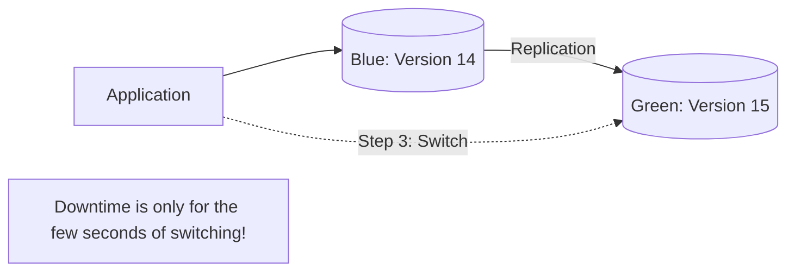

# 🔄 Database Patching and Upgrades: Zero Downtime Updates
> **Objective:** Master how to keep your database engines secure and up-to-date with the latest versions and security patches while minimizing downtime | **Language:** Hinglish | **Standard:** 2026 Expert Framework

---

## 🧭 1. Beginner-Friendly Hinglish Explanation
Database Patching aur Upgrades ka matlab hai "Database ko update karna bina site band kiye".

- **The Problem:** Har mahine database mein nayi "Security Vulnerabilities" aati hain. Aapko version update karna padega (e.g., Postgres 14 to 15). Par update karne mein database restart hota hai aur site 5-10 minute ke liye band ho jati hai.
- **The Solution:** 
  1. **Minor Patches:** Amazon/Google managed databases mein ye automatically ho jata hai "Maintenance Window" mein.
  2. **Major Upgrades:** Humein "Blue-Green" strategy use karni padti hai.
- **Intuition:** Ye "Ek chalti hui train ki patriyan badalne" jaisa hai. Train rukni nahi chahiye, par patriyan (DB Version) nayi honi chahiye.

---

## 🧠 2. Deep Technical Explanation
### 1. Patching (Minor Updates):
Fixes bugs and security holes. Usually compatible with existing data.
- **AWS RDS:** You can enable "Auto Minor Version Upgrade".

### 2. Major Upgrades (Major Updates):
Adds new features but might change how data is stored.
- **The Risk:** Some SQL queries might break or run slower on the new version.
- **The Strategy: Blue-Green Deployment.**
  1. Create a "Green" (New Version) copy of the database.
  2. Sync data from "Blue" (Old Version) to "Green" using Replication.
  3. Test your app against the Green DB.
  4. Switch traffic to Green.
  5. Delete Blue.

### 3. In-Place Upgrade:
Upgrading the same server. Fast but causes downtime. Only recommended for Dev/Staging.

---

## 🏗️ 3. Database Diagrams (The Blue-Green Upgrade)


---

## 💻 4. Query Execution Examples (AWS CLI)
```bash
# 1. Upgrade an RDS instance to a new major version
aws rds modify-db-instance \
    --db-instance-identifier production-db \
    --engine-version 15.3 \
    --allow-major-version-upgrade \
    --apply-immediately

# 2. Checking if an upgrade is available
aws rds describe-db-engine-versions \
    --engine postgres \
    --engine-version 14.1
```

---

## 🌍 5. Real-World Production Examples
- **Log4j Crisis:** When a major security bug was found, companies with **Infrastructure as Code** and **Managed DBs** patched thousands of databases in 24 hours. Others took weeks.
- **Postgres 16 Upgrade:** A fintech company used **Logical Replication** to move data from Postgres 12 to 16 over a month, then switched traffic in 2 seconds at 3 AM.

---

## ❌ 6. Failure Cases
- **Post-Upgrade Slowness:** The new version has a different "Query Optimizer". A query that took 10ms now takes 10 seconds. **Fix: Always run 'ANALYZE' immediately after an upgrade.**
- **Extension Incompatibility:** You use a special plugin (like `PostGIS`). The new DB version is out, but the plugin version isn't ready yet. The upgrade fails.
- **Replication Lag:** The "Green" DB is taking too long to sync with "Blue". You can never "Switch" because they are never equal.

漫
---

## ✅ 11. Best Practices for Upgrades
- **ALWAYS test the upgrade on a Staging DB first.**
- **Take a Manual Snapshot** before starting.
- **Run `ANALYZE`** on all tables after the upgrade.
- **Verify 'Extensions' and 'Plugins' compatibility.**
- **Schedule upgrades** during low-traffic hours.

---

## ⚠️ 13. Common Mistakes
- **Running a Major Upgrade without a backup.**
- **Ignoring the "Deprecated" features** in the new version release notes.

---

## 📝 14. Interview Questions
1. "Difference between a Minor and a Major database upgrade?"
2. "Explain the Blue-Green deployment strategy for databases."
3. "What is the biggest risk of upgrading a production database?"

---

## 🚀 15. Latest 2026 Production Database Patterns
- **Built-in Blue/Green:** (AWS RDS) One-click major version upgrades where AWS handles the replication, testing, and switching for you automatically.
- **Rolling Upgrades:** For Distributed DBs (like CockroachDB), you can update one node at a time. The DB stays online throughout the process!
漫
